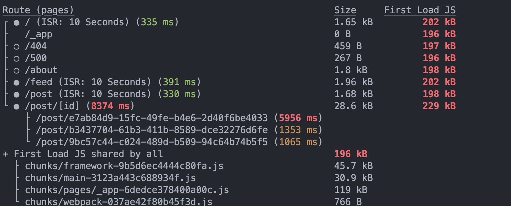
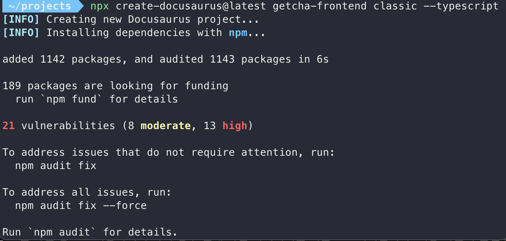
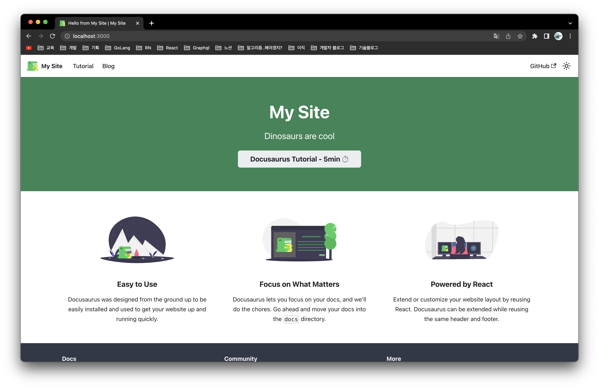
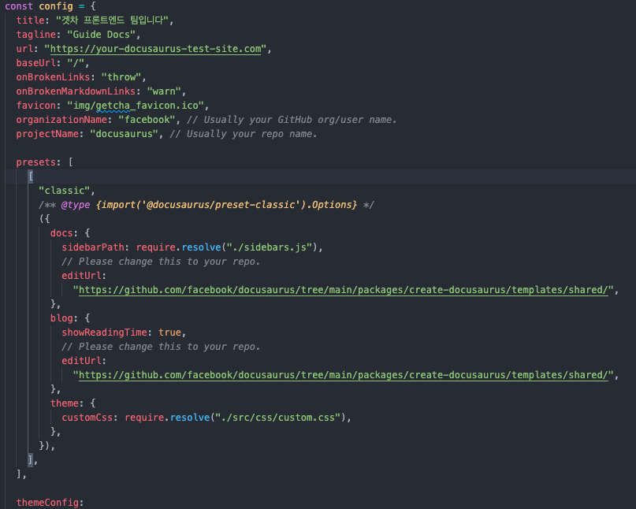
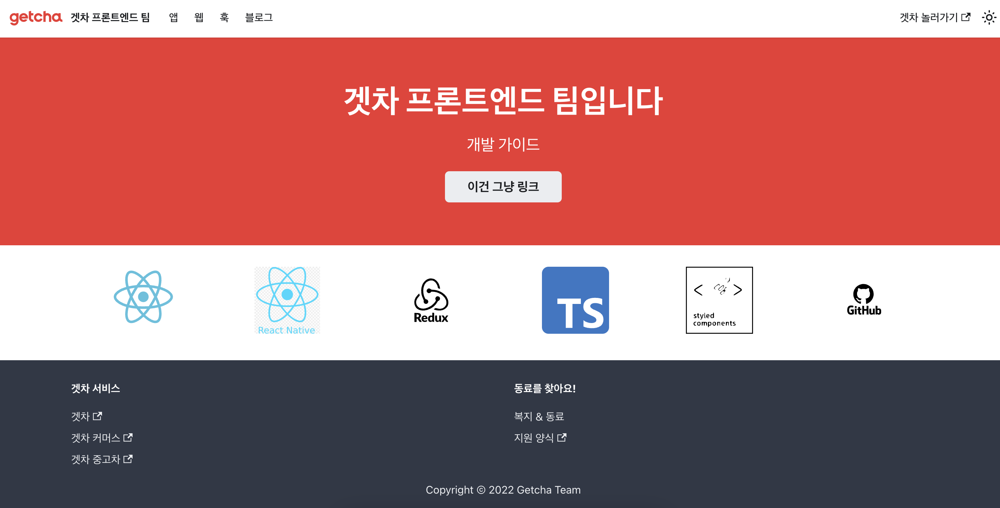
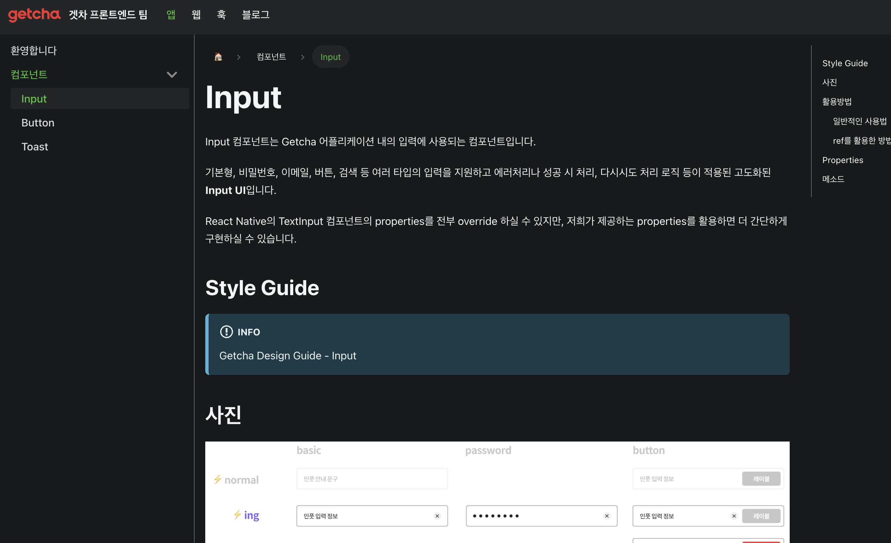
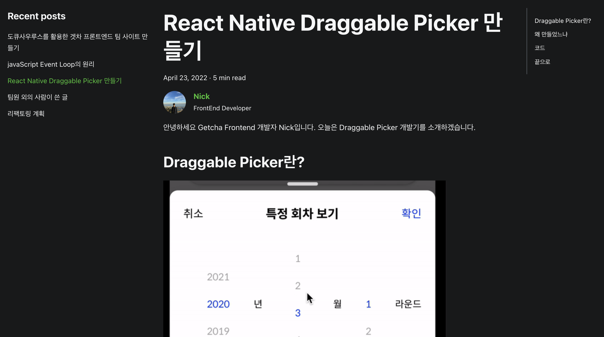

안녕하세요. 오늘은 페이스북의 정적 문서 생성 프레임워크인 도큐사우르스를 활용한 개인 테크 블로그 만들기 과정을 소개합니다.

<!--truncate-->

프론트 개발자로서 테크 블로그를 이미 많이 사용하시는 velog나 tstory로 쓰려고 하니 영 손이 가지 않았어요. 그 이유는,

1. 그 녀석들은 개성이 없습니다.
2. 테마나 디자인 등에서 자유로운 커스텀을 원해요.
3. SEO, Analytics 등 자유로운 커스텀을 원해요.
4. 명색에 프론트 개발자인데?

정도가 있었어요. 그래서 만들어보자 생각하고, 착수했습니다.

일단 저는 노션 신봉자기 때문에 노션으로 글을 작성하고 이걸 제 블로그처럼 보여줄 생각을 했어요.

그래서 CMS로 노션을 활용하고 여기서 데이터를 긁어서 next.js로 서비스하면 되겠다 싶었습니다. 그래서 실제 구현까지 다 해놨는데, 실제로 사용해보니 SSG를 안쓰기엔 속도가 매우 느렸고, 쓴다고 하더라도 가져오는 데이터가 터무니없이 많아서 도저히 속도가 안나왔습니다.



그래서 진짜 제가 풀고자 하는 문제가 무었인지 집중해보니, 글을 게시할 수 있는 예쁜 블로그만 있으면 되겠더라고요. 그래서 markdown 파일을 렌더링만 할 수 있는 정적 문서 라이브러리들을 찾아보기로 했습니다.

처음엔 개츠비나 깃북같은 유명한 정적 문서 생성 프레임워크들을 생각했습니다. 아예 블로그를 시작부터 빌딩할 수준의 크기라고 생각해서였어요. 하지만 이것들을 사용하는데도 개발리소스가 들어가는 것 같았고, 기본 디자인도 맘에 안들었습니다. 그래서 개발비용을 최소화하고 높은 수준의 디자인, 커스텀 이런 수준의 사이트를 만들 수 있는 프레임워크인 **도큐사우루스**를 활용하기로 결정했습니다.

---

## 도큐사우루스란?

도큐사우루스는 facebook에서 개발한 React 기반 **정적 페이지 프레임워크**입니다.

:::info 도큐사우루스 방문하기

💡 [도큐사우루스](https://docusaurus.io/ko/) 공식 홈페이지

:::

도큐사우루스의 목적은 정말 심플하고 강력합니다. 아래 사진은 도큐사우루스 메인페이지에 나온 슬로건인데요. 이 한 문장 안에 도큐사우루스의 모든게 담겨있다고 볼 수 있습니다.


### 특징

도큐사우루스는 개츠비와 같이 이미 자주 사용되던 정적 페이지 생성기들과 다른 몇가지 특징이 있습니다.

1. 콘텐츠만 신경써도 될 정도로 간단하다.

   간단히 프로젝트만 만들어도, 당장 사용해도 될 만큼 **완성도 높은** 사이트가 나오고, **커스터마이징**도 간단합니다.
   SEO나 i18n 국제화, 검색, 다크모드 같이 없으면 불편한 기능들이 전부 **기본으로** 제공됩니다.

2. 폴더 구조가 직관적이고 단순하다.

   하나의 상단 탭이 하나의 폴더이고, 그 하위에 모든 .md 파일이 위치하는 구조입니다.
   페이지 구성이 폴더 구조와 비슷해서 관리하기 용이합니다.

3. Mdx 파일 지원

   markdown 파일은 서식이 있는 텍스트에요. 마치 옷을 입은 .txt파일이랄까요. mdx는 고작 텍스트 파일에서 jsx를 사용하게 해주는 놀라운 기능입니다.

4. 다양한 플러그인 지원

   [다양한 플러그인](https://docusaurus.io/ko/docs/api/plugins)을 통해 커스터마이징이 가능합니다. 성가신 설정도 도큐사우루스에서 해주기 때문에 저희는 간단히 가져다 사용하기만 하면 된답니다.

:::info 마지막 특징
!! 5. (마스코트 공룡🦖이 **매우** 귀엽다)
:::

제가 처음 사용해보고 느낀점은 거의 모든 틀이 **정해져있고** 저는 정말 **콘텐츠만** 넣어서 빌드하면 완벽한 웹사이트가 나오는 느낌이었습니다. 리액트 기반 프레임워크다보니 커스터마이징도 매우 쉽다는 장점도 있었구요.

이제 프로젝트 생성부터 진행해보겠습니다.

---

## 프로젝트 생성하기

먼저 준비할 것은 **_16_** 버전 이상의 Node.js입니다.

터미널을 열고, 다음 명령어를 입력해줍니다.

```bash
npx create-docusaurus@latest my-website classic --typescript
```

도큐사우루스 **최신버전**(2.xx)으로 my-website라는 **이름의 프로젝트**를, **classic** 플러그인(도큐사우루스 권장 플러그인)과 **타입스크립트** 버전으로 생성하는 명령어입니다.



잘 생성되었으면 해당 프로젝트로 들어가서, 다음 명령어를 통해 프로젝트를 실행시킵니다.

```bash
yarn start
```

그리고 결과물을 확인하면 아래 사진과 같습니다.



보이는 것 처럼 시작부터 거의 완성된 도큐먼트 친화적인 홈페이지가 나옵니다. 👍🏻

---

### docusaurus.config.js

docusaurus.config.js는 이 프로젝트의 설정이 담긴, 이 프로젝트 폴더에서 가장 중요한 파일입니다. 헤더나 탭, 푸터 구성 및 전체 테마, 플러그인 등 이 프로젝트에서 쓰이는 모든 설정을 이 파일에서 합니다.



### 커스터마이징

위에서 설명한 docusaurus.config.js에서 간단히 테마와 글로벌 스타일 등을 변경하면, 다음과 같이 잘 만들어진 블로그같은 사이트가 만들어집니다.



이로써 원했던 모습의 사이트가 완성되었습니다. 디자인 커스텀은 나중에 하도록 하고, 일단은 기능은 하니까. 목적은 달성입니다.

이제 글을 쓰러 가봅시다.

---

## 문서

### 문서를 작성하기

문서를 작성하는 방법은 정말 간단합니다.문서가 작성되길 원하는 폴더에 .md파일을 만들고 마크다운으로 작성합니다. 저장하면 어이없을 만큼 간단하게 문서가 생성되어 있습니다. 그 다음은 결과를 확인하고 배포하면 끝입니다.

:::tip

저는 노션으로 편하게 작성해서 복사 & 붙혀넣기 방식으로 작성합니다. 다른 .md 에디터도 아마 찾아보면 복사 붙혀넣기 만으로 서식을 가져올 수 있을거에요.

:::

이제 아래에서 문서의 종류에 대해 알아보고 원하는 루트에 문서를 작성해보도록 해요. 도큐사우루스에서 문서는 두가지 타입으로 구성되어 있고, 각각 커스터마이징 하는 방법이 약간 다릅니다.

### 문서(Docs)



Docs는 전형적인 Document입니다. .md파일로 작성되어 있고, 위에서 언급했듯이 노션이나 타이포라같은 편집기로 편하게 작성한 뒤 복사&붙혀넣기로 손쉽게 게시글을 작성할 수 있습니다.

작성된 글은 좌측 사이드바에서 네비게이팅 가능하고, 우측에서는 Heading type단위로 목차가 만들어집니다.

아래 좌우 페이지네이션도 제공합니다.

---

### 2. Blog

블로그 기능도 페이지마다 .md파일로 렌더링된다는 점에서 비슷하고 좌우 네비게이팅이나 인덱스가 만들어진다는 점에서도 Docs와 비슷합니다.



아래의 기능들은 블로그에만 있는 기능들로 이마저도 개발이 필요없는 수준으로 제공되고 있습니다.

### 작성자 & 태그 기능

author를 .yml config파일로 관리합니다. 물론 이 문서 내에서 관리되지 않는 사람도 프로필을 등록할 수 있지만 이 파일에서 관리되고 있는 사람은 Key 값으로 간단히 사람 정보를 가져올 수 있습니다. 저는 혼자 사용하기 때문에 필요 없지만, 팀원들의 정보를 취합해서 실제 글쓴이를 name slug로 가져올 수 있어 편하고, 개인이 사용하더라도 여러 정보를 복사 붙혀넣기 하지 않아도 되기 때문에 여러모로 편한 것 같아요.

### 글 정보 및 작성자 컴포넌트

이 컴포넌트에선 글이 쓰여진 **날짜**, 이 글을 읽는데 **얼마나 걸릴 것 같은지**와 **작성자** 정보를 제공합니다.


또한 위 사진에서 tag array를 받는데, 나중에 해당 태그를 가진 게시글들만 모아서 볼 수 있는 기능도 제공합니다.

---

## 한계점

마크다운이 편하긴 해도 표현에 한계가 있어요. 그 점을 보완하기 위해 나온게 mdx인데, 도큐사우루스에 전반적으로 적용된 추상화된 스타일을 파악하고 이에 맞춰서 적응하기 전까진 아주 쉬운 수준의 mdx만 써야할 것 같아요. 반응형과 같은 부분에서 깨지는 사례가 종종 보였기 때문입니다.

나중에 도큐사우루스 프로젝트가 사장되거나 다른 좋은 프레임워크가 나온다면 갈아타기 번거로울 것 같아요. 제 데이터를 Headless CMS로 관리한다면 프론트 단만 교체하면 될텐데 말이죠. 제 데이터는 모두 레포에 있고, 이 프레임워크엔 여기만의 룰들이 있어서 여기서 작성해온 모든 데이터를 이식하기 번거롭습니다. 아직은 그런 니즈가 없지만 나중에 고생할 것 같아요.

## Outro

여튼 제 블로그는 어이없이 쉽게 만들어졌는데요, 커스텀을 좀 해서 블로그 다운 블로그를 만들어 운영해볼게요. 감사합니다!
