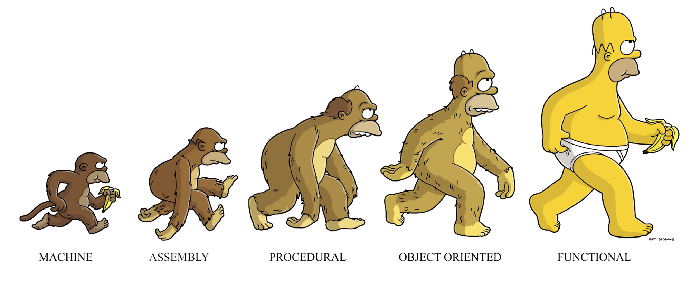

함수형 프로그래밍은 객체 지향 프로그램의 진화 형태가 아닙니다. 서로 쓰임새가 다를 뿐이에요.

오늘은 함수형 프로그래밍에 대해 간단히 알아볼게요.



<!--truncate-->

OPP의 뒤를 잇는 PL 패러다임 중 하나인 함수형 프로그래밍에 대한 강의를 듣고, 저희 프로젝트에서 코드 작성할 때 차용할만한 개념들이 몇몇 있어서 작성해봤습니다.

:::info 참조 영상

💡 [이 영상](https://www.youtube.com/watch?v=e-5obm1G_FY&t=405s)를 요약 및 내 이해를 더해서 작성했습니다.

:::

# 함수형 프로그래밍(Functional Programming)

언어나 코딩 스타일의 측면에서 명령형 프로그래밍, 객체 지향 프로그래밍 등 여러 프로그래밍 패러다임이 많습니다. 함수형 프로그래밍도 그 중 하나이고, 최근에 핫한 인기있는 언어들(haskell, clojure ..)의 작동방식이기도 합니다.

함수형 프로그래밍(Functional Programming, 이하 FP) 패러다임의 핵심은 하나입니다.

:::info 대원칙

💡 모든 코드를 순수 함수(Pure Function)으로 나누어 처리한다.

:::

그럼 순수 함수란 뭘까요?

---

## 순수 함수(Pure Function)

> **Pure Function**은 들어온 input만을 가지고 하나의 동작을 통해 output을 뱉으면서 Side Effect를 발생시키지 않는 함수입니다.

함수형 프로그래밍에서는 Pure Function만 사용합니다. 엄밀히 말하면 최대한 사용합니다. 함수형 프로그래밍 언어에서 Pure Function의 대우는 브라만 계급이라고 볼 수 있습니다. 이와 대조적으로 argument를 3개쯤 받고 Side Effect를 2개쯤 만들며 리턴값도 없는 함수는 수드라입니다.

예를 들어 콘솔함수를 생각해보면 이해가 쉽습니다. 아무것도 리턴하지 않고 콘솔만 찍는다면 return값은 없고 side effect가 발생한 상황입니다.

두번째 예로 전역변수를 변경하는 함수입니다. input으로 아무것도 들어오지 않아도 전역변수를 변경하는 함수는 output이 있을 수 있지만 Side Effect라고 봐야합니다.

```tsx
const MY_NAME = "HJ"
const printName() => {
	conosole.log("HI I`m "+ MY_NAME)
}
```

이 함수는 전역변수 input을 따로 받지 않고 전역변수`MY_NAME`을 받습니다. 즉, 함수 내에서의 연산이 input에 의존적이지 않기 때문에 Pure하지 않습니다. 두번째로, 리턴값이 없다. 그 대신 콘솔을 찍는 동작을 하는데 이는 Side Effect에 해당합니다. 함수 이름에서 보이듯 콘솔을 찍는게 이 함수의 목적이라 하더라도 리턴값이 없다면 Pure하지 않은겁니다.

다음과 같이 바꾸면 FP 패러다임을 적용한 것이고 같은 기능을 합니다.

```tsx
const MY_NAME = "HJ"
const getGreetMessage (name: string): string => {
	const message = "HI I`m" + name
	return message
}
console.log(getGreetMessage(MY_NAME))
```

---

## FP, 그럼 어떻게 하나요?

작은 동작 하나하나를 함수로 정의한다고 생각하면 쉽습니다. assignment나 for loop같은 개념이 존재하지 않거나 [higher order function](https://www.notion.so/Functional-Programming-d3b88ada77144589b1e63350ad82f149)으로 캡슐화되어 있다고 생각하면 편합니다.

예를 들어 명령형 프로그래밍에서 순차적으로 실행되는 간단한 프로그램을 보겠습니다.

```tsx
let name = "HJ";
let greetMessage = "Hi, I`m";
console.log(greetMessage + name);
```

이걸 함수형으로 다시 짜면 다음과 같습니다.

```tsx
const getName(name: string) => {
	return "HI I`m "+name
}
getName()
```

---

# Advanced

## Higher-Order Function (이하 HOF)

함수를 input으로 받거나 함수를 output으로 뱉는 함수를 HOF라고 합니다. 함수는 input을 받아서 output을 리턴하는 것인데, 이 함수 스스로를 객체로 생각하면 함수 또한 input으로 받을 수 있고, output으로 리턴할 수 있는 것입니다. 또한 이 과정은 Curring이라고 부릅니다.

위에서 작성했던 인사하는 함수를 HOF로 만들면 다음과 같습니다.

```tsx
const introduceWithName = (greetMessage: string) => {
    return (name: string)=>{
        console.log(greetMessage + , ", " + name);
    }
}
```

introduceWithName은 greetingMessage라는 string변수를 argument로 받아서, name이라는 string 변수를 받아 콘솔을 찍어내는 어떤 함수를 리턴합니다. 이로써 함수의 계층화가 이뤄졌습다.

같은 맥락으로 함수형 프로그래밍에서 사용하지 말아야 한다고 여겨지는 문법이 for과 while인데, 대신 map이나 reduce, filter같은 HOF에 콜백함수나 인자를 넘겨서 해결하는 것을 권장합니다. FP은 캡슐화와 추상화를 통해 내용을 숨기고 쪼개서 이해하기 쉽게만드는데 이 과정에서 함수라는 도구를 적극 활용한 것이라고 생각합니다.

---

## Avoid Mutability

FP의 기본 개념 중 Avoid Mutability는 '원본 데이터의 변형을 막는다'입니다.

예를 들어 배얼이 하나 있고 이 데이터에 접근해야 한다면 다른 폴더나 같은 파일 내의 변수를 직접 접근하는 것은 문제가 생길 수 있습니다. Shallow Copy가 발생할 수도 있고, 어떤 파일에서 바뀐 상황이 공유가 안되어 다른 파일을 작업하다가 원인을 모르는 데이터 변화에 혼란스러울 수도 있습니다. 즉 디버깅에도 매우 취약하다는 뜻입니다.

예를 들어 javascript의 sort함수를 생각해보면, 어떤 array에 sort를 적용하면 이 함수는 원본 객체를 건드리기 때문에 새로운 array에 리턴을 시킨다고 한들 원본은 이미 변해버린 뒤입니다.

```tsx
let array = [1, 3, 2, 4]; //나는 이 배열을 보존하고 싶지만
const newArray = array.sort(); //이미 원본은 변해버림.

console.log(array, newArray);
//결과 : [1,2,3,4] , [1,2,3,4]
```

그래서 함수형 프로그래밍에서는 원본에는 손을 대지 않습니다. 새로운 메모리에 객체를 복사하고, 이를 가공한 뒤 만들어진 값을 리턴합니다.

```tsx
const GLOBAL_ARRAY = [1, 2, 3, 4];

const popArray = (array: number[]) => {
  let newArray = [...array];
  newArray = newArray.pop();
  return newArray;
};
```

위 코드를 보면, argument를 deep copy하여 newArray에 넣고 함수의 기능을 수행한 뒤 만들어진 값을 리턴합니다. 이로써 원본은 수정되지 않고 함수의 제기능을 수행하였습니다. 어떤 argument가 와도 원본에 변화는 없습니다.

---

## Persistent data structure

바로 위에서 설명한 FP의 원본 보존의 원칙을 지키려면 언제나 deep copy로 객체를 복사해야 한다는 뜻입니다. 하지만 array의 복사는 꽤나 메모리를 많이 잡아먹고 그 크기가 커진다면 감당하기 힘든 수준일 것입니다. 그래서 등장한 것이 영속 자료구조입니다.

영속 자료구조는 원본을 유지하면서도 새로운 객체를 만들어낼 수 있는 자료구조의 형태입니다. 설명에 따르면 Array를 Tree로 변환하는 패러다임을 소개했는데, 다른 타입의 객체들은 어떤지 잘 모르겠습니다. 영상에 따르면 Hash Table에도 적용된다고 합니다.

### Array의 구조공유

:::info 참조 영상

🧹 [링크 영상](https://www.youtube.com/watch?v=e-5obm1G_FY&t=405s) 18:00부터 보세요. 이해하기 훨씬 수월합니다.

:::

리액트의 패러다임과 굉장히 유사한데, 일단 Array와 같은 자료구조를 Tree로 변환합니다. 이 Tree의 리프노드가 array의 element가 됩니다. 만약 이 자료구조에 어떤 변화가 생기면 기존 Tree는 그대로 두고, 노드를 하나 추가합니다. 그리고 이 노드를 기존의 노드들 중 다시 사용할 만한 노드들과 연결지어줍니다.

이 개념을 Structural Share(구조 공유)라고 합니다.

---

### Outro

JavaScript는 애초에 Heskell이나 Clojure같은 Functional Programming Language가 아니라서 이 패러다임을 전부 적용하기는 어렵습니다. 바로 위에서 설명했던 자료구조와 같은 '도구'가 없기 때문입니다. 이를 해소하고자 lodash, ramda, underscore와 같은 FP for JavaScript가 있으니 이를 활용해서 새로운 패러다임을 적용한 프로젝트를 만들어도 좋을 것 같습니다.
