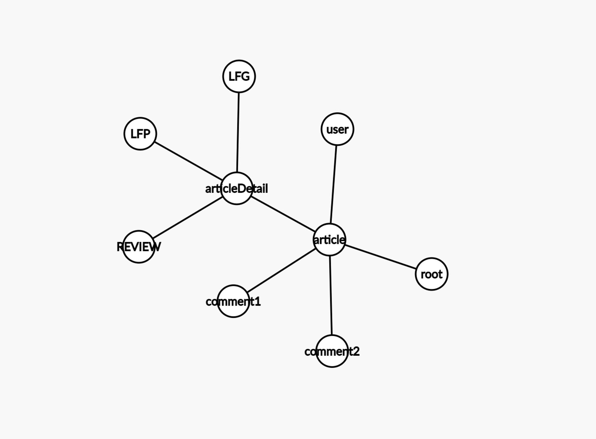
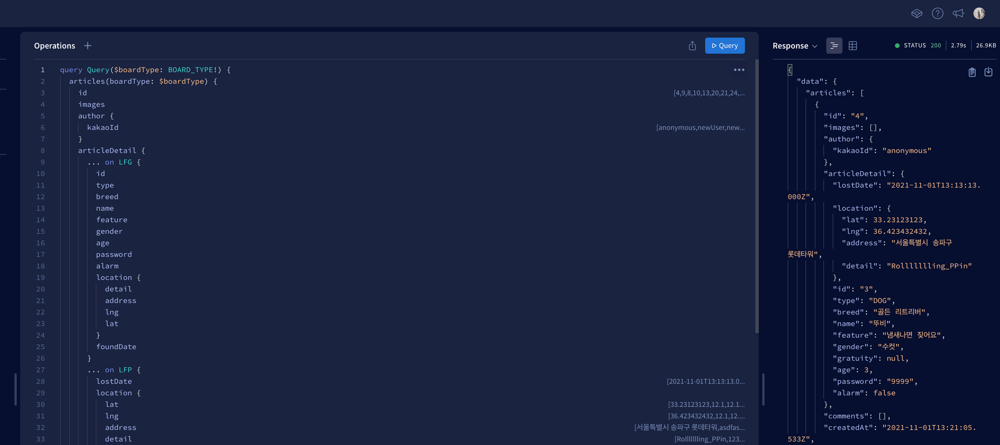
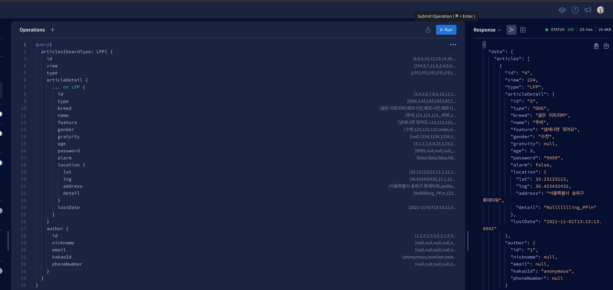
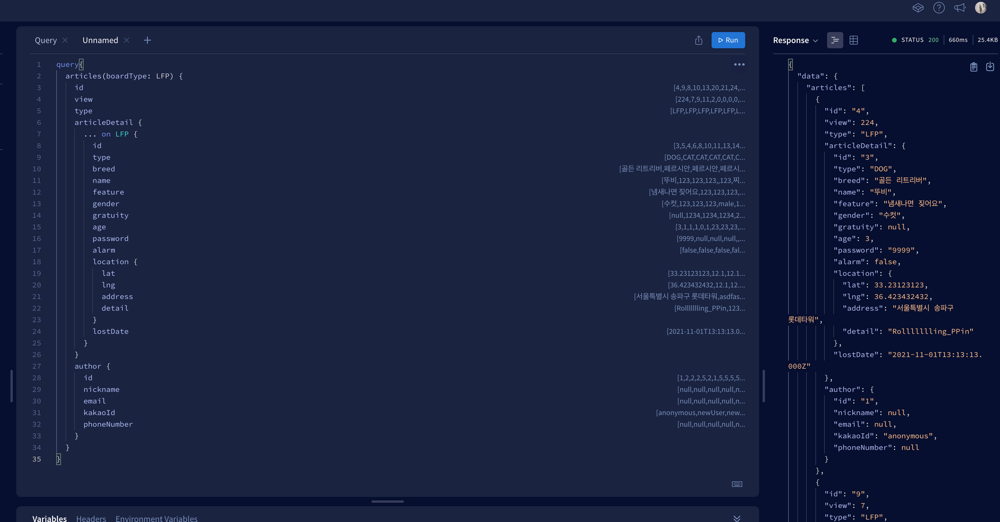
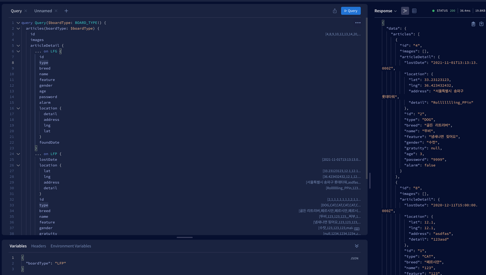

어떻게 써야 graphql을 graphql답게 쓴다고 말할 수 있을까요? 그 안에서 성능을 챙길 수 있을까요?

오늘은 Apollo Graphql에서 소개된 **Resolver Chain**이라는 개념으로 아키텍쳐를 변경해본 사례를 설명해볼게요.

<!--truncate-->

아래 코드는 저희 프로젝트에서 게시글을 가져오는 gql 쿼리입니다.

```tsx
import { ApolloError } from 'apollo-server-errors';
import { knex } from '../../database';

const articleQueries = {
    articles: async (_: any, args: any) => {
        try {
            let rawArticles: any[] = [];
            if (args.boardType === 'REVIEW') {
                rawArticles = await knex(args.boardType)
                    .join('article', `${args.boardType}.article_id`, 'article.id')
                    .join('user', 'article.user_id', 'user.id')
                    .select(
                        '*',
                        'article.created_at as article_created_at',
                        'article.updated_at as article_updated_at',
                        'article.id as article_id',
                        'user.id as user_id',
                        `${args.boardType}.id as id`,
                    );
            } else {
                rawArticles = await knex(args.boardType)
                    .join('article', `${args.boardType}.article_id`, 'article.id')
                    .join('user', 'article.user_id', 'user.id')
                    .join('breed', `${args.boardType}.breed_id`, 'breed.id')
                    .select(
                        '*',
                        'article.created_at as article_created_at',
                        'article.updated_at as article_updated_at',
                        'article.id as article_id',
                        'user.id as user_id',
                        'breed.id as breed_id',
                        `${args.boardType}.id as id`,
                    );
            }

            const rawImages = await knex(args.boardType).join(
                'image',
                `${args.boardType}.article_id`,
                'image.article_id',
            );

            const images: any = {};
            rawImages.forEach((rawImage: any) => {
                if (images[rawImage.articleId]) {
                    images[rawImage.articleId].push(rawImage.url);
                } else {
                    images[rawImage.articleId] = [rawImage.url];
                }
            });

            const articles: any[] = [];
            rawArticles.forEach((rawArticle: any) => {
                const {
                    articleId,
                    breedId,
                    view,
                    userId,
                    kakaoId,
                    email,
                    phoneNumber,
                    nickname,
                    articleCreatedAt,
                    articleUpdatedAt,
                    ...articleDetail
                } = rawArticle;

                articles.push({
                    id: articleId,
                    type: args.boardType,
                    view,
                    images: images[articleId] || [],
                    author: {
                        id: userId,
                        kakaoId,
                        email,
                        phoneNumber,
                        nickname,
                    },
                    articleDetail: { ...articleDetail, articleType: args.boardType },
                    createdAt: articleCreatedAt,
                    updatedAt: articleUpdatedAt,
                });
            });
            return articles;
        } catch {
            console.error('Articles에서 에러발생');
            console.trace();

            throw new ApolloError('DataBase Server Error', 'INTERNAL_SERVER_ERROR');
        }
    },
```

코드가 길어서 보기 힘들다는 점이나 모든 로직이 하나의 try-catch에 묶여있어 디버거 없이 에러찾기가 힘들다는 점 등 불편함이 있었습니다.

더 중요한 것은 이와같은 형태라면 graphQL을 사용할 필요가 없습니다. GET 메소드 요청을 받고 DB에 SQL을 날려서 가공한 뒤 response에 담아 내려주는 것과 다를게 없기 때문입니다.

또한 코드의 구성을 보면 foreign key로 관계된 모든 데이터를 join으로 가져오면 모든 데이터를 하나의 객체에 넣기 때문에 user, articleDetail, files, 같은 다른 타입 데이터가 혼재되어 있는 상태입니다. 심지어 id나 type과 같은 column은 다른 타입에서도 쓰는지라 as로 다른 이름으로 받아와야하는 불편함도 있었습니다.

## 1차 변경 - Gql 패러다임 적용

GraphQL의 패러다임이란 그레프 이론에서 하나의 node가 하나의 타입(db의 테이블)이 되고 이를 이어주는 edge로 connecting하는 것입니다.

아래는 article쿼리에 필요한 타입 관계입니다.



root쿼리에서 article을 호출하면, user, comment, articleDetail을 가져오고, articleDetail에서는 3개 중 하나로 분기하여 게시글의 상세정보를 가져오도록 구성해야합니다.

하지만 SQL은 테이블의 칼럼단위로 정보를 가져오기 때문에 중첩된 데이터를 가져올 수 없습니다. 예를 들어 SQL로 다음과 같은 스키마의 데이터가 있다고 가정해봅시다.

```graphql
type User {
  id: ID
  name: String
  email: String
}
type Comment {
  content: String
  writer: User!
}
type Article {
  title: String
  files: [Upload]
  description: String
  author: User!
  comments: [Comment]
}
```

그리고 다음과 같은 쿼리를 해봅시다.

```graphql
query {
  articles {
    title
    description
    files {
      url
    }
    comments {
      content
      writer {
        id
        name
        email
      }
    }
    author {
      id
      name
      email
    }
  }
}
```

이 쿼리를 처리할 때 한번에 모든 데이터를 가져올 수 있는 SQL 질의문은 join밖에 없습니다. 하지만 join은 모든 데이터를 한 객체안에 때려넣습니다. 그 안에서 id나 createdAt같은 공통값을 다른 이름으로 변환해줘야하고 클라이언트가 원하는 모양(Json)으로 변환한 뒤 내려줘야합니다. 그래서 GraphQL 패러다임에 맞게 리졸버 체이닝이라는 방식으로 구현합니다.

### 리졸버 체이닝(Resolver Chain)

리졸버 체이닝은 특정 타입을 가져올 때 처리의 방법인 리졸버에 타입마다 하위 필드가 어떻게 쳐리될지 정의하여 순차적으로, recursive하게 순회하며 데이터를 가져올 수 있는 방식입니다. 위의 코드를 다음과 같이 바꾸어 보았습니다.

```tsx
articles: async (_: any, args: any) => {
        const { boardType } = args;
        try {
            const articles = await knex('article').where('type', `${boardType}`);
            for (const article of articles) {
                const articleDetail = await knex(`${boardType}`).where('articleId', `${article.id}`).first();
                const breedObj = await knex('breed').where('id', `${articleDetail.breedId}`).first();
                const { breed, type } = breedObj;
                articleDetail.articleType = boardType;
                articleDetail.breed = breed;
                articleDetail.type = type;
                article.articleDetail = articleDetail;
                // TODO : 사진을 내려보내주는 처리가 필요함
                article.images = [];

            }

            return articles;
        } catch {
            console.error('Articles에서 에러발생');
            console.trace();

            throw new ApolloError('DataBase Server Error', 'INTERNAL_SERVER_ERROR');
        }
    },
```

대신 리졸버 정의 또한 수정하였습니다.

```tsx
import { GraphQLUpload } from "graphql-upload";
import { userQueries, userMutations } from "./user";
import { breedQueries, breedMutations } from "./breed";
import { articleQueries, articleMutations } from "./article";
import { knex } from "../database";

const resolvers = {
  Query: {
    ...userQueries,
    ...articleQueries,
    ...breedQueries,
  },
  Mutation: {
    ...userMutations,
    ...articleMutations,
    ...breedMutations,
  },
  Upload: GraphQLUpload,
  ArticleDetail: {
    __resolveType(parent: any) {
      return parent.articleType;
    },
  },
  Comment: {
    author(parent: any) {
      const { userId, kakaoId, nickname, email, phoneNumber } = parent;
      const CommentWriter = {
        id: userId,
        kakaoId,
        nickname,
        email,
        phoneNumber,
      };

      return CommentWriter;
    },
  },
  Article: {
    async author(parent: any) {
      return await knex("user").where("id", `${parent.userId}`).first();
    },
    async comments(parent: any) {
      return await knex("comment").where("articleId", `${parent.id}`);
    },
    async images(parent: any) {
      const articleType = parent.articleDetail.articleType;
      const rawImages = await knex(articleType).join(
        "image",
        `${articleType}.article_id`,
        "image.article_id"
      );
      const images: any = {};
      rawImages.forEach((rawImage: any) => {
        if (images[rawImage.articleId]) {
          images[rawImage.articleId].push(rawImage.url);
        } else {
          images[rawImage.articleId] = [rawImage.url];
        }
      });

      return images[parent.id] || [];
    },
  },
};

export default resolvers;
```

리졸버의 Root타입인 Query와 Mutation 이외의 필드 타입이 생겼습니다. 아래에 Article을 먼저 보면, Client가 Article의 author을 요청하면 해당 로직을 사용하라라는 뜻입니다. Comment 필드를 보면 Comment의 author를 요구하면 다음 로직함수를 사용하라는 뜻입니다. 쿼리를 날려보겠습니다.



리스트에는 필요없는 데이터까지 요청하니 쿼리 한번에 무려 2.7초가 소모되었습니다.

안타깝게도 성능이 매우 좋지 않습니다. 그 이유는 DB에 쿼리하는 요청을 매우 많이 했기 때문입니다. 게시글 갯수가 70개정도 되니, 테이블 조회 횟수만 카운팅해도 article 1회, articleDetail 1회, user 3회, comment 1회인데 70을 곱하고, comment 갯수에 따라 또 하위에 author 필드를 가져오는 연산이 추가됩니다. 이러니 쿼리 한번에 DB 몇백번을 왔다갔다하는 꼴이 되어 엄청난 속도차이가 발생하게 됩니다.

결론적으로 속도차이가 30배 정도 납니다.


join으로 한번에 긁어와서 이것저것 조합하여 내려주는 기본방식 - 22ms


새롭게 적용한 방식입니다. 필요한 정보만 넣어서 쿼리했을 때 - 600ms

이 차이는 comments나 author같은 리스트 데이터엔 필요없는 필드를 빼니 Comment, User 테이블을 다녀오는 시간이 빠지면서 발생한 것 같습니다.

이 정도로도 사용하는데 큰 문제는 없습니다. 다음과 같은 이유때문입니다.

1. 이렇게 많은 데이터를 한번에 가져올 일은 없습니다. 페이지네이션을 해서 내려줄것이고 소팅과 필터를 걸어서 내려줄 것이기 때문입니다.
2. 한번 내려온 데이터는 캐싱되기때문에 다음에 조회할 땐 매우 빠릅니다..
3. 리스트데이터에 꼭 필요한 필드는 몇개 안된다. 쿼리 튜닝을 통해 충분히 속도를 줄일 수 있다.

그렇지만 여기서 쿼리 리팩토링으로 성능을 더 끌어올려보겠습니다.

## 2. 쿼리 리팩토링

🚀 클라이언트, 서버를 나눠서 진행하겠습니다.

### 클라이언트

우선 클라이언트는 리스트용 데이터와 상세화면용 데이터를 다른 타입으로 받아야합니다. 도큐먼트 작성할 때 둘을 구분해서 요청합니다.

리스트용 데이터에는 Article 타입엔 articleDetail 데이터와 공통데이터인 files정도만 있으면 되고 특정 타입(LFP, LFG)은 breed 값도 필요하겠습니다.

그래서 아래와 같이 게시글 하나만 가져오는 getArticle 쿼리는 모든 데이터를 가져오도록 정의해둔 ArticleFragment를 통째로 요청하고, 게시글 리스트에 쓸 데이터인 getArticles 쿼리는 detail데이터와 images, id정도만 요청합니다. 이러면 comments와 author때문에 순회하면서 await resolver가 호출되지 않기 때문에 속도를 확 줄일 수 있습니다.

```tsx
query getArticles($boardType: BOARD_TYPE!) {
    articles(boardType: $boardType) {
        id
        images
        articleDetail {
            ... on LFG {
                ...LFGDetail
            }

            ... on LFP {
                ...LFPDetail
            }

            ... on REVIEW {
                ...ReviewDetail
            }
        }
    }
}

query getArticle($id: ID!) {
    article(id: $id) {
        ...ArticleFragment
    }
}
```

### 서버

이제 서버를 고쳐보겠습니다. 서버에서 DB에 다녀오느라 await으로 잡혀있는 시간이 가장 오버헤드가 큽니다. 이 부분을 줄여보겠습니다.

```tsx
articles: async (_: any, args: any) => {
  const { boardType } = args;
  try {
    const articleDetails =
      boardType === "REVIEW"
        ? await knex(`${boardType}`)
        : await knex(`${boardType}`).join(
            "breed",
            `${args.boardType}.breed_id`,
            "breed.id"
          );

    const articles = articleDetails.map((detail: any) => {
      const { articleId, breedId, ...detailData } = detail;
      return {
        id: articleId,
        articleDetail: { articleType: args.boardType, ...detailData },
      };
    });

    return articles;
  } catch {
    console.error("Articles에서 에러발생");
    console.trace();

    throw new ApolloError("DataBase Server Error", "INTERNAL_SERVER_ERROR");
  }
};
```

먼저 articleDetail 데이터를 찾는데, 이 때 user나 article같은 데이터는 join할 필요가 없습니다. 리스트용 데이터에서 사용하지 않기 때문입니다.

찾아온 데이터를 map으로 순회하며 요구사항대로 JSON 형태를 만들고, articleDetail 필드를 \_\_resolverType이 처리할 수 있도록 articleType을 넣어서 변경해줍니다. 이상태로 쿼리를 날려보면 다음과 같은 개선된 결과를 얻을 수 있습니다.



결과적으로 30~40ms까지 줄일 수 있었습니다.

## 3. DataLoader

저희도 article 1개 당 Comment N개가 붙는 1:N 구조 데이터가 많아서 필연적으로 1+N문제가 발생합니다. DataLoader를 사용하면 event loop에서 promise 요청을 처리할 때 batch로 모아두었다가 한번애 여러개의 요청을 보내는 방식으로 이 문제를 해결할 수 있다고 합니다. 리팩토링 할 때 이 부분도 추가하면 좋을 것 같습니다.

[GraphQL DataLoader를 이용한 성능 최적화 참고 링크](https://y0c.github.io/2019/11/24/graphql-query-optimize-with-dataloader/)

## 4. 쿼리 튜닝

애초에 SQL 튜닝을 통해 full scan이 아닌 indexing을 하도록 변경하여 성능을 끌어올릴 수 있습니다. 이 부분은 전문지식이 필요하다보니 서버 / 클라이언트 리팩토링할 때 다시 진행하겠습니다.

# Outro

Rest를 사용할 때는 SQL만으로 쿼리를 만들어서 데이터를 가져왔는데, GraphQL을 사용하는 만큼 그 개념을 적용해서 쿼리를 변경해봤습니다.
