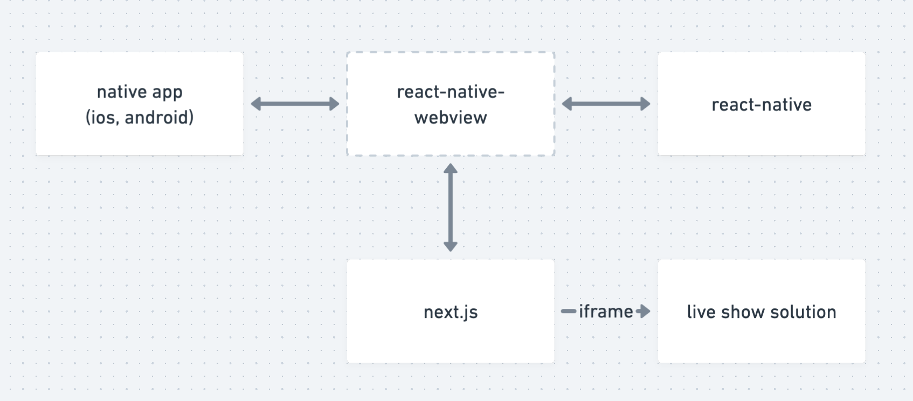

안녕하세요 😆

React Native로 서드파티 라이브러리를 활용한 개발 과정에서 발생한 이슈를 workaround했던 일을 설명드리려고 해요. 이 과정에서 *서드파티 라이브러리*에 대한 관점이 바뀌었고, _비슷한 문제가 발생했을 때_ 어떻게 대응해야하는지 생각해볼 필요가 있겠다는 생각에 이 회고의 글을 남깁니다.

사건의 발단은 웹에서 `iframe`을 활용해 임베딩한 `video` 태그가 Android에서는 잘 동작하는데, **IOS에서 네이티브 플레이어로 풀스크린 재생이 되는 문제**가 발견되면서 부터였습니다. 영상이 재생되긴 하니까 크리티컬하지 않다고 생각했는데, 생각해보니 비디오만 보일 뿐이지 라이브쇼 솔루션 개발사에서 제공하는 **채팅**이나 **구매 플로우**같은 핵심 UI를 IOS 네이티브 플레이어가 덮어버려서 꼭 해결해야겠다고 생각했습니다.

<!--truncate-->

## 뭐가 문제였을까

저희는 Native 앱이 아닌 **React Native**를 활용하고, 이 프로젝트는 **WebView**로 구현해둔 상태였습니다. 즉, 연결다리가 많다보니 어디가 문제인지 확실히 알 수 없어 디버깅에 하루를 통째로 갈아넣었던 것 같아요. 조금은 무식하지만 저는 문제가 될 수 있는 부분들을 전부 까보기로 했습니다. (본격 돌다리 두들기기)

:::info 문제의 구조

당시의 상황은 위 사진과 같습니다.

그래서 다음의 모든 경우의 수에서 에러가 발생할 수 있으므로, 전부 확인해야 했습니다.

- 네이티브 앱 레벨
- React Native & JavaScript 레벨
- 브릿지 역할을 하는 라이브러리
- Webview용 웹페이지
- 라이브쇼 솔루션 회사 제품

:::

### 라이브쇼 솔루션

먼저 가장 빨리 확인할 수 있는 라이브쇼 솔루션을 체크했습니다. 간단한 property만 체크하면 되고, 문제 없으면 이제 **저희 문제**만 확인하면 되니까요. 여기서 제공하는 사이트를 임베딩해서 쓰는 방식이었으므로 간단히 element만 확인해봤습니다. 예상대로 `video` 태그와 `div` 태그들 뿐이었습니다.

`vidoe` tag의 property 중에 `playsinline`이라는 값이 있는데, 이 값이 중요합니다. true로 되어있는지를 확인해야 했거든요. 이 값이 true가 아니면, video 태그가 네이티브 플레이어로 재생됩니다. 보시는대로, 솔루션 업체는 명확하게 이 값을 true로 지정해 두었습니다. 즉, 솔루션쪽은 전혀 문제가 없다고 판단했습니다.

### 웹

다음은 웹에서 `iframe`으로 라이브쇼 솔루션을 임베딩하는 코드를 살펴봤습니다. 사실 이 부분은 볼 필요가 없었던게, `iframe`으로 솔루션 업체에서 제공하는 url을 임베딩하는 코드 말고는 없다고 봐도 무방했기 때문에, 몇몇 불필요한 property가 있는지만 확인했습니다.

공식문서를 확인해보니, `allowFullscreen`같은 property가 있었는데, 이 문제를 해결하는데에는 효과가 없었습니다. 그래서 웹도 큰 문제가 없다고 판단했습니다.

### 앱(React Native)

앱에서는 `react-native-webview`라는 라이브러리를 통해 네이티브 웹뷰 클래스를 호출해 웹으로 만든 사이트를 띄우도록 되어 있어요. 문제가 있다면 라이브러리에 특정 기능을 활용하지 않아서라고 생각하고, [라이브러리 공식문서](https://github.com/react-native-webview/react-native-webview/blob/master/docs/Reference.md#allowsinlinemediaplayback)를 살펴봤습니다.

> 찾았다 요놈!

쭉쭉 내리다 보니 제가 찾고있던 property가 딱 있었습니다. property 이름에서 느낌이 와닿지 않아 찾는데 시간이 좀 걸렸습니다. ㅠ

그럼 이 값을 true로 주면 당연히 되겠지 했는데,

무슨 이유인지 실행해보니 **동작하지 않았습니다**. 왜 이 때 라이브러리가 잘못되었다고 생각하지 않았는지 후 ..

### 앱(네이티브 - IOS)

일단 문제는 해결해야겠으니, 마지막으로 네이티브 레벨로 내려왔습니다.

다행히 이 이슈가 React Native 레벨 문제라고 하더라도, 실행 로직이 아니다보니 가장 낮은 레벨인 Native 레벨에서 configuration 정도는 강제로 변경할 수 있다고 생각했습니다.

React Native에서 Native Module을 활용하는 라이브러리는 IOS의 Pods에서 관리됩니다. objective-c로 작성되어 있는데, RN 레벨에서는 확장자가 .h인 **header 파일**만 존재하고, Native 레벨에서는 확장자가 .m인 **구현체 파일**까지 존재합니다.

.h 파일은 사용할 변수나 메소드를 정의하고, .m은 이를 바탕으로 변수 및 get, set 메소드를 자동생성해줍니다. 저는 이 중에서 제가 필요한 property인 `allowsInlinePlayback`이라는 변수를 set하는 메소드가 동작하지 않는다고 가정하고, assignment 부분을 initialize처럼 동작하도록 강제했습니다.

아래는 이와 관련된 깃 이슈에 올린 솔루션입니다.

이렇게 수정한 결과, 문제없이 동작했습니다. 해결한 다음날이 라이브쇼 첫방송이다보니 퇴근 직전에 문제 해결하고 긴장이 쫙 풀렸던 기억이 납니다. 😵‍💫

## 알고보니 라이브러리가 문제였다.

당장 급한 불을 껐으니, 진짜 문제를 해결하기 위해 마지막으로 라이브러리를 확인해봤습니다.

`react-native-webview`는 react-native에서 비공식이지만 권장하는 webview 기능이기 때문에 오류가 있을 것이라고는 상상도 못했습니다. `react-native-webview` 깃허브에 이슈를 확인해보니 [비슷한 이슈](https://github.com/react-native-webview/react-native-webview/issues/2544)가 있어 comment를 남기고 소통을 시도했지만 별 소용이 없었어요.

> 공허하다..

### 그럼 직접 까보자

사실 거의 공식 라이브러리다보니 문제가 있을거라는 **의심**도 없었고, 해결할 것이라고는 **기대**도 하지 않았습니다. 그래서 마지막에 확인했던 것이었어요.

:::tip react-native의 커뮤니티급 라이브러리
이런 커뮤니티급 라이브러리는 보통 React Native로 Android나 IOS 네이티브 코드를 조작하는 라이브러리입니다. 가령 `react-native-webview`는 Android Webview클래스와 IOS의 WKWebview 클래스를 직접 조작해요. 아래 사진과 같이 동작합니다.

즉, 목적이 React Native 개발자가 WebView같은 네이티브 클래스를 네이티브 코드 조작 없이 다룰 수 있게하는 라이브러리입니다.

위 사진과 같이 리액트 네이티브에서는 기본으로 제공하던 기능을 특정 기능을 모듈로 분리해 **커뮤니티급 라이브러리**로 관리합니다. React Native 공식 홈페이지를 보면 위와 같이 안내하므로, 비공식이지만 **기본 제공 기능**처럼 활용하곤 합니다.

:::

### 코드 부검 시작!

먼저 React Native단에서 넘겨주는 property를 확인했습니다. 문서에 적힌대로 대부분 잘 받아오는 것을 볼 수 있었습니다.

아래 사진은 위에서 받아온 props를 여차저차 가공을 하거나 그대로 받아서 실제 Native Module의 Webview 클래스 구현체를 만드는 과정입니다.

잘 보면, 위에서 받아온 property 몇개가 아래로 전달이 안되고 있었습니다. 저는 당연히 제가 잘못 본 줄 알았는데, 진짜더라구요. 실제로 확인을 해보기 위해, React Native 레벨에서 `node_modules`에 다운받아져있는 라이브러리를 직접 수정 후 결과를 확인해봤습니다.

결과는 아주 잘 나왔습니다. 즉시 정상적으로 동작했습니다.

### 오픈소스에 기여

이 문제때문에 고통받는 개발자가 몇분 있었고, 다행히 제가 해결했으니 [Pull Request](https://github.com/react-native-webview/react-native-webview/pull/2548)를 날려서 오픈소스에 기여해보기로 했습니다. 일단 [공식 repository](https://github.com/react-native-webview/react-native-webview)를 fork받고, 수정사항을 확인한 뒤 포맷에 맞춰 commit을 날리고, upstream branch로 pull requset를 올렸습니다.

너무 제가 필요한 부분만 고치게 될까봐, IOS Developers의 [WKWebview Class 공식 문서](https://developer.apple.com/documentation/webkit/wkdownload/3727342-webview/)를 확인하고 추가로 수정해야할 사항이 있는지 확인한 뒤, 추가 수정사항을 반영해 PR을 올렸습니다.

아래 코멘트는 이 라이브러리의 메인테이너인데요, 리팩토링하다가 누락했다고 합니다 😇 (내 귀한 시간 ..ㅎ)

여하튼 여차저차 해서 제 PR이 반영되었습니다.

이와 동시에, 아래 사진을 보면 제 코멘트 우측에 `Contributor` 태그가 생긴 것을 볼 수 있습니다. Contribute는 기여하다라는 뜻인데요. 단어선택을 정말 잘 한 것 같다는 생각이 들었어요 👍 아주 작은 수정이지만, 이 라이브러리에게는 작은 버그가 사라진 셈이니까요.

사실 그것보다도 이 이슈로 고통받던 사람들을 해방시켜줬다는 사실이 더 뿌듯합니다.

이번 대응에는 디버깅에 거의 하루라는 시간을 소모했지만, 이렇게 문제도 해결하고 오픈소스에도 기여할 수 있는 좋은 기회였습니다.

---

## 다음에도 라이브러리에 문제가 있다면?

결론부터 말하면 당장은 방법이 없습니다.

웹이었다면 stable 버전으로 바꿔서 배포하거나, fork하고 조금 수정해서 배포하면 됩니다. 하지만 앱이라면 문제가 다릅니다. hotfix가 불가능하기 때문이에요. 배포하기까지 심사를 거쳐야하고, 영업일 기준 1~2일이 소요됩니다.

### Code Push

React Native나 Flutter같은 하이브리드 앱의 장점 중 하나는 네이티브 앱에서는 불가능한 hotfix가 가능하다는 점입니다. 하지만 코드푸시도 네이티브 코드를 고치거나 패키지 버전 변경같이 설치할 때 진행되는 프로세스에 포함되는 코드는 수정할 수 없습니다. 즉, 코드푸시로도 라이브러리 오류 문제를 해결할 수 없습니다.

### fs 모듈

노드 실행환경에는 기본 api들이 제공되는데, 그 중 fs라는 모듈이 있습니다. file system에 접근하게 해주는 모듈인데, 이 모듈로 런타임에 node_modules을 수정할 수 있지 않을까 생각해봤는데요, 생각해보니 앱을 설치하는 순간 앱은 node_modules를 각각 플랫폼에 맞는 형태로 변환합니다.

:::tip 플랫폼별 node_module 변환
IOS → Pods

Android → AndroidX
:::

그래서 런타임에는 node modules에 접근할 수 없습니다.

### react-native-fs

[react-native-fs](https://github.com/itinance/react-native-fs)는 네이티브 코드 레벨에서 file system에 접근할 수 있게 해주는 라이브러리입니다. 안타깝게도 라이브러리와 직접 연관되어있는 **Pods**에는 접근이 되지 않는 것 같았고, Download 폴더, Library 폴더, Document 폴더 등에는 접근 가능한 것으로 확인했습니다. 이마저도 런타임에 파일을 고치기보다는 파일 업로드나 Native 레벨의 정적 asset에 접근하는 용도로 활용합니다.

이번에 방법을 찾았더라면 **React Native** + **Code Push**의 효과를 극대화할 수 있을 것이라 생각했는데 그렇지 못해 조금 아쉽긴 합니다. 두 플랫폼 다 node_modules라는 개념이 프리빌드 페이즈에서 사라진다는 점 때문에 런타임에 뭔가를 수정한다면 `react-native-fs` 뿐이긴 합니다면, 네이티브 코드가 수정되어 빌드되고 반영되는지를 확인을 해보지 못해서 아직 명확하지 않고 되더라도 네이티브 개발을 할 줄 알아야하니 그리 효율적인 방법 같지는 않습니다.

---

## 의존성과 종속성에 대하여

이번 사태로 배운점이 있다면 **의존성**과 **종속성**을 조절하지 못하면 언젠가 문제가 생기고, 우리는 이에 대한 해결책을 가지고 있어야한다는 점입니다. 실제로 이번 라이브쇼 프로젝트는 자사 서비스가 아닌 제휴사와의 계약사항이었고 릴리즈 날짜가 픽스되어있는 작업이었는데, 사용하는 서드파티 라이브러리로 인해 정상 서비스를 할 수 없는 사태가 발생했을 때, 그 책임을 이 오픈소스가 짊어지지 않습니다.

### 큰 라이브러리도 틀릴 수 있다

이번에 문제가 되었던 라이브러리는 [react-native-webview](https://github.com/react-native-webview/react-native-webview)입니다. 월 다운로드수가 150만이고, star는 4700개네요. 굉장히 크고 활발히 유지되는 라이브러리라 볼 수 있습니다.

이 정도의 커다란 라이브러리에서도 장애가 발생합니다.

### 뭐든, 도입할 땐 신중하자

우리는 개발공수를 줄이기 위해 라이브러리를 가져다 사용하곤 합니다. 라이브러리는 복잡한 기능을 간단히 **모듈화**해주고, **관리해야할 코드를 줄여주는** 장점을 가지고 있습니다.

하지만 어떤 문제를 야기할지 모릅니다. 그리고 문제가 발생했을 때 **손을 쓸 수 있는 방법이 많이 없고**, 그 문제를 발견하는데 오랜 시간이 걸릴 수 있습니다.

그러므로 새로운 라이브러리를 도입할 땐 팀원들 간의 합의가 필요하고, **꼭 필요한지** 검증하는 단계가 있어야하며 그렇지 않다면 최대한 **안정적인 라이브러리들을 활용해서 구현**해야한다고 생각합니다.

### 핵심 기능은 우리 손에 있어야 한다.

각 서비스에서 코어 패키지가 있을겁니다. 가령 비디오 영상 플렛폼에서는 비디오 플레이어 라이브러리가 될 것이고, 쇼핑몰 앱에서는 그리드 뷰가 될 수 있겠습니다. getcha의 코어 패키지는 웹뷰와 탭뷰입니다.

이번 `react-native-webview`이슈와 비슷하게, `react-native-tab-view`도 오작동 이슈가 있었습니다. 메이져 업데이트를 하고나니 컨텐츠가 보이지 않는 치명적인 버그였습니다. 당장은 동작하도록 수습은 해두었지만, 이 부분은 아직도 레거시로 남아있습니다.

핵심 기능을 우리가 직접 구현하지 않으면, 이런 문제는 반복될 수밖에 없습니다. 저는 라이브러리를 가져다 사용하는 것 자체가 **기술부채**라고 생각합니다. 기술부채에서 **부채**라는 단어는 빚을 낸다는 뜻인데, 문제 해결을 위해 기술적으로 미래에 갚아야 할 빚을 만드는 것입니다. 나보다 훨씬 뛰어난 개발자가 나보다 더 잘 만든 패키지를 제공해준다는데 뭐가 문제냐 할 수도 있겠지만, 언제까지 그 개발자가 패키지를 유지해줄지는 보장할 수 없습니다.

물론 모든 기능을 최소한의 패키지만 사용해서 개발하는 것은 불가능에 가깝습니다. 하지만 그 선은 내부 합의로 정해야 하고, 같은 기능이라도 어떤 라이브러리를 사용할지에도 신중해야합니다.
