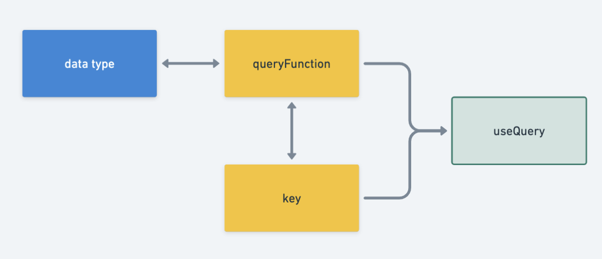
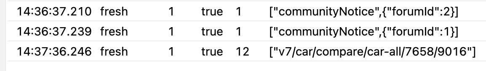
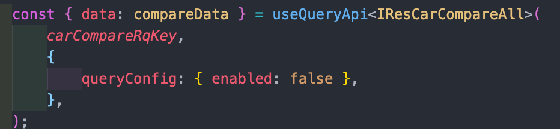
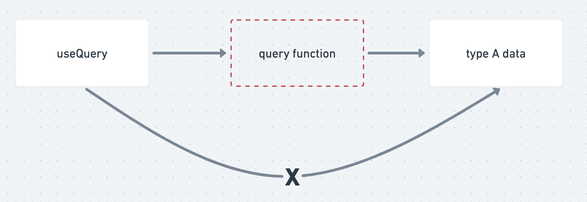
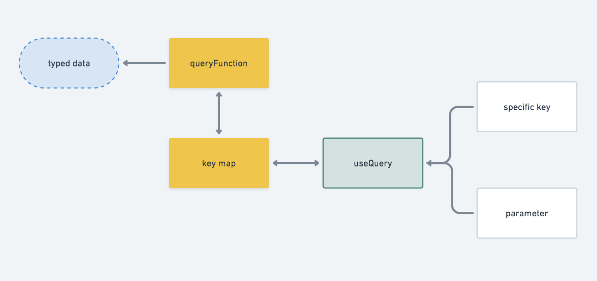
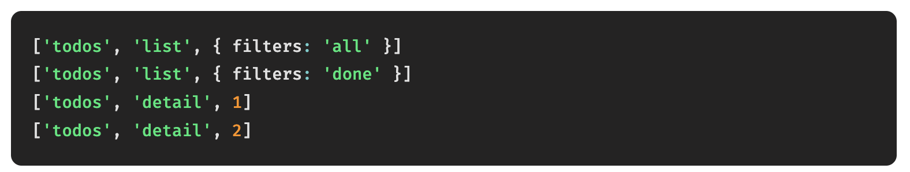
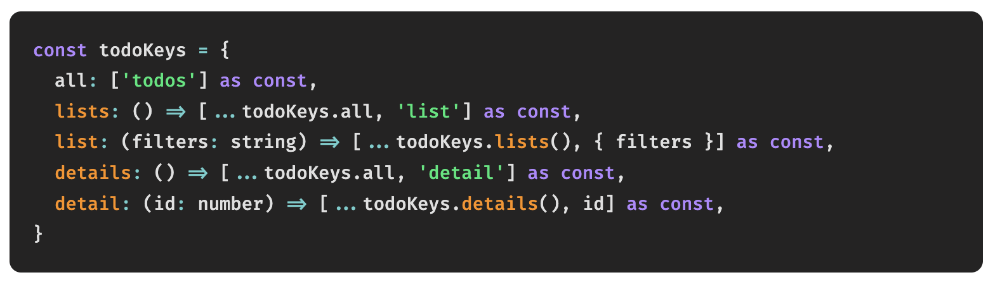
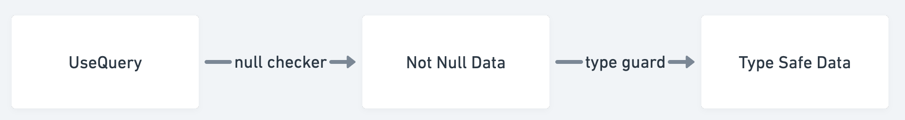

안녕하세요. 😜

오늘 알아볼 것은 react query를 더 잘 쓰는 방법입니다. 이미 잘 만들어진 라이브러리지만, typeScript를 쓰고 쿼리 키와 쿼리함수를 관리하는 관점에서 어느정도 구조와 규칙을 정할 필요가 있었어요.

<!--truncate-->

react query는 서버 사이드 상태 관리를 위한 도구입니다. 상태 관리 도구들은 동기로 동작하기 때문에 비동기로 서버 상태를 조회해서 넣어주는 로직들은 saga같은 미들웨어로 구현할 수 밖에 없었는데요, 그냥 동작 하나 추가하려고 한건데 엄청난 코드를 생산해내야하는 비효율성과, 클라이언트-서버 사이드 상태를 분리한다는 니즈가 생겨서 react-query를 도입하기로 했어요.

본격적으로 Saga 걷어내기 작업에 앞서, **react query**를 효율적으로 활용할 수 있는 방법이 필요했습니다. 현재 작성되어있는 `useQuery Wrapper` 함수가 있긴 한데, 몇몇 부분에서 비효율적이고 **type safe**하지 않다고 생각했기 때문에 전면 수정을 결정한 이상 최적의 모델을 찾고, 이를 활용한 boilerplate를 만들어 공유하는 작업이 선행되어야 했습니다.

:::info 생각해야 할 부분은 다음과 같았습니다.

- **type-safe** 해야한다.
- 계발 레벨에서 생산성이 높아야한다.
- 호출 레벨에서 신경쓰지 않아도 되는 부분은 걷어내야한다.

:::

이렇게 정의된 `useQueryApi`를 참고해서, `useQueries`, `useInfiniteQuery`, `useMutation`를 정의하는 것이 목표입니다.

---

## 현재 상황

현재 useQuery를 감싸서 만든 함수가 정의되어있고, 내부에서는 Axios를 활용한 Api Client 인스턴스를 React Query로 호출하는 형태입니다. 이 훅이 하는 일은 key와 parameter를 받아 여러 처리를 하고 API 인스턴스를 선언하여 호출하고 그 결과를 반환합니다.

```tsx
const useBaseQueryApi = <Res, Req = undefined>(
  key: TQueryKey<Req> | string,
  config?: IConfig<TQueryConfig<Res, Req>>,
) => {
  // [url, parameters] 형태로 넘어왔는지 여부
  const isKeyArray = Array.isArray(key) && key.length > 1;

  // error 처리
  const error = useRef(undefined);
  const isError = useRef(false);

  // baseFetch : Axios 인스턴스
  const apiFetcher = baseFetch((ex: any) => {
    error.current = ex;
    isError.current = true;
  });

  // url, params
  const url = (isKeyArray ? key[0] : key) as string;
  const params = (isKeyArray ? key[1] : undefined) as Req;

  // react-query 실행
  const result = useQuery(
    key,
    async () => {
      return apiFetcher<Res, Req>(url, params, config?.axiosConfig);
    },
    config?.queryConfig,
  ) as UseQueryResult<Res, Error>;

  return {
    ...result,
    error: error.current,
    isError: isError.current,
  };
};
```

---

## 변경해야 하는 이유

### 얕은 결합성

`useQuery`에서 `key`, `queryFunction` 은 `required` 입니다. 즉 두 parameter는 하나의 `useQuery` 훅을 구성하는 요소이고 이 호출단위로 cache가 관리됩니다. 이 말은 `key`와 `queryFunction`은 하나의 세트이기 때문에 명확히 묶어서 관리해야 한다는 뜻입니다. 하지만 현재 사용방식을 보면 데이터의 type 정의와 queryFunction, useQuery가 따로 관리되고 있습니다. 셋은 하나로 관리되어야 합니다.



> useQuery의 구조

### Key



> cache의 일부분

현재 `key`는 `queryFucntion`의 Endpoint로 관리되고 있는데, 이건 현재의 방식을 조금 수정해서 사용하면 될 것 같습니다. 다만, 저희가 `version`과 `baseUrl`을 각각 3개씩 쓰고 있는데, 이 부분은 `queryClient`를 정의할 때가 아닌 `queryFunction` 레벨에서 정의되어야 할 것 같습니다.

:::tip 이런 형태도 생각해볼 수 있습니다.

`version`-`baseUrl`-`endPoint`로 쿼리함수가 정해지니까, 이 형태로 tree를 만들 수 있습니다.

:::

다만, key 자체는 우리가 constant를 정의하듯, `queryFunction` 이름을 정하듯 한눈에 들어오는 이름을 사용하는게 좋아보입니다. 가령 위에서 `communityNotice, {forumId: 1}`이 `v7/car/compare/car-call`보다는 낫습니다. 왜냐하면 endpoint는 endpoint일 뿐 key가 아니고, 그냥 endpoint를 key로 활용하는 것 뿐이니까요.

또한 parameter는 key와 분리해서 array로 관리되어야 합니다.

### type

현재는 데이터가 리턴하는 데이터의 타입을 사용부에서 제네릭으로 적용합니다. 그렇기 때문에 **type-safe**하지 않습니다. 이 부분은 더 낮은 레벨인 `queryFunction` 레벨에서 정의되어야 합니다. **queryFunction**이 리턴하는 데이터는 서버로부터 정의되기 때문에 서버만 정확히 작동하면 **명확**하고, **type-safe**하기 때문입니다.



위 사진은 현재 활용중인 `useQueryApi`입니다. Response Type이 `IResCarCompareAll`이라는 타입의 데이터로 assersion 되고 있습니다. `useQueryApi` 코드를 확인해보면 `queryFunction`의 입출력 타입과 관계없이 해당 useQuery의 Response Type으로 대입해버립니다.

하지만 useQuery의 Response Type은 `queryFunction`의 Response Type에 종속되므로, useQuery의 Response Type은 queryFunction의 Response를 받아서 사용해야합니다.



### Api Client가 혼재함

저희 서비스는 Axios 인스턴스를 3개나 사용하는 특수한 상황에 놓여있습니다. 그래서 `useQuery` 훅 내에서 axios 설정 및 관리를 할 필요가 없다고 생각합니다. 또한 useQuery는 axios랑 관련이 없기 때문에 더더욱 의존성을 덜어내야 할 부분입니다.

:::caution
axios는 `queryFunction`과 관련있습니다.
:::

즉, 현재 상태에서 `useQuery`는 Api Client의 옵션을 받을 필요가 없습니다. 이 부분은 `queryFunction`의 영역이기 때문에 `queryFunction` 정의 부분에서 명확히 정의되어야 합니다.

---

## 어떻게 변경할까?

결론적으로 제가 제안드리는 방식은,`key-queryFunction`을 hash-map으로 관리하고 `useQueryApi`를 재정의하여 key와 parameter만 주입하면 특정 타입 데이터를 받도록 하는 방식입니다.



> 제안하는 방식

1. key와 parameter를 useQuery에 넘긴다.
2. useQueryApi는 keyMap에서 queryFunction을 조회해서 함수를 가져온다.
3. queryFunction에 parameter를 넘겨 useQuery 호출하면 type이 보장된 데이터를 받을 수 있다.

과정만 보면 현재 사용방식과 크게 다른점이 없지만, key의 값이 현재와 같이 endpoint가 아닌 specific한 문자열이 되고 그 문자열은 fetch 함수와 연결되어 있다는 차이점이 있습니다.

### useQueryApi

```tsx
import { queryMap } from 'queryMap';

const useQueryApi = (keys, params, config) => {
  const queryKey = [...keys, params.toString()];

  if (!queryMap.has(keys)) {
    throw new Error('쿼리함수가 정의 되어있지 않습니다');
  }

  return useQuery({
    ...config,
    queryKey,
    queryFn: queryMap.get(keys),
  });
};
```

### Custom Hook

`useQueryApi`를 수정해서 현재 사용하고 있는 Redux-Saga를 React Custom Hook으로 구현하는 방법입니다.

일단 훅은 **Type 단위**로 생성합니다. 특정 타입 데이터를 CRUD하는 과정이 이 파일 하나에서 모두 이루어집니다.

또한 데이터를 가져와서 정제된 데이터를 주기 전까지 과정이 모두 이루어집니다. 이 과정이 모두 Saga에서 이루어졌는데, Custom Hook으로 대체할 수 있습니다. 가령 다음과 같은 형태가 될겁니다.

```tsx
// Car 데이터를 가져오는 쿼리.
const useFetchCar = () => {
  const { data: cars, isError } = useQueryApi(
    ['carList'],
    { page: 0 },
    { enabled: false },
  );

  if (isError || cars.length === 0) {
    toast.show('차량 데이터에 문제가 발생했어요.');
  }

  return cars.filter((car) => !car.disable);
};
```

### key-queryFunction 매핑

JavaScript의 자료구조인 [Map](https://developer.mozilla.org/en-US/docs/Web/JavaScript/Reference/Global_Objects/Map)을 사용할것입니다.

Map은 Object와 비슷하지만 다양한 차이점이 있습니다.

그 중, key의 type을 정할 수 있다는 점이 있습니다. string만 들어올 수 있는 Object와 달리 Map은 key의 타입을 정할 수 있습니다.

```tsx
const QueryKeies = ["carList", "post", ...]

const queryMap = new Map({

})
```

함수 하나 당 키를 추상화하는 방법입니다. 아래 예시를 보면 페칭 쿼리가 뭔지는 모르겠지만 `todos라는 쿼리를 list로 가져오며 all 필터를 적용한다`. `상세 데이터를 가져오되 2번 id 데이터를 가져온다` 등의 명확하면서 강력한 추상화가 적용된 모습을 볼 수 있습니다.



key-callback 조합은 현재의 Constant 관리방법처럼 매우 길어질 가능성이 있습니다. 이를 key tree로 만들 수 있을겁니다. 아래는 함수 하나 당 query key를 여러개 만드는 예시입니다.



> 출처: react-query 메인테이너 블로그

### error 처리

react query를 호출하는 과정에서 발생하는 에러에 대한 처리도 같이 해주면 좋겠습니다.

저는 앱 내의 모든 에러를 처리하는 **error center**를 만들면 좋을 것 같습니다. 여기서는 react query가 던지는 표준에러와 그 에러를 어떻게 처리할지에 대한 콜백함수를 같이 받습니다.

:::tip 간단한 예시

- 에러 처리 콜백 함수가 들어오면 그 기준에 따라 에러를 처리합니다.
- 에러 처리 콜백함수가 들어오지 않으면 기본 에러 처리 기준에 따라 처리합니다.
- 콜백함수를 전부 통과했는데도 에러가 처리되지 않았을 때는 어떤 처리를 합니다.
- **404**면 페이지가 없습니다로 리다이렉팅, **500**이면 서버가 죽었어요. **503**이면 와이파이 확인하세요 ….

:::

### nullCheck & typeGuard

useQuery의 데이터를 사용부에 전달하기 전에 최종확인 과정으로 null check와 typeGuard를 거쳐야합니다. 서버의 데이터가 항상 옳은 타입을 뱉을거라는 보장은 없습니다. 실수로 특정 key의 이름을 변경하거나 삭제할수도 있고 엉뚱한 데이터나 타입의 값이 내려올 수도 있습니다. 이런 경우를 마지막 전달하기 전에 검수합니다.



1. null check

   null checking 과정에서는 data가 undefined인지 체크합니다. array여야하는 데이터가 비어있더라도 array인지 까지 확인합니다.

2. type guard

   null check 과정을 거치고 나면 이 데이터가 실제 해당하는 타입인지를 알아야 합니다. id나 title 같은 필수 데이터 타입이 존재하는지, 일정 크기 이상인지 등을 확인해서 type-safe한지 마지막으로 확인합니다.

위 두개 과정을 통과했다면 비로소 해당 데이터는 type-safe하므로 렌더링 부에 전달할 수 있습니다.

---

## 이러면 뭐가 좋아지냐

### key 직관성

key가 endPoint에서 직관적인 이름으로 바뀝니다. 이 이름은 constant 폴더 내에서 관리될 것이며,

### key + queryFn = type safe data

key와 queryFunction을 명확하게 연결해주고, queryFunction이 return하는 데이터가 명확하니 특정 key를 넣었을 때 react query가 리턴해주는 데이터는 typeScript의 관점에서 **명확**합니다.

### saga 대체

저희가 saga를 활용하던 방식을 custom hook으로 대체하면 거의 동일한 기능을 수행할 수 있습니다. redux 문법도 괴랄한데, 잘 쓰이지도 않는 generator 함수를 활용하는 saga의 패턴까지 전부 일반적으로 js에서 활용하는 문법들로 대체가 가능합니다.

### 개발 생산성

useQueryApi에는 그저 key와 parameter만 넘기면 됩니다. key와 [parameter](https://www.typescriptlang.org/docs/handbook/utility-types.html#parameterstype)는 자동완성으로 제공되므로 실수하지 않을 수 있습니다.

## 마치며

명확하게 말할 수 있는 사실은, react query는 **고레벨 라이브러리**라는 점입니다. 데이터를 가져오는 과정을 쉽게 해줄 뿐이지 실제로 데이터를 가져오는 기능은 Axios나 fetch같은 **HTTP Client Instance**입니다. 즉, 데이터의 타입은 react-query 레벨에서 정해지지 않는다는 뜻입니다. 이 사실을 명확히 인지하고 type-safe한 값을 받을 수 있도록 명확한 과정을 거쳐야 합니다.
