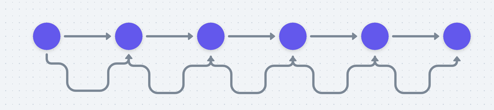

혼자서 작업할 때 Git Flow(깃 플로우)를 생각하는 사람은 없습니다.

깃허브는 다들 아시다시피 굉장히 좋은 툴입니다. 하지만 좋은 클라이언트가 관리까지 잘 해주진 않아요.

최근 빈번하게 발생한 코드 누락 사태와 같은 코드 관리 사고를 겪고 문제의식을 자각하게 되었습니다.

더 큰 문제를 야기하기 전에 곧장 회의를 통해 공감대를 형성하고 간단한 규칙을 정해보기로 했습니다.

<!--truncate-->

저는 회사에서 _upstream_ & _downstream_ 구분없이 메인 레파지토리에서 작업하고 있었습니겟다. CI/CD 및 배포와 관련된 `main`과 `develop` 브랜치가 있고, 이곳으로 여러명이 코드를 병합하는 형태입니다. 그러다보니 병합 간 덮어쓰기로 인한 유실이 빈번합니다. 또한 엄연한 프로덕트 레파지토리임에도 불구하고 많은 브랜치들이 의미없이 방치되어있고, 이를 메뉴얼하게 삭제하는데도 한계가 있다는 문제도 있습니다.

그래서 이번 기회에 깃 관리에 대한 명확한 룰을 정하고 지켜나가는 **터닝포인트**로 만들기로 했습니다.

:::info 📌 목표

1. `git graph` 단순화 (꼭 필요한 커밋들만 모읍시다)
2. 리뷰 문화 만들기 & 클린 코드 & 컨벤션 준수
3. 그 와중에 **속도** 챙기기

:::

## Repository 분리

우선 레파지토리 분리를 고려해봤습니다.

현재 단일 레포에서 모든 작업이 이루어지고 있기 때문에 `git-graph`가 관리가 힘들다는 문제가 있습니다. 의미없는 브랜치들이 즐비하고 그래프가 꼬여서 일이 터지면 디버깅하기도 힘이 듭니다. 그래서 **작업**과 **릴리즈 및 코드관리**를 분리할 필요성이 있다고 판단했습니다. 이 상황은 팀원이 더 늘어나면 더 심해질거에요. 그 상황이 되면 더 엄격하게 관리해야 할 수도 있습니다.

그래서 아래 그림과 같이 현재 Repository에는 `master`, `develop`, `release tag` 만 존재하도록 하는 안을 제안했습니다. 모든 작업은 fork로 복제한 repository에서 pr로 upstream으로 올리도록 하지만 관리자가 따로 있는건 아니고 리뷰 후 승인을 스스로 하도록 하도록요.


이 방식이 필요하다는 것에는 공감했지만 지금 당장 정한 규칙을 팀원들이 잘 지켜만 준다면 **당장의 목표**에는 큰 영향을 주지 않는다는 사실에 공감할 수 있었어요. 그래서 이 방식은 다른 서브 프로젝트에서 체험해보고 도입하기로 했습니다.

## 깃 플로우 도입

깃 플로우(Git Flow)는 깃을 활용하는 매커니즘같은 것인데 명확하게 정해지거나 권장되는 바는 없고 **Best Practice** 정도만 존재합니다. 또한 _github_, _bit bucket_, _gitlab_ 등 git 서비스마다 각기 다른 플로우를 가지고 있습니다.

깃 플로우가 너무 복잡하고 절차가 많으면 잘 안하게되고, 결국 시간에 쫒겨 흐지부지되기 쉽습니다. 그렇다고 너무 간단하면 관리가 되지 않죠.

아래 그림은 깃 플로우를 설명하는 대표적인 도표입니다. 놀랍게도 저희가 이미 하던 방식과 유사했습니다. 이 방식은 따라하기 번거롭다고 하던데, 저희는 이대로 하고 있어서 문제 없이 적용하기로 했습니다.


이를 저희 작업방식대로 변환하면 다음과 같아요. 잘 지켜지지 않던건 리뷰 정도인데 이번 기회를 통해 적절한 수준에서 리뷰도 하기로 했습니다.


---

## 깃 규칙 정하기

수많은 깃 액션들을 할 때, 지켜야할 규칙을 명확히 정의했습니다.
`branch` 생성, `commit` 생성, `push` 등등 많은 명령어를 기계적으로 입력하지 않고, 규칙에 의거하기 위함입니다.

### branch

위에서 언급한 **up & down stream** 방식을 쓰지 않는다면 `branch`를 적절히 만드는 것이 중요합니다. 깃 그래프에 브랜치가 여러개 있을 때 작업 상황을 보기 편하기 때문입니다.

1. 명명 규칙

브랜치는 기능단위가 아닌 작업단위입니다. 해당 브랜치에서 어떤 일이 일어나고 있는지 간단히 알려주고, 병합되면 사라지는 개념이기 때문에 큰 무게를 두지 않고 다음과 같은 간단한 룰을 정했습니다.

:::info ❓ 이름 규칙

    main -> 최신화된 코드 (운영서버 자동배포)

    develop -> 개발용 코드 (개발서버 자동배포)

    release -> 릴리즈 (태그로 관리)

    feature -> 기능개발

_name + ‘/’ + 설명 (이슈 있다면 지라 티켓 사용)_

:::

2. 생성 규칙

   1. 항상 develop 브랜치에서 생성한다.
   2. 생성 전 develop branch가 최신 상태임을 확인한다.
   3. 명명규칙은 위 6개 항목만 사용한다.
   4. hotfix는 main에서 생성한다

:::note 새로운 브랜치 develop-web

현재 회사에서 활용하는 웹 서비스는 react-native를 웹으로 포팅한 mobile-web입니다.
그리고 브랜치에 코드가 병합되는 순간 mobile-web이 배포되는 상황인데요, 앱은 배포해도 되지만 웹은 배포하면 안되는 코드가 테스트 목적으로 develop 브랜치에 올라갔다가 배포되는 일이 빈번했습니다.

그래서 develop 브랜치를 두개 두자는 의견이 나왔습니다. 앱 테스트용과 웹 테스트용으로 두는 것이죠. 하지만 코드가 꼬여버릴 수 있다는 문제로 일단은 현상 유지하기로 했습니다. 추후 더 큰 문제가 발생한다면 다시 고려해볼 순 있겠네요.
:::

### Commit

`Commit`은 작업 단위로 사용되기도 한 만큼, 해당 커밋에서 무슨 목적으로 어떤 작업을 했는지 명확하게 설명해야합니다. 또한 특정 브랜치에서 작업이 끝난 후 해당 작업으로 돌아갈 수 있는 플래그 중 하나입니다. 내가 없을 때 내가 만든 커밋을 동료 개발자가 볼 수도 있다는 사실을 염두한 단위인 만큼, 명확하게 기록할 필요가 있었습니다. 그래서 커밋 템플릿을 도입하기로 결정했습니다.

[컨벤셔널 커밋](https://www.conventionalcommits.org/ko/v1.0.0/)이라는 사이트를 참고했고, 저희는 너무 많은 종류를 두기보단 직관적인 전략을 선택했습니다. 기능 추가엔 **feat**, 버그 수정엔 **fix**, 리팩토링엔 **refactor**만 사용하기로 했으며 구체적인 내용은 본문에 작성하도록요.

1. commit 메시지는 커밋 템플릿에 따라 간결 & 명확하게 작성합니다.

   ```md
   ################

   # 제목은 50자 이내 / 끝에 마침표 금지

   # 바로 아래 공백은 지우지 마세요 (제목과 본문의 분리를 위함)

   ################

   # 본문(구체적인 내용)을 아랫줄에 작성

   # 여러 줄의 메시지를 작성할 땐 "-"로 구분 (한 줄은 72자 이내)

   ################

   # feat: 새로운 기능 추가

   # fix: 버그 수정

   # refactor: 코드 리팩토링

   ################
   ```

2. 메시지에 한글을 사용합니다.
3. **squash**를 활용합시다.

   목적은 필요한 커밋만 올려서 `git graph`를 깔끔하게 유지하기 위함입니다. 작업 시점에는 여러번 커밋을 올려도 되는데, 프로덕션에 올라갈 때는 `squash`를 통해 단위작업 당 하나로 묶어서 올려줍니다. 가령 작업 기간동안 100개의 커밋을 올렸다면 전부 한번에 올리기보다 **작업 단위**로 20개씩 커밋을 묶어서 올려주면 깃 그래프 보기에도 편하고, 돌아가기도 쉽습니다.

### rebase

코드 유실 사고의 대부분은 이 명령어를 안해서 발생한다고 생각합니다. 최신 코드가 아닌데 브랜치를 만들어 작업 후 합치거나, 합치는 시점에 리모트 브랜치를 받아오지 않고 로컬 브랜치에 병합 후 푸시를 하는 경우 등이 있겠죠.

저희는 그런 상황을 방지하기 위해 작업을 시작하기 전에 **develop을 최신 상태로** 만든다. 작업을 마치고 `pull request`를 날리기 전에 항상 출처 브랜치를 `rebase`해서 `conflict`가 없는 최신 상태로 만들고 pr을 올린다는 규칙을 정했습니다.

이 방식대로 하면 아래 그림과 같이 base 브랜치인 main 브랜치가 한 줄로 유지되는 효과가 있습니다.



### Pull Request

Pull Request는 자유롭습니다. 하지만 리뷰를 위해 간단한 설명을 달아놓기로 했어요. 만약 간단한 수정사항이라면 PR 제목만으로도 설명이 될 것이라고 생각하므로 생략해도 좋다고 합의했습니다.

아래는 PR 템플릿인데요, 리액트 팀에서 활용하는 양식을 그대로 가져왔습니다. 테스트 방법에 대한 부분은 오픈소스 프로젝트라 들어가있던 내용인 것 같은데, 추후 테스트 라이브러리 도입 후 요긴하게 쓰일 것 같아 포함시켰습니다.

```markdown
## 작업 내용 요약

-

## 테스트 방법

-

## 참고사항
```

### Release

develop 브랜치에서, 즉 개발서버에서 검증이 끝났다면 `release branch`를 생성하여 릴리즈를 진행합니다. 저희는 리액트 네이티브 어플리케이션을 활용하기 때문에 릴리즈하는 경우는 `Store Update`와 `Code Push` 두가지 종류가 있습니다.

두 경우에 대해 branch 및 tag 이름에 다음의 규칙을 적용합니다.

```tsx
// Store Update
release/v8.2.0

//Code Push
release/v8.2.0+cp.i100.a200
```

릴리즈가 문제없이 종료되었다면 Tag를 생성하고 릴리즈 branch를 지워줍니다. 릴리즈 브랜치까지 지우는 이유는 **태그**가 그 역할을 할 수 있기 때문이고, 롤백하는 상황이 발생하더라도 커밋 단위로 돌아갈 수 있기 때문입니다.

```tsx
git tag release/

git tag --push
```

이렇게 발행한 태그에 따라 릴리즈를 생성하여 버전을 관리해주면 깃 플로우는 끝입니다.


## 생각해볼 사항과 도구들

### Git Hook

Git Hook은 여러 깃의 액션 (pull, push, commit ...) 등이 일어날 전후 상황을 캐치해서 동작을 하는 훅입니다.

저는 이 동작을 쉽게 제어하기 위해 [husky](https://typicode.github.io/husky/#/)를 사용하고 있습니다. commit이나 push를 하기 전에 특정 스크립트를 실행시켜주는 일종의 방어장치같은 것입니다.

현재 저희는 **pre-commit**과 **pre-push** 두개 활용중이고 *typeScript*와 *prettier*가 적용되어 있습니다.

지금의 코드가 아직 정돈이 되지 않아 깃 훅에 더 많은 스크립트를 추가하면 진행이 안될 것 같아서 지금은 이 정도만 사용하고, 추후 코드를 조금 더 다듬은 뒤 엄격한 규칙을 적용해볼 생각입니다.

### revert

잘못된 작업으로 인해 리셋할 일이 있으면 기록을 위해 `git revert` 명령어를 활용합니다.

### 리뷰

조금 느리게 가더라도 **검증 과정**을 거쳐야 합니다. 다만 팀원들의 자율성을 보장하는 형태로, 리뷰를 마치고 **merge**는 본인이 누르는 방식이 좋습니다. review는 **책임을 전가하는 형태**가 되어서는 안되기 때문이에요. 리뷰의 결과가 어떻든 본인이 생각할 때 좋은 방식과 코드를 병합하는 것이죠.

여러 문서들과 블로그를 보니 다음과 같은 규칙을 정하는 회사들도 있었습니다.

:::info K사 리뷰 규칙

- PR을 할 때 한번에 1000줄을 넘지 않게 한다.
- 리뷰에 감정을 담지 않는다 😆
- 너무 심하지 않으면 효율성 문제는 제기하지 않는다.

:::

저희도 당연히 너무 심한 리뷰나 감정을 담은 태클을 않을겁니다. 반대로 더 나은 서비스 품질과 서로의 성장을 위해 리뷰가 좋은 밑거름이 되었으면 좋겠습니다.

## 마치며

깃 없으면 어떻게 이렇게 여러사람들과 일했을까 싶을 정도로, 깃은 개발자에게 중요한 도구입니다.

하지만 우선 좋은 도구를 잘 다룰줄 알아야 하고, 협업을 위한 도구인 만큼 **모두가 동의한** 적절한 규칙과 관리가 필요합니다.

이처럼 깃 관리 방식을 정할 땐 구성원들이 모두 모여서 이야기하는 시간이 필요합니다. 도움이 되셨으면 좋겠습니다.
