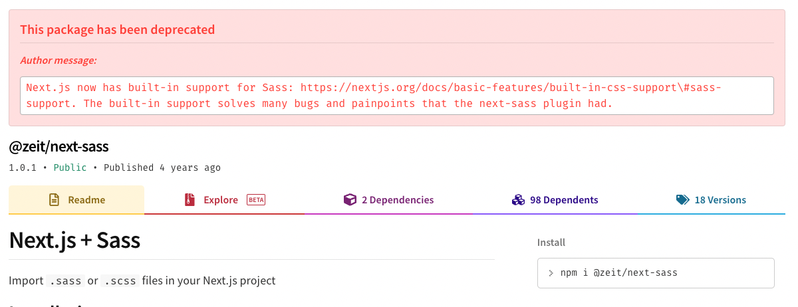
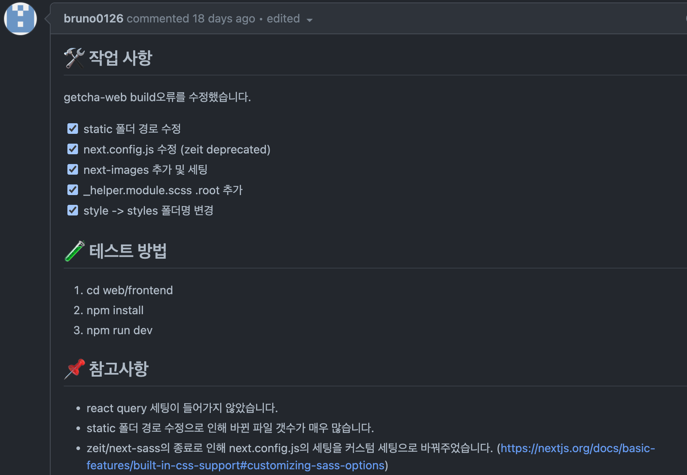
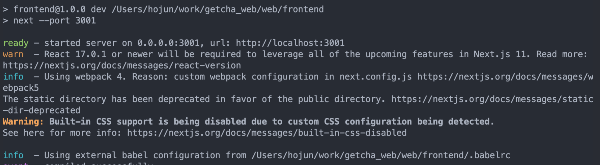
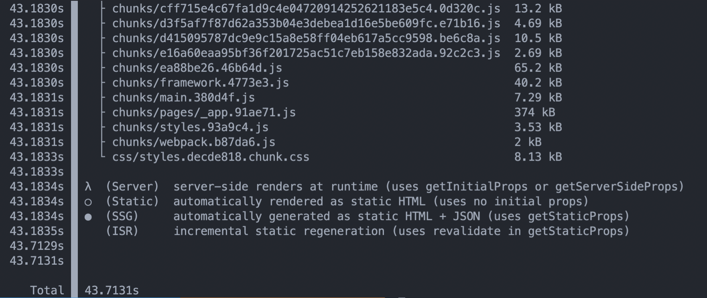
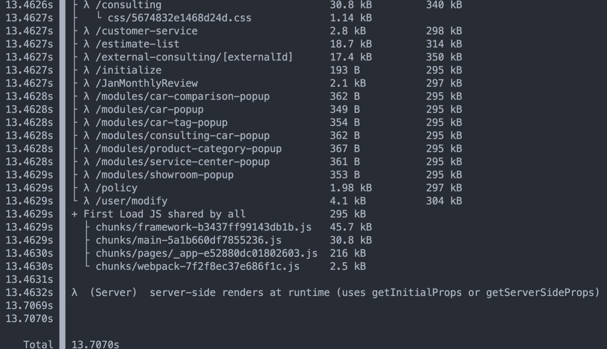
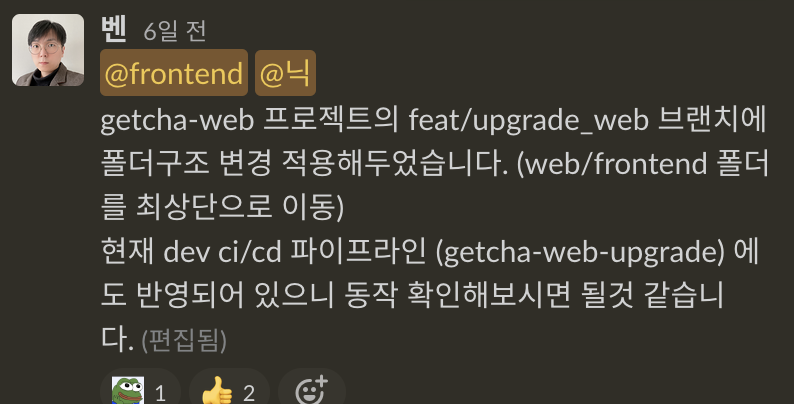
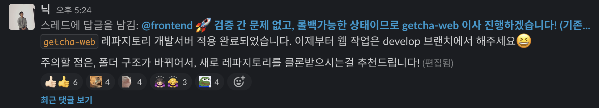

안녕하세요 🙃

잘 동작하는 프로덕트의 버전을 올리는 결정은 굉장히 심사숙고해야 합니다. 당장 빌드가 안될 수도 있고, 라이브러리 의존성 문제가 생길 수도 있으며 지금은 보이지 않더라도 추후에 문제를 야기할 수 있기 때문이죠. 그 때가 되면 되돌리기 힘들어집니다.

하지만 저희가 당면한 문제는 조금 달랐습니다. next.js 9~10 버전을 쓰고 있는 겟차 웹 프로젝트에서 sass 모듈 하나가 3년전부터 지원을 종료했고, 이 문제로 더이상 빌드가 되지 않고 있었기 때문에, 언제 터져도 이상하지 않을 시한폭탄과 같았습니다.



<!--truncate-->

이 문제를 해결하니 다른 문제들이 터져나왔습니다. 현재 sass를 쓰고있지 않지만, 남은 레거시 파일은 동작해야 하므로 next.js에서 제공하는 빌트인 sass 모듈을 사용하려고 하니 결국 버전업을 해야 했습니다.



버전업을 하니 svg 관련 문제로 인해 next-image 라이브러리 세팅을 해야 했고 정적 asset의 위치 관련 워닝을 해결하기 위해 구조를 조금 변경해야 했습니다.

이 뿐만이 아니라 낮은 버전으로 인해 최신 기능들이나 성능상의 이점을 누리고 있지 못했고, 많은 패키지들이 의미없이 번들 크기만 잡아먹고 있었습니다.

그래서 빌드 에러를 해결하는 김에 레거시 청산의 목적과 함께 이전과는 다른 아키텍쳐를 도입하기로 했습니다.

---

## 작업 내용

우선 react와 next.js를 최신버전으로 업데이트 했습니다. 이 버전들을 기점으로 기존의 세팅들을 최신화하고 프레임워크(next.js)가 권장하는 모듈을 사용하고 경고성 메시지들을 수정하는 작업을 진행했습니다.

웹팩 5버전, 사용하지 않아도 되는 바벨, 삭제된 sass 모듈(zeit), next에서 제공하는 빌트인 css 모듈 활용 등



### 컴파일러 변경 (babel → swc)

next.js는 12버전부터 swc를 기본 컴파일러로 채택했습니다. 프로젝트 루트폴더 아래에 babelrc 파일이 없다면 자동으로 swc가 빌드를 담당하게 됩니다. 우선 babelrc에 정의되어 있던 styled-component와 inline-svg 관련 설정을 next.config.js로 옮기고 babelrc 파일을 제거한 뒤 빌드를 해봤습니다. 거의 3배 정도의 속도 향상을 확인할 수 있었습니다.

:::info babel vs swc 컴파일러 성능 차이

물론 next.js에서는 20배 정도 빨라졌다고 하는데, 저흰 그 정도 크기는 아니라서 3배정도의 성능차이만 보인 것 같고, 아마 더 큰 프로젝트가 될 수록 그 진가를 발휘하는 것 같습니다.

- 바벨을 사용했을 때



- swc를 사용했을 때



:::

변경된 next.config.js 설정 변경은 다음과 같습니다.

```tsx
const path = require('path');

const withImages = require('next-images');

const withBundleAnalyzer = require('@next/bundle-analyzer')({
  enabled: node.env.PRODUCTION ? 'true' : 'false',
});

module.exports = withBundleAnalyzer(
  withImages({
    swcMinify: true, // minify 작업까지 swc가 하도록 합니다.
    sassOptions: {
      includePaths: [path.join(__dirname, 'styles')],
    },
    images: {
      domains: ['https://cloud.getcha.io'], // next/image의 Image 컴포넌트의 기본 도메인입니다.
      disableStaticImages: true,
    },
    eslint: {
      ignoreDuringBuilds: true,
    },
    compiler: {
      styledComponents: {
        // 바벨에 있던 styled-component 설정을 옮겨왔습니다.
        ssr: true,
        displayName: true,
      },
    },
  }),
);
```

### 클라이언트 스토어 변경 (redux → zustand)

redux는 react의 디자인 패턴인 flux 패턴을 구현한 전역 상태 관리 도구입니다. 하지만 상태 하나만 추가하려고 해도 수많은 코드를 작성하게 하고 그로인해 유지보수가 어렵게 하고 개발경험을 해치는, 그렇게 좋은 툴은 아닙니다.

그래서 사용성, 유지보수 용의성, 효율성을 위해 또다른 상태관리 도구인 zustand를 도입하기로 했습니다. zustand는 flux 패턴을 그대로 유지하면서 단순한 구조를 가졌으며 적은 코드로 redux를 사용하는 효과를 냅니다.

다른 후보였던 mobx, jotai, recoil 등이 있었지만 철저한 검증을 했다기 보다 비슷한 구조와 뛰어난 개발경험을 줄 수 있는 zustand를 선택하게 되었습니다.

### 서버 사이드 스토어 추가 (swr)

업데이트 전 구조는 상태관리 도구가 **클라이언트**와 **서버** 사이드로 따로 구분되어있지 않고 리덕스 하나에서 모두 관리되는 상태였습니다. 이를 클라이언트, 서버 둘로 나누기로 하고 서버 사이드 페칭 라이브러리인 **swr**를 활용해 이 문제를 해결하기로 했습니다.

swr은 next.js의 개발사인 Versel에서 만든 데이터 페칭 라이브러리로, stale while revalidate의 약어입니다. RFC 5861에서 정의된 ‘**stale while revalidate**’ 전략에서 따온 것으로 오래된(stale) 데이터를 브라우져 캐시에서 꺼내서 바로 보여주고 백그라운드에서 데이터를 페치하는 전략입니다.

### 정적 에셋 폴더 변경

next.js에서 정적 에셋의 관리 폴더는 굉장히 중요합니다. 상대경로로 접근할 때 기본적으로 root가 아닌 public을 확인하기 때문이에요. next/image와 같은 이미지 최적화 모듈은 애초에 public 폴더를 기준으로 한 상대경로를 입력받도록 되어 있습니다. 그래서 정적 에셋이 포함된 폴더를 통째로 public 폴더 아래로 옮겼습니다.

### 안쓰는 파일, 패키지 제거

사용하지도 않는 패키지를 그냥 가지고 있는 것은 **번들 크기를 증가**시킬 뿐만 아니라 **유지보수**를 어렵게 만듭니다. 특히 저희는 거의 3년 가까이 관리없이 기능만 덕지덕지 붙혀왔던 마이너 레파지토리였던 *getcha-web*이기에 안쓰는 기능이나 정적 에셋들이 그대로 방치되어 있었습니다. 특히 단기간에 진행된 캠페인이나 주기적으로 특정 기간에 진행하는 광고 페이지 같은 경우 사용하고 삭제하지 않다보니 컴포넌트, 페이지, 정적 에셋같은 부분들이 쌓여있었습니다.

방치된 파일 하나를 지우려고 전체 검색을 해보고, 사용되고있지 않다면 지웁니다. 만약 사용하고 있다면 그 사용하는 파일로 가서 해당 파일은 사용되는지를 확인하고 지우는 방식으로 전반적인 파일들을 제거했습니다.

물론 이 작업은 번들크기를 줄여 사용자 경험을 좋게만드는 효과도 있지만, 그보다도 프론트엔드 개발자들의 유지보수에 큰 도움이 되었습니다.

---

## 테스트 및 배포

이번 업데이트에서 가장 중요한 점은 테스트였습니다.

작업 자체는 리팩토링이었기 때문에 시작 전과 후가 100% 일치함을 보장해야 했습니다. 하지만 저희 웹에는 테스트 라이브러리가 없어서 어떤 테스트도 불가한 상황이라 메뉴얼하게 모든 기능을 체크해봐야 했습니다.

E2E 테스트 환경의 필요성을 아주 뼈저리게 느꼈다고 할 수 있겠네요.

다행히 개발서버를 이주하기 전에 배포 버전 테스트를 할 수 있게 인프라의 측면에서는 지원을 받을 수 있었습니다.



그렇게 새 배포환경에서 충분한 테스트를 거치고 롤백 가능한 상태를 만들어둔 뒤 개발서버 이전을 진행했습니다.



## 후기

이번 업데이트를 통해 고질적으로 프론트 개발자들을 괴롭혔던 여러가지 이슈를 해결할 수 있었고, 불안불안하게 돌아만 가도록 만들던 프로젝트에 구조를 잡고 안정성을 더할 수 있었습니다. 물론 번들크기를 줄이고 성능을 개선해 사용자 경험도 올릴 수 있었으니 두마리 토끼를 다 잡은 셈이라고 볼 수 있겠습니다.
