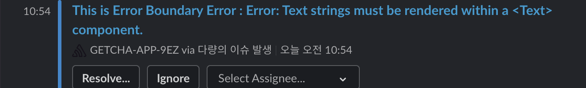
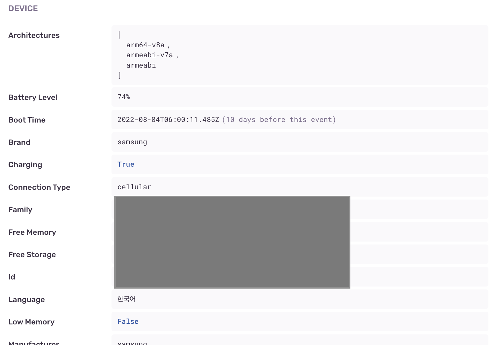
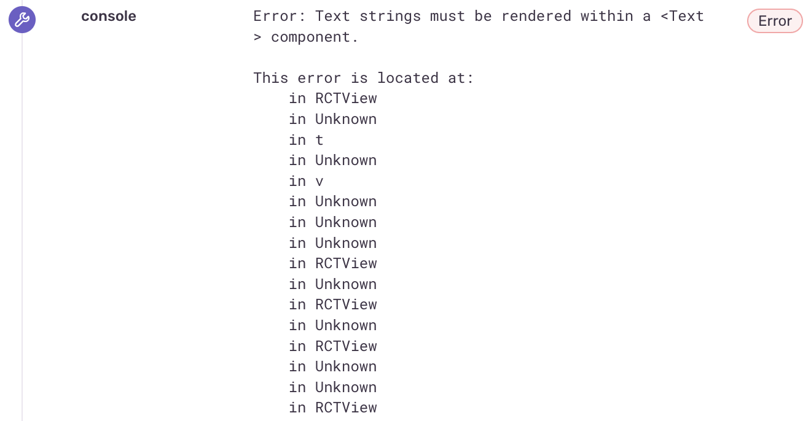
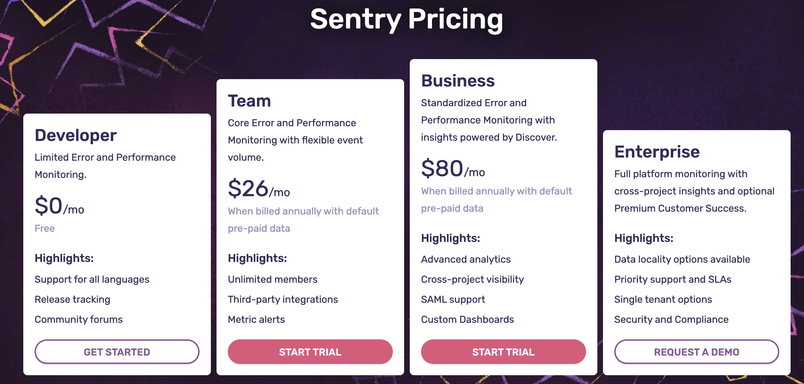
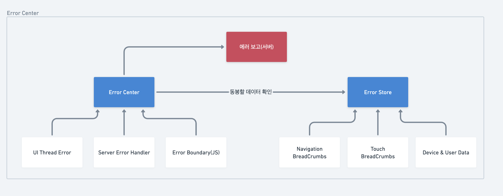

안녕하세요! 겟차 프론트엔드 개발자 Nick입니다.🙃

겟차의 메인 서비스 겟차 어플리케이션은 사용자의 에러경험 개선을 위해 **[Sentry](https://sentry.io/welcome/?utm_source=google&utm_medium=cpc&utm_campaign=9575834316&utm_content=g&utm_term=sentry&device=c&gclid=Cj0KCQjwl92XBhC7ARIsAHLl9amwYh-VyrrfCF_r24ZmA4PdQfXEs3E6h7Z64W1uWzwoGLwGkLQOcMQaAmv_EALw_wcB&gclid=Cj0KCQjwl92XBhC7ARIsAHLl9amwYh-VyrrfCF_r24ZmA4PdQfXEs3E6h7Z64W1uWzwoGLwGkLQOcMQaAmv_EALw_wcB)**라는 에러 모니터링 툴을 사용합니다. Sentry는 에러가 발생했을 때 사용자의 상세한 기기정보와 함께 에러관련 정보를 기록해줍니다. 실제로 사용자들의 핸드폰에서 장애가 발생했을 때 저희는 Sentry가 로깅하는 데이터를 보고 디버깅을 할 지점을 모색합니다.

또한 아래와 같이, 슬랙에 연동하여 사용자의 기기에서 에러가 발생했을 때 알림을 받도록 되어 있어서 거의 실시간으로 사용자 에러를 보고받을 수 있습니다.



사용자가 실제로 겪는 문제점을 알게해준다는 점에서 Sentry는 굉장히 유용한 툴이라고 볼 수 있습니다. 실제로 사용자가 자주 겪는 문제를 센트리를 통해 파악해 사용자 경험을 개선했던 사례 또한 있고요.

## 문제점

하지만 저희가 센트리를 쓰며 여러 에러를 확인하고 사용자 불편사항을 선제적으로 대응했던 경험은 그리 많지 않습니다. 그러면서 월 몇십만원의 비용을 지불하고 있었죠. 이는 명백히 비효율적이며 관성에 의해 유지하고 있는 시스템으로 인식되었습니다.

구체적인 문제점은 다음과 같습니다.

### 과도한 정보

미래에 저희 서비스가 고도화되어 에러 관리를 더 체계적으로 해야하는 상황이 온다면 그 땐 필요할지도 모르겠지만 당장 사용자의 앱이 어떤 버전이고 어떤 OS인지 등 기본적인 정보가 필요하지 기기의 아키텍쳐나 충전중이었는지는 중요하지 않습니다.



### BreadCrumbs

핸젤과 그레텔이 다시 돌아오기 위해 떨어뜨렸던 빵조각을 **BreadCrumbs**라고 부릅니다. 사용자의 여정이라고도 볼 수 있는데요, 어떤 화면에서 뭘 클릭했고, 그 과정에서 어떤 액션이 일어났는지 등등을 기록합니다.

문제는 이 BreadCrumbs가 부정확하다는 점입니다. 실패했다고 적혀있는 쿼리는 잘 동작하고, 같은 화면에서 에러가 발생했다고 적혀있는 경우가 비일비재합니다. 컴포넌트 단위가 아닌 스크린 단위로 기록하다 보니 디버깅을 하려면 Component Drilling을 하며 하나하나 찾아가야하는 경우가 많습니다.

또한 리액트 네이티브 에러 객체의 StackTrasing 값을 암호화한 상태 그대로 출력하다보니 봐도 디버깅에 도움되지 않는 데이터가 나옵니다.



저렇게 unknown으로 다 가려버리면 뭐 어디서 뭐가 잘못되었는지 알 길이 없습니다. 이는 확실히 개선이 필요한 부분입니다.

### 부가기능

Sentry에서는 단순 로깅 말고도 **Performance** 트래킹이나 **대시보드** 기능과 같이 사용자 경험 전반을 쉽고 빠르게 보고 개선할 수 있는 기능들을 추가로 제공합니다. 부끄럽게도 저희는 단순 로깅 기능만을 사용하고 있는데요, 실제 대시보드나 퍼포먼스 탭에서 보이는 정보들은 저희가 분석하기엔 과도했기 때문입니다.

OS별 에러 분포, 사용하는 국가 별 분포, 최근 몇시간 내 에러, 처리된 에러와 처리되지 않은 에러 등등 딱히 당장 필요한 정보가 아닌데도 보고받고 있습니다. 그렇다보니 점점 해당 기능들을 사용하지 않게 되고, 쓰던것만 쓰게 되는 것 같습니다.

센트리에서 제공하는 부가기능들은 아마 서비스의 사용자가 늘어나고 각양각색의 에러들이 보고될 때 다시 고려해볼 것 같습니다. 당장은 필요하지 않아 보였어요.

### 비싼 가격

Sentry는 기본 무료 버전도 있지만 이 버전은 토이프로젝트 정도에 적합한 트래픽을 처리할 수 있을 정도이고, 회사에서 사용할 땐 보통 비즈니스나 엔터프라이즈를 사용합니다. 여기에 Pay-as-you-go로 트레픽량을 늘리면 늘리는 만큼 과금을 하기 때문에 인프라 비용을 많이 차지하게 됩니다.



필요없는 에러는 로깅하지 않도록 줄였음에도 월 몇십만원의 과금을 하고 있고, 보고받는 에러도 명확하지 않으며 명확하다 하더라도 디버깅이 어렵고 과한 데이터를 받는 센트리를 더이상 유지하기 보다는 새로운 에러 시스템을 구축해서 효율과 비용절감, 두마리 토끼를 잡기로 했습니다.

---

## 센트리 대체모델

센트리를 없애려면, 센트리에서 제공받던 필수 기능인 **에러 발생 시 보고체계**을 구현해야합니다.

센트리가 어떻게 구현되어 있는지는 명확하게 모르지만, 확실한건 **JavaScript 레벨**에서 에러가 발생했을 때 Sentry 서버로 데이터를 전송합니다. 아마 Native 앱의 정보와 JavaScript 레벨 데이터는 에러가 발생하는 순간 SnapShot을 찍어 동봉하는 것으로 보여지고요.

JavaScript 레벨 데이터는 BreadCrumbs이라는 이름으로 수집되는데, 필요한 데이터만 따지면 화면 이동(navigation), 터치(touch), 네트워크 요청(network)으로 구분되고, 이보다 더 크거나 작은 범주로 수집되기도 합니다(life cycle, ui 등등)

일단 BreadCrumbs 중 이동에 관한 부분은 Sentry의 네비게이터 설정 과정을 보니 React-navigation에서 받아오는 것으로 추측됩니다.

```tsx
const routingInstrumentation = new Sentry.ReactNavigationInstrumentation();

<NavigationContainer
...
routingInstrumentation.registerNavigationContainer(navigationRef);
...
/>
```

터치와 네트워크 요청에 관한 부분은 JavaScript보다 더 낮은 레벨이거나 Sentry가 제공하는 HOC(withSentry) 내 로직에 있다고 추측됩니다.

여기까지만 봤을 때, 네이티브 레벨에서 데이터를 가져오는 로직은 **기기정보(필요하진 않음)** 뿐이었으므로 사용자의 행동양상을 스토어에서 전역으로 관리하고 이를 실제 에러가 발생했을 때 조회해서 동봉해 서버에 보내주는 로직으로 구현하면 될 것 같다고 판단했습니다.

그래서 중앙 에러처리 센터를 만들고, 여기서 모든 로깅을 처리하도록 End Point로 지정하면 되겠다 싶어 러프하게 설계를 해봤습니다.

:::tip 리엑트의 에러구조
리엑트 네이티브에서 발생할 수 있는 에러는 크게 3가지입니다.

1. JavaScript Thread Error - 자바스크립트 문법 에러입니다. 개발자의 실수로 오타를 냈다던가, 런타임에 데이터에 맞지 않는 메소드를 쓴다던가 하는 문제들에 해당합니다. 이 에러를 만나면 리액트는 컴포넌트 트리를 전부 언마운트시키고 프로세스를 죽입니다.
2. UI Thread Error -> 브라우저나 어플리케이션의 UI를 그리는 쓰레드에서 발생한 에러입니다. 스크롤이나 터치 이벤트 시 올바르지 않은 인덱스로 스크롤을 지시했다던가 하는 이벤트에 해당합니다. 에러 발생 시 위와 동일하게 프로세스는 죽습니다.
3. throw Error -> 직접적으로 에러 객체를 던졌을 경우 발생하는 에러입니다. 비동기 에러는 위 두가지 기본 에러에 해당하지 않으므로, throw 예약어로 커스텀 에러 객체를 던저 상위 catch 구문까지 전파시켜 에러를 처리합니다.

:::

### 에러센터

에러센터는 사용자가 서비스를 사용함에 있어 **발생하는 모든 에러를 처리하는** 중앙 처리기라고 볼 수 있습니다. 모든 종류의 에러는 에러센터를 거치고, 그 중 보고할 만한 데이터만 서버에 보고해요. 보고할 땐 스토어에서 수집중인 _BreadCrumbs_ 데이터를 함께 보내줍니다.



모든 BreadCrumbs에는 timestamp를 기본으로 넣어놓을 것이기 때문에, 나중에 사용자 에러 여정을 구성하는데도 도움이 될 것이라 생각합니다.

:::info 사용자 에러 여정

사용자 에러 여정은 사용자가 에러를 만나기 전까지 취했던 행동양상을 말합니다. 어떤 에러가 어디서 발생했다는 사실만으로는 디버깅이 어려울 수 있기 때문에, 어떤 스크린에서 뭘 눌렀고, 어떤 쿼리가 발생했다를 역추적할 필요가 있습니다. 가령 다음과 같은 모습이 될 것입니다.

00:01 A 스크린으로 이동

00:01 A스크린의 id가 B인 컴포넌트 클릭

00:02 query C 호출(실패!) **JavaScript Thread Error 발생!**

```tsx
const { data } = useQuery(["someThing"], queryFunction)

...
return {
    data.map(datum => <Render item={datum}>)
}
```

위와 같은 모습이라면 C 쿼리를 받아 UI를 그리는 작업을 처리하려고 했지만 null 체크를 안해서 interable 객체가 아닌 undefined 값이 대신 내려왔고, 이로인해 map 메소드를 호출하지 못하고 JavaScript 에러를 만났다. 정도로 해석할 수 있습니다.

:::

### 에러 센터 대시보드

에러를 로깅하는 것도 중요하지만, 그 에러를 확인할 수 있는 시스템 또한 필요합니다. 서버에서 에러를 실시간으로 받아 리스트 데이터로 보여주고, 중요한 지표를 기준으로 대시보드도 구성할 수 있어야 하며 처리된 에러라면 더이상 로깅하지 않는 기능도 있어야 합니다.

또한 슬랙으로 에러를 보고하는 Slack Webhook도 기능으로 가지고 있으면 좋겠습니다.

## 검증해봐야 할 사항

### 퍼포먼스 하락

하지만 막연히 생각해봤을 때 가능하겠다 싶은 것이지, 실제 구현했을 때 효율은 장담할 수 없습니다. Sentry가 어떤 레이어에 구현된 패키지인지 몰라서, 만약 지금 진행하고자 하는 방식인 JavaScript 레이어에서 구현했을 때 과도한 메모리 사용이나 연산량 혹은 로깅의 목적으로 사용자 경험을 방해할 수준의 버벅임이 관측된다면 이는 없느니만 못한 시스템이 됩니다.

### 어디까지 기록할 것인가

사용자의 기기 메모리가 무한정 존재한다면 사용자의 모든 행동거지를 전부 기록하고 싶지만, 안타깝게도 그렇지 않습니다. 앱을 끌때 어처피 다 휘발되니까 다 기록하고 싶긴 한데, 한번 앱을 켜면 며칠동안 앱을 안끄는 사용자도 있으니까 그것도 안됩니다. 그렇다면 **적절한** 선에서 기록해야 하는데, 그 정도를 잘 모르겠습니다.

:::info 구상중인 모델

- 언제 어디서 어디로 이동했다(Navigation)
- 언제 어디있는 어떤 컴포넌트를 눌렀다(Touch)
- 언제 어디로 어떤 쿼리를 어떤 파라미터와 함께 날렸다(Network)

정도를 각각의 타입마다 50~100개 크기의 Queue에 기록하고 휘발시킬 생각인데(FIFO), 여러 테스트를 통해 부하가 없는지 확인해봐야 할 것 같습니다.

:::

### 네이티브 데이터

실제 Sentry에서 제공하는 Native 레벨 데이터를 어떻게 가져올지도 의문입니다. 나중에 에러 센터도 고도화가 필요할텐데, 네이티브 레벨 정보를 가져오는 방법은 알 수가 없습니다. 찾아보면 아마 방법은 있겠지만, 확신을 가지고 시작할 수 없어 답답한 구석은 있습니다.

## 마치며

이번 프로젝트를 잘 마무리하면, 회사는 월마다 나가는 과금을 줄일 수 있게 되고 프론트 개발자들은 꼭 필요한 에러데이터만을 우리 손으로 컨트롤 할 수 있게 되며 디버깅이 쉬워지는 효과가 있을 것입니다.

다만, 이번 작업이 클라이언트만 하는 작업이 아니라 에러 서버를 따로 구성하는 과정도 백엔드 개발자들에게 혹을 하나 붙혀주는 꼴이라 바쁜 와중에 부탁하기는 조심스럽긴 하지만, 에러 센터의 필요성을 말씀드리고 프로젝트로 같이 진행할 수 있도록 설득하는 과정이 필요해 보입니다.

모쪼록 제 설계가 잘 들어맞아 잘 작동했으면 좋겠고, 추후 이를 모듈로 분리해서 오픈소스로 공개하는 날이 왔으면 좋겠습니다.😆
