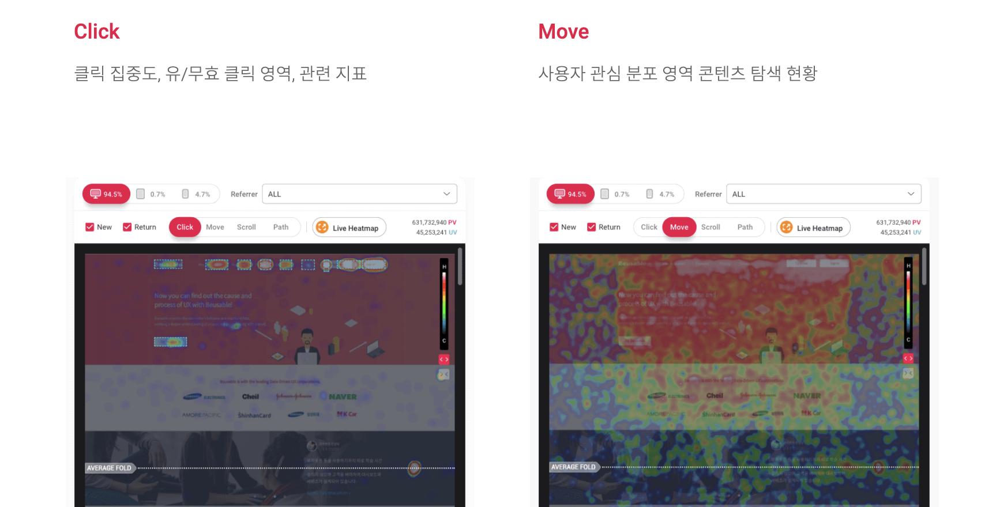

# 사용자의 행동 여정 그리기, BreadCrumbs

사용자의 행동데이터는 알게모르게 수집됩니다. 요청을 보낸 당신은 어디서 어떤 정보를 가지고 접근하는지에 같은거요.

이제 그런거 말고, 실제 사용자가 우리 사이트에서 뭘 하고 돌아다니는지에 대한 데이터 수집이 필요할 때가 있어요. 오늘 알아볼 것은, 이러한 정보를 사용자 행동 데이터(BreadCrumbs)로 정의하고 적용하는 방법입니다.

<!--truncate-->

사용자가 보기엔 달라지는 부분이 없어도, 클라이언트 사이드에서 명확한 데이터 수집 로직은 매우 중요한 작업 중 하나입니다. 이전까지는 특정 이벤트의 발생만을 매뉴얼하게 수집했습니다. 가령 _어떤 버튼을 클릭했다_, *어떤 화면을 봤다*와 같이 원하는 행동에 수집로직을 컴포넌트에 심어서 저희 데이터 서버로 보냈죠.

이와 비슷한 맥락에서, 사용자의 행동 데이터는 **사용자의 여정**을 그릴 수 있게 해주는 데이터입니다. 서비스의 라이프사이클이나 이동, 터치, 쿼리, UI 조작 등 수많은 인터렉션을 기록합니다. 오늘은 이 사용자 행동데이터 **BreadCrumbs**을 간단히 설계하고 구현하는 과정을 소개하려 합니다.

## BreadCrumbs

---

**BreadCrumbs**은 옛날동화 핸젤과 그레텔에서 두 남매가 집 가는 길을 표시하기 위해 떨어뜨린 빵조각을 뜻해요. 사용자가 서비스 내에서 이동하고, 상호작용하는 모든 과정을 마치 빵조각을 떨어뜨리듯 기록했다고 해서 붙혀진 이름입니다.

구현하는 과정은 간단합니다. 사용자가 특정 액션을 할 때, 스토어에 해당하는 객체를 업데이트하면 됩니다. 타입 정의부터 실제 데이터 수집까지 함께 구현해보겠습니다.

### 타입

저희는 3가지 데이터를 수집하기로 했습니다. 나중에 더 필요하면 추가로 구현하게 될 것 같은데, 지금 구현하면 불필요한 메모리만 잡아먹을 것 같아서 필요한 데이터는 아래 3가지면 되겠다 싶었어요.

우선 3가지 타입을 정의하고, 기초 인터페이스를 정의합니다.

```tsx
type BREADCRUMB_TYPE = 'navigation' | 'query' | 'touch';

interface BREADCRUMB {
  type: BREADCRUMB_TYPE;
  timestamp: number;
}
```

모든 행동은 timestamp와 type을 가집니다. 위 세가지 타입 중 하나의 액션이 발생할테고, unix_timestamp로 시간을 기록하도록 했습니다. 이를 기반으로 3가지 구체적인 BreadCrumb들을 설계합니다.

### Navigation

Navigation BreadCrumb은 언제 어떤 스크린에 머물었는지에 대한 기록입니다. 저희는 스크린 이동 이벤트마다 해당 기록을 남기도록 했습니다.

**React-Navigation**에서 제공하는 *네비게이션 상태 객체*에는 key라는 스크린 단위 고유 이름을 가지고 있고, 각각의 스크린에는 개발자가 붙혀준 이름이 있습니다. 그리고 스크린 이동 간 parameter로 넘긴 객체로 params를 가지고 있고요. 이렇게 3개의 키를 가진 객체가 Navigation State입니다.

```tsx
export interface NAVIGATION_STATE extends BREADCRUMB {
  key: ID;
  name: string;
  params: any;
}
```

### Touch

앱 서비스에서 사용자의 터치는 인터렉션의 시도를 의미합니다. 어떤 액션의 트리거를 의미하고요. 아래 코드는 터치 상태 타입입니다.

```tsx
export interface TOUCH_STATE extends BREADCRUMB {
  scale?: string; // 기기 크기 (width, height)
  id: ID; // 터치한 컴포넌트의 노드 아이디(컴포넌트 구분용)
  x: number; // 터치가 발생한 x 좌표 (px)
  y: number; // 터치가 발생한 y 좌표 (px)
  screen?: string;
}
```

x, y값은 *전체 기기 크기*에서 *터치한 위치의 좌표*입니다. 하지만 모든 기기는 해상도가 달라서 단순히 좌표만 넘기면 의미가 없을 수 있기 때문에 scale 값에 기기 크기를 같이 넘겨서 어떤 곳을 클릭했는지 가늠할 수 있게 했습니다.

screen은 터치 이벤트가 발생한 스크린 이름입니다.

id는 컴포넌트 트리 내 Node의 id인데, 컴포넌트의 아이디와는 개념이 다르고 자식 컴포넌트가 우선으로 찍히기 때문에 정확한 데이터는 아니지만 일단 같은 id가 나오면 같은 부모 컴포넌트라는 사실은 알 수 있기 때문에 넣어놓긴 했습니다. 더 좋은 구별방식이 나온다면 변경하고 싶은 부분입니다.

img 태그에 alt값으로 설명을 써놓듯, 모든 터치 이벤트에 구체적인 설명을 넣고 싶지만, 이는 자동수집 데이터이기 때문에 넣을 수가 없네요. 😢😢

### Query

어떤 인터렉션의 결과로 서버를 다녀오는 일이 발생했을 때 기록합니다. 대부분 성공하지만, 실패했을 땐 서비스에 큰 영향을 주기도 하기 때문에 필수로 수집해야 하는 데이터입니다.

```tsx
export interface QUERY_STATE extends BREADCRUMB {
  headers: {
    version: string;
    'device-id': string;
    'session-id': string;
    os: 'ios' | 'android' | 'web';
  };
  data: any;
  url: URL;
  status: Pick<AxiosResponse, 'status'>;
  errorMessage?: string | null;
}
```

쿼리의 결과를 받았을 때 성공인지 실패인지, 어떤 URL로 요청을 보냈는지, header에 데이터는 잘 넣어놨는지 등등을 꼼꼼히 기록합니다.

### BreadCrumbs

이렇게 3가지 데이터를 각각의 Queue에 저장하면, 다음과 같은 모양이 됩니다. 타입이 Array라고 되어있긴 한데, 내부적으로는 Queue로 관리되어 FIFO순서로 예전 데이터는 자동 휘발됩니다. 아마 BreadCrumb이 갖는 부하에 대한 검증이 끝나면 최대한 크기를 늘려서 관리하면 좋겠다 싶었습니다.

```tsx
interface BreadCrumbsState {
  navigation: NAVIGATION_STATE[];
  touch: TOUCH_STATE[];
  query: QUERY_STATE[];
}
```

---

## 구현

생각보다 구현은 간단했습니다. 자료구조를 만들고, 자동으로 Queue에 데이터를 밀어넣는 작업 뿐이기 때문입니다. React Native에서 스토어 구현부터 각각의 데이터를 어떻게 수집하는지 알아볼게요.

### Store

어떤 전역 스토어를 사용해도 문제없습니다. 저희는 클라이언트 사이드 스토어로 Redux를 사용하기 때문에 리덕스 문법으로 작성했습니다. 저희는 간단히 Array 인스턴스와 관련 메소드로 작성했지만, Queue 클래스를 구현해서 인스턴스를 생성해 초기화하고 액션을 처리할 때 Queue 메소드를 쓰셔도 됩니다.

아래 방식은 네비게이션 정보를 추가하는 액션입니다.

```tsx
setNavigationCrumbs: (state, { payload }: { payload: NAVIGATION_STATE }) => {
    const navigationCrumbs = state.navigation;
    if (navigationCrumbs.length >= NAVIGATION_BREADCRUMBS_SIZE) {
        navigationCrumbs.shift();
    }
    state.navigation = [
        ...navigationCrumbs,
        { type: 'navigation', ...payload, timestamp: getUnixTimestamp() },
    ];
},
```

### Navigation

`React Navigation`에서 전체 컨테이너를 감싸는 `NavigationContainer`에서 제공하는 메소드 중 `onStateChange`가 있습니다. 탭이나 스택 정보가 변경될 때마다 호출되는 함수인데, 이 때 해당 구조에 대한 데이터가 `navigationRef.current?.getRootState()`에서 제공됩니다. 이 데이터를 recursive하게 순회하면 현재 위치한 스크린에 대한 정보를 얻을 수 있습니다.

```tsx
const onStateChange = () => {
		const currentScreenData = getActiveRouteData(
			navigationRef.current?.getRootState(),
		);
		dispatch(setNavigationCrumbs(currentScreenData));
	};
...
<NavigationContainer
	ref={navigationRef}
	onStateChange={onStateChange}
	...
>
```

### Touch

터치 이벤트는 모든 컴포넌트를 감싸는 최상위 컴포넌트에 부여합니다. 모든 컴포넌트에 메뉴얼하게 넣거나 기본 Touchable 컴포넌트를 만들어서 전역에서 해당 Touchable 컴포넌트를 합성해서 사용한다면 더 효과적으로 TouchCrumb을 수집할 수 있겠지만, 현재 그런 시스템이 없어서 모든 컴포넌트에 대해 수집하도록 변경했습니다.

```tsx
const logTouchEvent = (e: GestureResponderEvent) => {
	const { pageX, pageY, target } = e.nativeEvent;

	dispatch(
		setTouchCrumbs({
			x: pageX,
			y: pageY,
			id: target,
		}),
	);
};

<SafeAreaView ... onTouchStart={logTouchEvent}>
...
</SafeAreaView>
```

### Query

저희는 HTTP 통신을 위한 쿼리 클라이언트로 *axios*를 사용합니다. 그 중 axios의 요청과 응답을 각각 하이잭해서 필요한 처리를 해주는 *interceptors*를 활용했습니다. 요청할 때 해줄 수 있는 처리는 별로 없어서, 응답 시에만 로직을 심어뒀고, 결과를 정상적으로 받았을 때, 에러가 났을 때를 나눠서 수집하도록 아래와 같이 로직을 구성했습니다.

```tsx
const ApiInstance = axios.create({...});

ApiInstance.interceptors.response.use(
	(response) => {
		store.dispatch(
			setQueryCrumbs({
				headers: response.config.headers,
				url: response.config.url,
				timestamp: new Date().getTime(),
				status: response.status,
			}),
		);
		return response;
	},
	(error) => {
		store.dispatch(
			setQueryCrumbs({
				headers: error.response.config.headers,
				url: error.response.config.url,
				data: error.response.config.data,
				errorMessage: error.response.data.message,
				timestamp: new Date().getTime(),
				status: error.response.status,
			}),
		)})
...
```

위와 같이 작성하면 3가지 BreadCrumbs을 수집할 수 있게 됩니다.

---

## 활용

BreadCrumb은 활용도가 꽤나 높은 데이터로써 다양하게 사용할 수 있으며 더 많은 데이터를 수집할수록 훨씬 다양한 용도로 사용자의 행동 양상을 분석할 수 있다고 생각합니다.

저희 서비스에서는 위에서 수집한 데이터를 기반으로 아래와 같은 기능들을 구현중이며 이 중 몇몇은 일부 사용자를 대상으로 테스트중에 있습니다.

### 스냅샷

특정 이벤트가 발생했을 때, 당시 상황이 궁금할 수 있습니다. 예를 들어 에러가 발생했을 때, 어쩌다 에러가 발생하게 되었는지나 어디서부터 잘못된 것인지를 디버깅하기 위해 필요합니다.

가설을 검증하는 과정에도 중요한 역할을 할 것입니다.

간단하게 구현하면 다음과 같이 특정 순간에 스냅샷을 찍고, 그 스냅샷을 타임라인별로 구성해서 보는 기능도 가능하겠습니다.

```tsx
// psudo code로 봐주세요. 아직 작성중입니다 ~ 😅
/**
 * * 특정 시점의 BreadCrumbs를 조회하여 스냅샷을 만듭니다.
 * @param size : 필요한 크기. 추후 각각에 대해 받을 수 있게 만들 예정;
 */
export const getSnapShot = (size?: number = 20) => {
  const { navigation, query, touch } = store.getState().breadCrumbs;

  return {
    navigation,
    query,
    touch,
  };
};

/**
 * * 스냅샷으로 타임라인을 구성합니다.
 * @returns
 */
export const getTimelineSnapshot = () => {
  const { navigation, query, touch } = getSnapShot();

  const added = [...navigation, ...query, ...touch];
  return added.sort((a, b) => a.timestamp - b.timestamp);
};
```

:::info 타임라인

아래 사진은 BreadCrumbs를 타임라인별로 출력한 모습입니다. 위에서 부터 type만 읽어도 다음과 같은 흐름을 유추할 수 있습니다.

1. 터치를 해서 화면이동을 했음.
2. 해당 화면에서 쿼리 6개를 호출했음.
3. 터치를 해서 화면이동을 했음.
4. 해당 화면에서 쿼리 3개를 호출했음.
5. 터치를 해서 화면이동을 했음.


:::

더 상세한 내용은 type 말고도 다양하게 동봉된 세부 BreadCrumb을 확인하면 알 수 있게 됩니다.

### 딥 네비게이션

사용자가 다시 어떤 스크린으로 돌아가야만 할 때에도 유용하게 사용할 수 있습니다. BreadScrumbs에서 과거에 해당 스크린으로 이동할 때 넘겨줬던 파라미터를 조회하여 그대로, 혹은 조금 수정하여 이동할 수 있게 합니다.

예를 들면 다음과 같은 상황이 있을 수 있겠습니다. 비회원이 게시글에 좋아요를 누르려고 시도했을 때, 로그인 화면으로 보내고, 회원가입을 한 뒤 로그인을 하고 다시 최초 좋아요를 하려고 했던 게시글 화면으로 이동해야 합니다.


### 히트맵

히트맵(Hitmap)은 사용자의 **터치 이벤트의 집약도**를 보여줍니다. 우리가 야심차게 강조하려고 준비한 공간은 사용자의 눈에 잘 띄지 않았고, 당연히 한번쯤은 눌러볼 줄 알았던 버튼은 한두달이 되도록 한번도 눌리지 않고 방치되어 있을 수 있습니다. 이처럼 UI(User Interface)엔 정답이 없기에 데이터를 통해 성공과 실패를 평가할 수 있는 척도가 되어주는 지표입니다.

아래는 유명한 UI/UX 분석 도구인 뷰저블의 [히트맵 소개 페이지](https://www.beusable.net/ko/feature-uxheatmap)에서 가져온 사진입니다. 클릭 분포, 마우스가 머무른 시간, 마우스 플로우 등을 한눈에 알 수 있게 표현한 그래프라고 보면 좋겠습니다.

이 그레프는 TouchCrumb을 활용해서 만들어낼 수 있습니다. 유의미한 데이터를 모으려면 꽤 많은 사용자가 데이터를 보고해야하므로 시간이 걸리겠지만, 추후 여건이 된다면 만들어보고 싶네요.



이 밖에도 사용자 여정에 관한 모든 데이터들은 프로덕트를 관리하고 더 낫게 만드는데 있어서 탁월한 역할을 할 것이라고 생각합니다.

---

## Outtro

**BreadCrumb**은 사용자의 여정이라는 귀중한 데이터를 보여줍니다. 지금은 카테고리도 3개뿐이고 데이터 량 자체도 모자라지만 무궁무진한 쓰임을 생각하면 현재의 구조를 강화해서 더 많은 데이터를 수집해야합니다. 크기가 커지면 사용자 데이터 핸들링에 관한 모듈로 분리해서 다른 개발자들도 활용할 수 있게 오픈소스로 관리되도 좋을 것 같네요.
