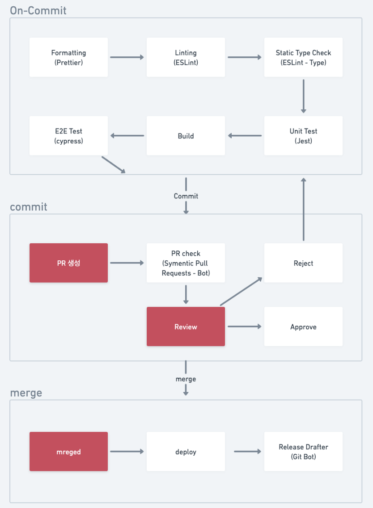
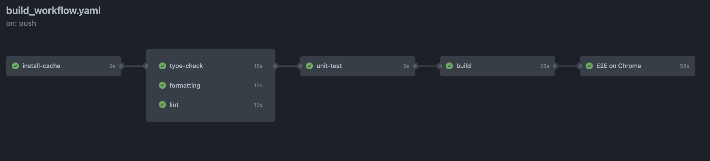
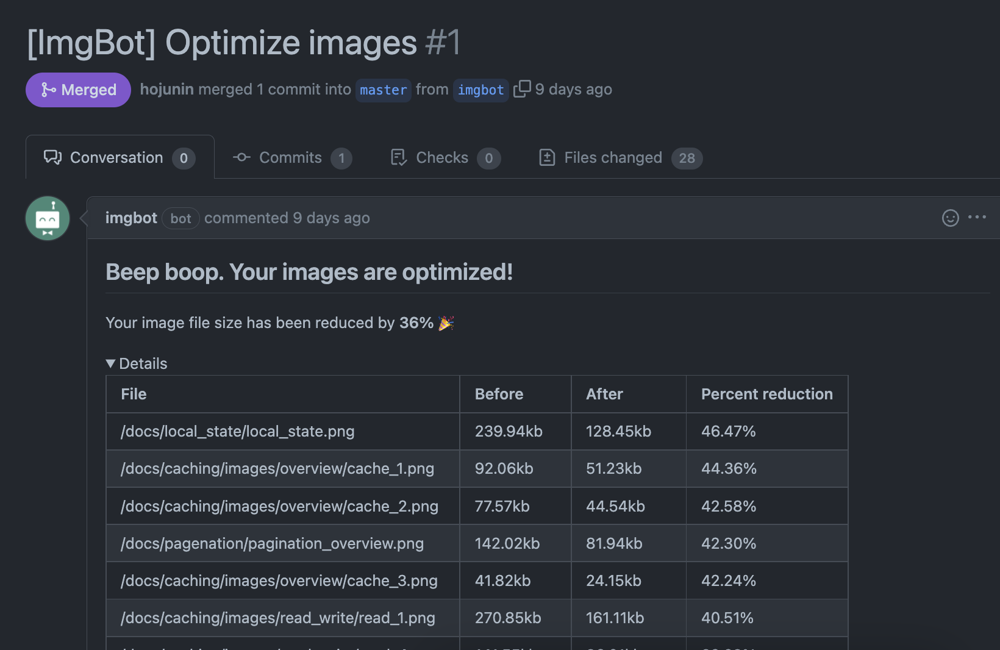
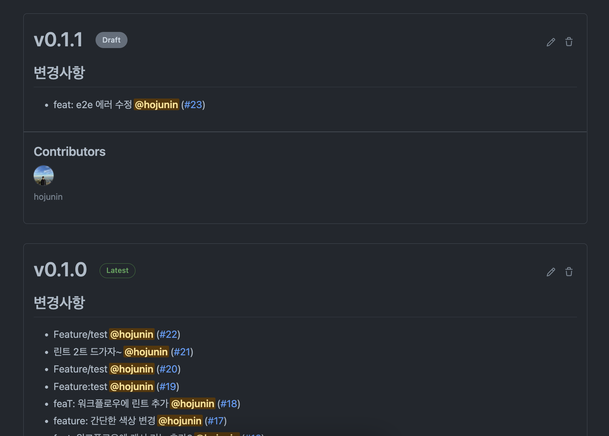
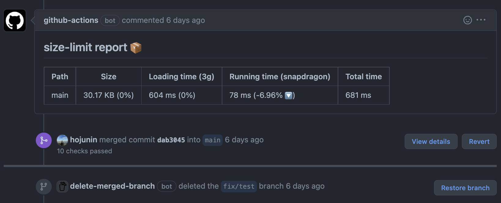

깃허브 액션으로 워크플로우를 구축해봤어요.

안전하게 코드가 저장소로 전달되는 과정인 CI를 구축했다고 볼 수 있습니다.

<!--truncate-->

안녕하세요. 😉

개발자들끼리 협업을 하다보면 기상천외한 일들이 낮지 않은 확률로 일어납니다. 급하다고 프로덕션에 즉각 반영되는 브랜치에 직접 push를 하기도 하고, 귀찮아서 컨벤션이나 타입도 안맞추고 merge를 하기도 합니다. 자율성이 보장되는 집단이나 너무 바쁜 회사들의 경우엔 그 정도가 더 심합니다.

하지만 아무리 바쁘고 자율성이 높아도, 프로덕트의 품질은 관리되어야 하고 그러기 위해선 규칙들이 필요합니다.

다행히도 이와 같은 고민을 먼저 해주신 선조들 덕분에 여러가지 좋은 규칙이나 기술들이 탄생했지만 지키지 않으면 다 쓸모 없는 것이고 되이려 프로덕트 내에서 여러갈래의 스타일이 만들어져 프로덕트 관리가 더 안되는 결과를 초래합니다.

이러한 규칙과 기술들을 손쉽게 적용한 코드 병합. Github Actions를 활용해서 CI를 위한 워크플로우를 설계를 해보겠습니다.

## 워크플로우

워크플로우라는 단어는 직군마다 다른 의미일 수 있지만, 개발과 관련된 협업을 할 때는 팀원이 코드를 작성하고 그 코드가 모두가 기준으로 삼는 공용 브랜치에 성공적으로 병합 및 배포 될 때까지 거치는 과정을 말합니다. 물론 앞뒤에 더 많은 과정들이 있을 수 있지만 이번에 설계하는 부분은 코드가 합쳐지는 과정 까지에요.

## 워크플로우 설계하기

---

설계에 앞서, 원칙이 필요합니다. 저희가 정한 규칙은 다음과 같아요.

:::info 💡 워크플로우 원칙

1. 의미없는 단계는 철저히 배제한다.
2. 동작하지 않는 코드는 main stream(main, develop)에 병합될 수 없다.
3. 핫픽스를 위한 파이프라인을 가진다.

:::

애초에 단계를 정할 때 원칙에 부합하지 않다면 배제되어야 하고, 사용하다보니 필요 없다고 생각되는 단계는 철저히 제거해야합니다. 물론 저희도 아직 오래 써보지 않아서 추가하거나 제거한 건 없습니다 😅

아래 사진은 제가 생각했을 때 원칙에 부합하면서 가장 효과적이라고 생각한 플로우입니다. 빨간색 박스는 개발자가 직접 해야하는 부분이고, 나머지는 전부 자동화되거나 깃 봇이 동작하는 부분들입니다.



테스트가 실패했다던가 리뷰에 통과하지 못하는 경우 슬랙 알림을 주는 장치 등이 추가되면 좋을 것 같네요. 아직 구현은 하지 못했습니다.

그럼 설계는 이쯤 하는 것으로 하고, 설계도대로 구현을 해보겠습니다.

---

## Github Action

Github Action은 Git에서 제공하는 CI/CD 툴입니다. 따로 어떠한 설치과정도 없이, workflow를 설계해서 yaml파일만 특정 위치에 추가해주면, 알아서 CI 과정을 진행해주기 때문에 매우편합니다.

원리는 간단합니다. 특정 이벤트가 발생하면 특정 job을 실행해줍니다.


github action를 활용하려면 용어부터 알아야 합니다.

:::tip 용어 설명

- Workflow : 워크플로우는 한번에 하나 이상의 job을 실행할 수 있는 자동화 프로세스입니다.

- Events : 이벤트는 워크플로우를 실행시키는 트리거입니다.

- Job : 잡은 워크플로우에서 실행되는 단일 작업입니다. 여러 step으로 구성되며 동일한 runner에 의해 실행됩니다.

- Runnuers : 러너는 워크플로우가 동작하는 서버입니다. (병렬로 동작하는 쓰레드라고 보면 될듯 합니다)

- Artifact : job 실행 중에 생성된 어떤 파일을 저장소에 올릴 수 있게 하는 저장소입니다. 90일 간 저장 가능하다.

:::

## 캐싱 & 아티팩트

Github Actions를 on-premise로 설치하면 우리 서버비용만 나오지만, git 서버를 이용하면 사용 용량, 시간만큼 돈이 나가고, [빌드시간 자체가 돈](https://docs.github.com/en/billing/managing-billing-for-github-actions/about-billing-for-github-actions)이기 때문에 자주 배포가 일어날 땐 반복동작을 줄이는게 중요합니다.

그래서 패키지 설치같은 자주 일어나는 반복동작은 캐싱을 통해 해결하고, 빌드같이 job 실행 도중 발생하는 결과물을 업로드하고 나중에 다운로드해서 사용해서 해결합니다. 이를 아티팩트라고 합니다.

---

## 코드를 보자.

간단히 저희의 빌드 과정을 살펴보면서 동작방식을 설명해볼게요. 위에서 설명드린 설계에서 on-commit 페이즈를 Github Action으로 구현한 것입니다. 사진을 보면 플로우가 눈에 들어오실 거에요.



아래 코드는 저희 프로젝트 최상단의 .`github/workflow/build.yaml`파일입니다. 이 위치에 아래 파일이 존재하기만 하면, 이 플로우대로 github Action이 실행됩니다. 정말 간단하지 않나요?

본격적으로 yaml 파일을 읽어보기 전에, 구체적인 용어들도 간단히 알아보기로 해요.

:::tip 🧑🏼‍💻 용어 설명

runs-on : 어떤 환경에서 실행할 것인지 (리눅스 서버 버전같은)

steps : 그 job이 어떤 순서로 실행될 것인지

names: step 이름

uses: 마켓플레이스에 미리 등록된 액션을 이름과 버전으로 불러와 사용한다.

with: 해당 step의 parameter라고 이해하면 편하다.

run : 실행할 명령어

:::

github Actions는 기본적으로 병렬로 동작합니다. 어떤 실행이 다른 실행에 영향을 주거나 순서가 중요한 작업의 경우 needs라는 예약어로 의존성을 주입할 수 있습니다.

그럼 본격적으로 코드를 읽어봅시다. 그리고 바로 위에서 설계한 내용과 사진과 코드가 일치하는지 생각해보면 좋겠네요.

```yaml
name: 커밋 후 코드정리, 테스트
on: [push] // 어떤 브랜치든 push되기만 하면 실행됩니다.
jobs:
  install-cache: // 패키지 설치 단계, 캐시된게 있으면 불러오고 아니면 설치
    runs-on: ubuntu-latest
    steps:
      - name: Checkout Commit
        uses: actions/checkout@v2
      - name: Use Node.js 14
        uses: actions/setup-node@v1
        with:
          node-version: "14.x"
      - name: Cache yarn dependencies
        uses: actions/cache@v2
        id: cache-dependencies
        with:
          path: node_modules
          key: ${{ runner.os }}-yarn-${{ hashFiles('**/yarn.lock') }}
          restore-keys: |
            ${{ runner.os }}-yarn-
      - name: Install Dependencies
        if: steps.cache-dependencies.outputs.cache-hit != 'true'
        run: |
          yarn install --immutable --immutable-cache --check-cache
  type-check:
    runs-on: ubuntu-latest
    needs: install-cache
    steps:
      - name: Checkout Commit // 체크아웃. 작업된 코드를 불러온다.
        uses: actions/checkout@v3 // 미리 저장된 액션을 불러온다. (마켓 제공)
      - name: Use Node.js 14
        uses: actions/setup-node@v1
        with:
          node-version: "14.x"
      - name: Restore yarn dependencies
        uses: actions/cache@v2
        id: cache-dependencies
        with:
          path: node_modules
          key: ${{ runner.os }}-yarn-${{ hashFiles('**/yarn.lock') }}
          restore-keys: |
            ${{ runner.os }}-yarn-
      - name: Check types
        run: yarn tsc // 명령어 실행
  formatting:
		... 중략
  lint:
    ... 중략
  unit-test:
    runs-on: ubuntu-latest
    needs: [install-cache, type-check, formatting, lint] // 선행작업 완료 후 유닛테스트 시작
    steps:
      - name: Checkout Commit
        uses: actions/checkout@v3
      - name: Use Node.js 14
        uses: actions/setup-node@v1
        with:
          node-version: "14.x"
      - name: Restore yarn dependencies
        uses: actions/cache@v2
        id: cache-dependencies
        with:
          path: node_modules
          key: ${{ runner.os }}-yarn-${{ hashFiles('**/yarn.lock') }}
          restore-keys: |
            ${{ runner.os }}-yarn-
      - name: Run Unit test
        run: yarn test
  build:
    runs-on: ubuntu-latest
    needs: unit-test // 유닛테스트 끝나고 빌드
    steps:
      - name: Checkout Commit
        uses: actions/checkout@v3
      - name: Use Node.js ${{ matrix.node }}
        uses: actions/setup-node@v1
        with:
          node-version: "14.x"
      - name: Restore yarn dependencies
        uses: actions/cache@v2
        id: cache-dependencies
        with:
          path: node_modules
          key: ${{ runner.os }}-yarn-${{ hashFiles('**/yarn.lock') }}
          restore-keys: |
            ${{ runner.os }}-yarn-
      - name: Run build
        run: yarn build
  cypress-run:
    runs-on: ubuntu-latest
    name: E2E on Chrome
    needs: [build] // 빌드 끝나고 통합 테스트.
    steps:
      - name: Checkout Commit
        uses: actions/checkout@v3
      - name: Use Node.js 14
        uses: actions/setup-node@v1
        with:
          node-version: "14.x"
      - name: Restore yarn dependencies
        uses: actions/cache@v2
        id: cache-dependencies
        with:
          path: node_modules
          key: ${{ runner.os }}-yarn-${{ hashFiles('**/yarn.lock') }}
          restore-keys: |
            ${{ runner.os }}-yarn-
      - name: install cypress
        run: npx cypress install
      - name: run cypress
        run: yarn e2e:headless
```

## 추가기능

---

그리고 이번 CI 구축 과정에서 몇몇 쓸모있는 깃 봇들을 몇개 배웠어요. 대부분 무료거나 public 레파지토리에 한하여는 무료였으니 써보시는걸 추천드리겠습니다.

### [imgbot](https://github.com/marketplace/imgbot)

imgbot은 레파지토리 내 사진과 같은 정적 파일들의 이미지를 용량최적화해서 다시 pr을 올려주는 봇입니다. 실제 3~40% 정도의 사진용량을 줄여줍니다. CDN을 적극적으로 활용하거나 보안 등의 문제가 있는 프로젝트가 아니라면 매우 추천하는 봇이에요.



단점은 private 레파지토리의 경우 가격이 비싸고, 코드가 어딘지 모를 서버에 갈 수도 있다는 불안감 정도가 되겠네요. 하지만 개인 프로젝트에 쓰기엔 아주 좋다고 생각합니다 👍

### [release drafter](https://probot.github.io/apps/release-drafter/)

release drafter는 Pull Request를 통해 병합된 내용들을 차곡차곡 모아서 release 초안을 작성해주는 봇입니다. 실제로 일을 하다보면 어디서부터 어디까지가 이번 배포때 적용되었는지는 태그를 손수 달아주거나 커밋을 날려주는 방법으로 표시만 하는 식으로 알 수 있었는데, 이 봇을 사용하면 릴리즈할 때마다 PR 정보와 함께 모아주니 아주 편했습니다. 버전관리에도 아주 좋습니다.

그러한 측면에서 실제 오픈소스에서 활발하게 이용되는 봇 중 하나이기도 합니다. 메시지 형식은 커스텀도 가능하답니다.



### [size-limit](https://github.com/ai/size-limit)

FrontEnd 프로젝트에서 번들사이즈의 크기는 굉장히 중요합니다. 초기 로드 시점에 기다리는 시간을 좌우하기 때문에 번들 크기를 줄이는 작업은 사용자 경험에 큰 영향을 주기 때문입니다.

size-limit은 코드가 병합될 때마다 번들 크기는 얼마나 변했고, 로드 시간은 얼마나 달라졌는지에 대한 리포트를 작성해서 코멘트로 알려줍니다.



### **[delete-merged-branch](https://github.com/apps/delete-merged-branch)**

이건 간단한 기능인데요. 병합된 브랜치는 의미가 없기 때문에 삭제를 해야하는데 일일이 제거하기 귀찮으신 분들을 위해 추천드립니다.

위 사진에서 가장 아랫부분 보이시나요? 봇이 병합된 브랜치를 자동으로 제거한 모습입니다. 간단히 봇만 추가하면 동작하는데 꽤 유용합니다.

---

## Outro

기술부채를 줄여나갈 수 있는 가장 좋은 방법은 부채를 안만드는 게 아닐까 싶습니다. 쌓여있는 부채를 보면 한숨은 푹푹 나오는 와중에 당면한 문제는 계속 불어나기 때문에 부채는 눈덩이처럼 불어나곤 합니다. 간단한 CI 플로우 구축으로 검증된 코드들을 병합하는 문화를 만들어나가는 것은 어떨까요?
