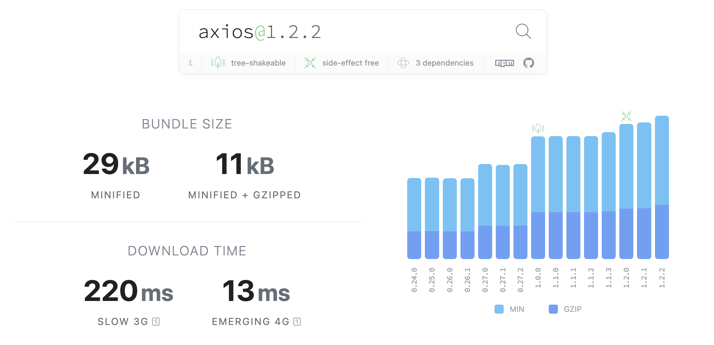

Axios라는 라이브러리 아시죠?

별 이유 없이 버전업한 이 라이브러리가 쏘아올린 거대한 사고 대응기를 소개할게요.

<!--truncate-->

[Axios](https://axios-http.com/kr/docs/intro)는 웹 개발자라면 누구나 알만한 Http Client입니다. Node에서 fetch API를 기본으로 제공해주지만 node 18버전부터 제공하고 있고, 사용법도 좀 별로라서 서버 데이터를 호출할 땐 axios를 주로 쓰니까요. 그런 Axios가 몇년동안 major 버전이 없는 채로 0.x 를 유지하다가 최근 1.x 대 버전이 출시되었어요.

### 기능

0.x대는 꽤 오랫동안 유지된 안정된 코드로, 저희 회사 서비스 전반에서 사용되는 버전이었어요. 그리고 지금도 별 문제 없었기 때문에 잘 쓰고 있었는데, 최근 React Native의 Breaking Change가 포함된 버전을 올리면서 여러 패키지들을 follow up 하는 과정에서 axios도 0.x인 것을 1.x대로 올리게 되었습니다.

출시된지 불과 반년정도 밖에 지나지 않았는데, 그 내용을 보면 엄청난 기능들이 추가되고 아무 설정 없이 버전만 올려도 완전히 호환된다고 나와있었기 때문에 올리는김에 같이 올리기로 했습니다.

구체적인 변경사항은 [이 문서](https://github.com/axios/axios/releases/tag/v1.0.0)를 참조하시고, 요약하면 다음과 같아요.

- API가 사용하기 쉽게 변경됩니다.
- typeScript 지원 영역을 확대합니다 (ex. formData의 제네릭 타입 등)
- 에러 핸들링 기능 강화
- 테스트 지원

사실 당장 필요에 의해 업그레이드하는건 아니었는데, 어처피 패키지 팔로업도 자주 있는 일이 아닌 만큼 이것저것 뒤쳐지는 라이브러리들을 끌어올린다는 목적 하에 진행했던 것 같아요.

번들 크기는 약간 차이 났습니다. 이전 버전에 비해 1.5배 정도긴 한데, lottie같은 녀석들이나 내부 로거들이 엄청 커다랗다 보니, 이 정도면 귀여울 수준이죠.



## 문제

웹에서 IE가 말썽이었듯, 크로스 플랫폼 개발자에게도 꼭 한 녀석이 문제입니다. 정말 뜬금없이 안드로이드에서 사진 업로드 기능이 동작하지 않는다는 제보를 받았어요.

문제가 되는 모듈은 2년동안 아무 문제 없이 돌던 코드라 당황스러웠지만, 일단 원인이 무엇인지 파악하는게 중요했습니다.

### 원인 파악

우선 저희 서비스에서 이미지 업로드를 위해 사용한 로직은 다음과 같아요. 회사 코드를 유출할 수는 없으므로 수도코드로 적어볼게요.

```jsx
// psudo code입니다.

const uploadImage = async (multi_part_data, extra_data) => {
  try {
    const { data } = uploadImagesApi(multi_part_data, extra_data);

    updateReduxWithSuccess(data);
  } catch (error) {
    Toast.show('사진 등록에 실패했어요');
    updateReduxWithFail(error);
  }
};
```

당장 뭐가 문제인지 모르겠고 로그도 남고 있지 않았습니다. 2년전 코드다보니 현재 활용하는 로거와 연결되어있지 않았기 때문이에요. 그래서 빠르게 로그부터 심었습니다. 그 후 몇몇 케이스가 보고되어서 어떤 부분이 문제인지 빠르게 확인할 수 있었습니다.

문제가 된 부분은 file upload를 위한 API를 호출하고, 받은 response에서 data라는 객체를 꺼낼 때 발생했습니다. 그래서 다음 수순인 API에 대한 기록을 살펴봤는데 API를 쏘기는 하지만 서버엔 어떠한 로그도 없었다는 청천병력같은 소식을 들었습니다. 클라이언트에서 확인했을땐 분명 axios instance의 interceptor의 request, response 에서 로직이 돌고 있었기 때문에 굉장히 혼란스러웠어요.

### status code = 0

그 중 조금 이상했던건 axios의 응답 status code가 0이었던 점이에요. Axios가 status code로 0을 내려주는 경우를 처음 봤는데, 제가 아는건 [Http 표준 응답](https://en.wikipedia.org/wiki/List_of_HTTP_status_codes)이라고 해서 200, 400, 404 같은것이거든요.

알아보니 이게 Axios 스펙이 아니라 XMLHttpRequest 표준 스펙이었어요. 즉 서버에 요청은 커녕 연결도 안되서 0을 받는것이고, 흔히 Status Code로 알고 있는 Http 표준 응답(200,400..)과는 다른 개념이라고 합니다. 이 부분에 대해서는 지식이 없어서 몰랐어요.

### 문제는 Axios였다.

결론은 Axios가 문제였습니다. Axios 버전업과 함께 발생했다는 점과 서버에 도달조차 못했다는 점에서, Axios 버전업이 문제라는 사실을 유추할 수 있었어요. 바로 다운그레이드를 진행했고, 예상대로 정상 동작함을 알 수 있었습니다.

하지만 저희는 웹이 아니라 React Native를 활용한 앱 서비스기때문에 다운그래이드한 버전을 스토어에 배포하려면 최소 하루 이상이 소요되므로, 최대한 javaScript 레벨에서 해결해야 했습니다. (JS만 고친다면 Code Push로 즉각 배포가 가능해요)

JS레벨에서 해결을 위해 조금 더 찾아보니, 관련된 이슈가 많았습니다. 유독 안드로이드에서만, Axios가 1.x 버전으로 올라가면서 Android에서 Multi-Part 타입 데이터를 요청할 때 Content-Type을 명시하지 않으면 요청이 가지 않는 문제였어요. 뒤늦게 issue 탭에서 검색해봤을 때 이미 비슷한 이슈로 고통받는 사람들이 많았습니다.

https://github.com/axios/axios/issues/4823

```jsx
import axios from "axios"

// Content-Type을 명시하면 해결된다.
await axios.post(
		uploadImagePath,
		 body,
		 headers: {
      'Content-Type': 'multipart/form-data',
		},
)
```

## 내가 얻은거

이번 이슈는 상황 인지부터 문제 해결까지 매끄럽지도 않았고, 속도도 느렸습니다. 꽤나 크리티컬한 문제임에도 말이에요. 그래서 팀원들과 포스트모템(사후처리)을 진행했고 다음과 같은 결론을 내릴 수 있었어요.

### 우리가 잘했던 점

심각한 문제임을 인식한 순간 모두가 빠르게 문제 해결을 위해 도왔어요. 덕분에 저희가 갈피를 못잡고 있을 때 여러개의 재현 조건을 수집할 수 있었고 결국 진짜 에러까지 범위를 좁혀나가는(Narrowing) 효과를 얻었다고 볼 수 있죠.

문제를 야기한 사람은 분명히 있어요. 만약 우리 집단의 문화가 범인을 색출하는 형태였다면, 이미지 업로드 테스트 담당자도, Axios 라이브러리를 버전업한 개발자도 징계를 면하지 못했을거에요. 하지만 저희는 당장 해결해야하는 문제 해결에 집중했고, 이후 다시 발생하지 않도록 되돌아보는 회의를 했을 뿐이에요.

### 우리가 못했던 점

사용자가 겪은 안좋은 경험이 너무 오래 지속되었어요. 최초 식별 시점이 릴리즈 후 맞이하는 주말이여서 늑장대응을 했다고 볼 수도 있고, 문제가 Axios라는 거대한 라이브러리에 꽁꽁 숨겨져 있어서 실제 해결 과정이 매끄럽지 못했던 점도 있고요.

빠른 공론화를 통해 이해관계자들 모두가 달려들어 해결한 오늘 오전에 비해, 주말엔 공론화하거나 이해관계자를 멘션하기에 부담이 되서 혼자 끙끙대다가 해결하지 못했던 점도 주요했습니다. 이정도의 이슈면 최대한 많은 사람이 붙어서 해결했어야 했는데

### 너무나도 느렸던 속도

우리 서비스는 커뮤니티가 매우 중요하고, 그 중 사진이 업로드되지 않는 것은 매우 중요한 이슈기 때문에 빠른 대응이 필요했어요. 그럼에도 상황 인지부터 내부 로거가 아닌 직원 제보로 알게 되었다는 점에서 낙제점이고, 확실히 문제임을 알게된 이후에 위의 과정을 통해 원인을 파악하는 과정이 매끄럽지 않았어요. 사실 명확히 에러를 추적하다가 알게되었다기 보다 몇몇 의심스러운 곳을 찔러보다가 얻어걸린 것이라고 볼 수 있으니까요. 의심스러운 부분을 찾아내는데만 1시간은 소요한 것 같아요.

### 테스트의 부재

저희는 자동화된 테스트 코드가 없어요. 그래서 크리티컬한 기능에 한하여 릴리즈때마다 특정 인원이 이미지 업로드 기능을 점검하는데, 명확한 시나리오를 부여하지 않아서 테스트에 구멍이 생겼어요.

이미지가 서버에 업로드되건 말건 일단 기기에서 보여주기 위해 클라이언트 쪽 스토어에 사진 데이터를 저장하고 나중에 진짜 올릴 사진들만 아이디로 서버에 전송하기 때문에 사진을 첨부한 게시글을 작성하기까지 눌러야 테스트 종료인데 테스트를 진행한 팀원은 클라이언트에 사진이 보이는 것 까지만 테스트했던 것이죠.

테스트 자동화를 구축하고, 기능마다 unit test, e2e test 코드를 작성하는건 공수가 많이 드는 일이라 C레벨이나 팀원들을 설득할 수 없었는데 이번 사건으로 공감대가 어느정도 형성된 것 같아요.

### 결국 시스템이 문제다

사람이 왜 잘못이 없겠습니까만. 그렇다고 사람 탓을 할 순 없어요. 비난의 화살을 돌릴거면 자동화된 시스템과 모두가 합의된 의사결정 시스템을 봐야해요. 인간은 언제나 실수하고, 망각하기 마련이니까요. 다시 그 문제가 발생하지 않도록 시스템을 만들고 항상 지켜지도록 노력해야해요.
