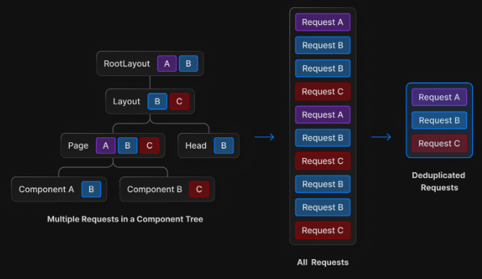

클라이언트에서 API 요청을 할 때 보통 axios라는 라이브러리를 쓰곤 합니다. 사용하기 편하게 추상화되어 있고 기능도 많이 제공하기 때문이에요. 근데 왜 갑자기 fetch API를 공부하게 되었냐면 next.js 13버전부터 서버컴포넌트가 도입되며 데이터 중복 제거를 위해 **fetch api를 권장**하고 있기 때문입니다. 기존 12버전 이하에서 SSR을 컨트롤하는데 사용하던 로직들을 fetch의 캐시 정책에 따라 동작하도록 변경되었다고 설명하고 있어요.



<!--truncate-->

## Fetch API란 무엇인가

MDN 문서에 따르면, Fetch API는 브라우져에서 원격 자원을 취득할 수 있는 방법입니다. 가령 우리가[https://www.api.com/image.png](https://www.api.com/image.png같은) 에 위치한 자원을 가져오고 싶다면 fetch API에 자원 주소 및 필요한 기타 인자들을 넘기고 Promise에 담긴 응답을 받는 것이죠.

:::info
[XMLHttpRequest](https://developer.mozilla.org/ko/docs/Web/API/XMLHttpRequest)라는 API도 있지만, 예전에 쓰던 것이고 Fetch Api가 더 고급 기능입니다.
:::

## 요청의 반환값

fetch API는 axios와 다른 점이 있습니다.

### 표준상태에 따른 에러처리

fetch API의 특징 중 하나는 서버 요청에 실패라는게 없다는 것입니다. fetch는 항상 응답으로 Promise를 반환하는데 명백한 오류인 404나 500같은 Http 상태값에 대해 reject가 아닌 resolve 로직을 던져요. Http 표준상태값에 따른 에러를 상위 컨텍스트로 던지지 않는다는 뜻입니다.

:::info
💡 fetch API가 요청에 reject Promise를 반환하는 경우는 네트워크 연결이 실패하는 경우를 포함하여 아예 요청을 완료하지 못한 경우로 한정됩니다.
:::

이를 구분할 수 있는 방법은 response의 ok 값을 조회해서 true인지를 확인하는 것입니다.

```jsx
// response.ok를 이용하여 요청의 실패를 확인합니다.
fetch("https://api.com/data", {
  ...options,
})
  .then((res) => {
    if (res.ok) {
      return res.json();
    } else {
      throw new Error("요청 실패");
    }
  })
  .then((data) => {
    // 데이터로 할 일 하기
  })
  .catch((err) => {
    // 에러 핸들링
  });
```

### json() 메소드로 파싱

fetch API로 받은 JSON 응답을 받아도 바로 사용할 수 없어요. Http 응답 전체를 반환하기 때문에 json() 메소드로 파싱해줘야 합니다.

:::info
💡 json() 메소드는 응답 본문을 JSON으로 파싱한 결과를 프로미스로 반환합니다.
:::

## 사용법

기본적인 사용법을 알아볼게요.

### 기능 감지

우선 fetch API를 사용할 수 있는지 확인하기 위해 다음과 같은 로직을 작성합니다.

```jsx
if (window.fetch) {
  // Fetch API를 사용할 수 있으므로 사용 로직 작성
} else {
  // Fetch API를 사용할 수 없으므로 대체 로직 사용, XMLHttpRequest 사용같은 것. 아니면 에러처리
}
```

### 요청 제어하기

fetch Api는 인자를 2개 받는데, 그 중 하나는 자원의 **주소**이고 두번째는 **init** 객체라고 부르는 옵션 덩어리입니다. MDN 문서에서 제공한 예시를 그대로 가져와 보여드릴게요. [공식문서](https://developer.mozilla.org/en-US/docs/Web/API/fetch)에서 모든 옵션을 볼 수 있습니다.

```jsx
// * 이 들어간 옵션은 필수값입니다.
fetch(url, {
    method: POST', // * GET, POST, PUT, DELETE 등, default는 GET
    mode: 'cors', // no-cors, *cors, same-origin
    cache: 'no-cache', // * default, no-cache, reload, force-cache, only-if-cached
    credentials: 'same-origin', // include, *same-origin, omit
    headers: {
      'Content-Type': 'application/json',
    },
    redirect: 'follow', // manual, *follow, error
    referrerPolicy: 'no-referrer', // no-referrer, *no-referrer-when-downgrade, origin, origin-when-cross-origin, same-origin, strict-origin, strict-origin-when-cross-origin, unsafe-url
    body: JSON.stringify(data), // body의 데이터 유형은 반드시 "Content-Type" 헤더와 일치해야 함
})
```

위 코드를 읽어보면 POST메소드로, cross-origin 정책은 cors, cache 정책은 사용 안함, 자격증명 요청은 same origin만, 등등의 옵션을 넣고 요청을 할 수 있어요.

위 작업을 Request Instance를 직접 넘기는 방식으로 변경할 수도 있어요.

```jsx
const myHeaders = new Headers();

const myRequest = new Request('https://api.com/something', {
  method: 'GET',
  headers: myHeaders,
	...
});

fetch(myRequest)
  .then((response) => response.json())
```

Request 생성자는 fetch API와 동일한 값을 받으므로 사용했던 요청 객체를 재사용할 수 있습니다. 위에서 생성한 요청 객체를 재사용하면서 init 객체만 바꿔치기 하려면 다음과 같이 작성합니다.

```jsx
const anotherRequest = new Request(myRequest, newInit);
```

### 자격 증명을 포함한 요청

자격 증명이 필요한 요청의 대표적인 예시는 인증정보 중 하나인 cookie입니다. 요청에 인증 정보를 전달하기 위한 정책을 설정하는 것인데 다음과 같은 정책 중 하나를 선택할 수 있어요.

| credentials           | 인증 정보를 담을 수 있는가? |
| --------------------- | --------------------------- |
| same-origin (default) | 같은 출처 간 요청에만 가능  |
| include               | 모든 요청에 가능            |
| omit                  | 모든 요청에 불가능          |

cors 정책과도 밀접한 관련이 있어서 자세한 내용을 다루기엔 방대하네요.

### 캐싱

fetch API에서 cache는 브라우저가 요청한 리소스를 로컬에 저장하고, 동일한 요청이 발생했을 때 로컬에 저장된 리소스를 불러오는 기능을 말합니다. 이를 정책으로 컨트롤할 수 있어요. 사용자는 이 캐시 정책을 조절하여 요청하는 리소스가 로컬에 저장되거나 새로운 리소스를 요청할 수 있습니다. 기본 캐시 정책은 'default'로, 기본적으로 브라우저는 리소스를 캐싱합니다.

| cache          | 설명 |
| -------------- | ---- |
| default        |      |
| no-cache       |      |
| no-store       |      |
| reload         |      |
| force-cache    |      |
| only-if-cached |      |

### 응답 제어하기

fetch API의 응답값인 response 객체에는 다음과 같은 값들이 있어요.

- status - 상태값. 기본값은 200입니다.
- statusText - 상태 코드 메시지를 담은 값입니다. HTTP2에서는 지원하지 않아요.
- ok - 표준 응답 코드에 따라 정상 응답이면 true, 아니면 false입니다.

원하는 데이터를 얻고싶다면 이 response 값을 JSON 객체로 반환하면 됩니다.

```jsx
if (response.ok) {
  return response.json();
}
```

### 헤더

fetch API는 header라는 인스턴스를 만들어 요청에 포함시킬 수 있습니다. 보통 리소스를 요청할 때 매핑할 데이터를 보내고 응답이 됐을 때 결과를 확인하기 위해 사용됩니다.

:::tip
Header 인스턴스는 Map 클래스의 인스턴스이므로, Map에서 제공하는 메소드들을 전부 활용하실 수 있습니다.
:::

HTTP 표준 헤더에서 불변인 값을 변경하려고 하면 TypeError를 뱉습니다. 이를 [가드](https://developer.mozilla.org/ko/docs/Web/API/Fetch_API/Basic_concepts#%EA%B0%80%EB%93%9C)라고 불러요

```jsx
const myResponse = Response.error();
try {
  myResponse.headers.set("Origin", "http://mybank.com");
} catch (e) {
  console.log("은행인 척 할 수 없어요!");
}
```

또한, HTTP 요청의 생명주기를 다루거나 요청이 보내진 시각, 리소스 타입 등을 알기 위해 header 객체를 사용합니다. 아래와 같이 헤더에서 컨텐츠 타입을 확인 후 파싱 전 체크를 해줄 수 있습니다.

```jsx
fetch(myRequest).then((response) => {
  const contentType = response.headers.get("content-type");
  if (!contentType || !contentType.includes("application/json")) {
    throw new TypeError("앗, JSON이 아닙니다!");
  }
  return response.json();
});
```

## Interceptor

Axios에서 사용하던 Interceptor를 구현하는 방법은 직접 구현하기와 라이브러리 사용하기가 있습니다. 그 중 직접 구현하는 방법을 알아볼게요.

바로 브라우져의 전역 객체에서 제공하는 fetch 메소드를 새로 정의한 함수로 override하되, 그 함수 안에는 fetch api를 호출하도록 하면 되고, 그 호출하는 부분 앞뒤로 원하는 로직을 넣으면 그게 request interceptor, response interceptor가 되는 것입니다.

```jsx
const { fetch: originalFetch } = window;

window.fetch = async (...args) => {
  // request interceptor 로직

  let response = await originalFetch(resource, config);

  // response interceptor 로직

  return response;
};
```

이번 토이 프로젝트에서 fetch API를 전역에서 쉽게 사용할 수 있도록 모듈을 만들어볼건데, 이 부분이 완성되면 글에 추가하도록 할게요.

## 결론

axios는 그냥 편하자고 사용하는 라이브러리인데, 실제 브라우져 스펙은 fetch API입니다. 너무 axios만 사용하다보니 표준 스펙을 무시하고 개발했던 경향이 있는 것 같아서, 이번 기회에 fetch API에 대해 알아볼 수 있었고 충분히 axios가 제공하던 기능들을 그대로 사용할 수 있다는 사실을 알았습니다.

하지만 현업에서는 라이브러리를 다시 사용할 것 같아요. 이것처것 찾아보다가 wretch라는 이름의 **fetch api를 쉽게 사용할 수 있게** 하는 라이브러리를 알게 되었는데 나중엔 이걸 써보면 좋을 것 같습니다.

## Reference

[Fetch API - Web API | MDN](https://developer.mozilla.org/ko/docs/Web/API/Fetch_API#%EA%B8%B0%EB%B3%B8_%EA%B0%9C%EB%85%90%EA%B3%BC_%EC%82%AC%EC%9A%A9_%EB%B0%A9%EB%B2%95)

[Intercepting JavaScript Fetch API requests and responses - LogRocket Blog](https://blog.logrocket.com/intercepting-javascript-fetch-api-requests-responses/)

[Safe Data Fetching in Modern JavaScript](https://www.builder.io/blog/safe-data-fetching)

[wretch](https://elbywan.github.io/wretch/)
