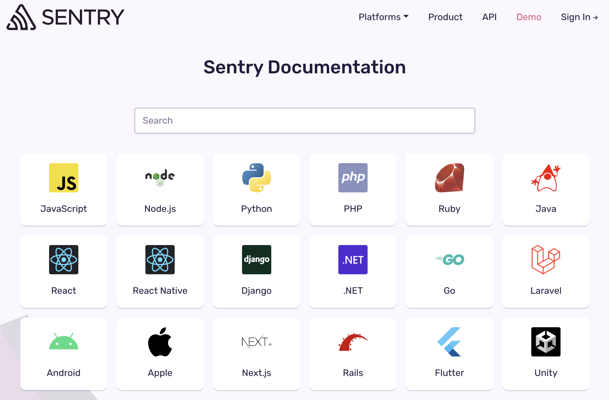
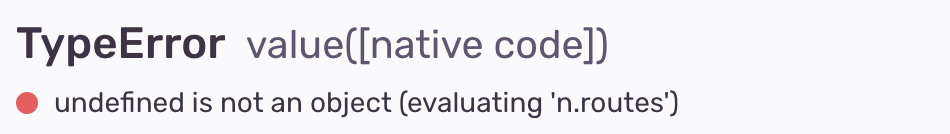
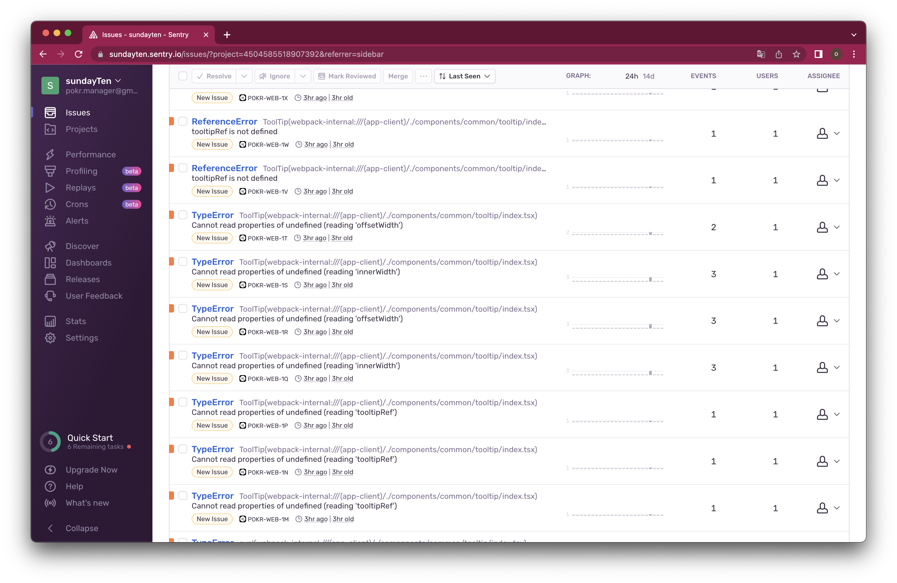
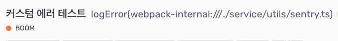
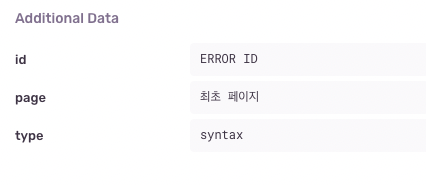

플랫폼 서비스를 이용하는 사용자들이 제일 짜증나는 상황이 장애상황이라면, 개발자들에게는 그 장애상황이 왜 발생했는지 모르는 상황일거에요. 마치 형사들이 사건의 실마리를 하나하나 찾아가며 단서를 찾고, 범인과 그 동기 등을 분석하듯 저희도 장애가 발생하면 가장 효율적인 포인트부터 의심해가며 장애를 추적하고, 범인을 검거합니다. 물론 항상 잘 잡진 못하고요. 미제사건도 많아요.

오늘 알아볼 것은 이 에러 추적의 시발점이 되어주는 Sentry라는 에러 추적 도구를 잘 사용하는 방법입니다.

<!--truncate-->

## Sentry

[Sentry](https://docs.sentry.io/)는 에러트래킹을 위한 Saas 서비스입니다. 에러가 발생하면 발생 시점의 스냅샷을 기반으로 추적에 필요한 다양한 데이터를 전송해줘요. 서버와 클라이언트 모두 다양한 언어와 프레임워크 지원하고 사용하기 편리한 관리자 화면도 제공합니다.

:::tip 센트리가 지원하는 플랫폼들



:::

센트리는 이미 DataDog와 함께 에러 트래킹 도구의 양대산맥으로, 다들 아실거에요. 그래서 긴 설명은 불필요할 듯 싶네요. 바로 본론으로 들어가볼게요.

## Sentry의 문제점

Sentry를 쓰다보면 좋은점도 많지만, 분명히 불편한 점도 있습니다.

### 이름과 메시지

기본적으로 에러는 [기본 에러객체로](https://developer.mozilla.org/ko/docs/Web/JavaScript/Reference/Global_Objects/Error) 표현됩니다. 실제로 별다른 설정 없이 에러를 던지면 아래 사진과 같은 에러들이 수집되요. 소스맵이 없는 에러의 경우 번들링되고 minify된 코드가 보여기 때문에 디버깅이 쉽지 않습니다.



그러므로 에러의 이름과 메시지는 명확히 파악되어야 합니다.

:::info 에러 커스텀의 필요성

에러메시지가 명확하면 다음과 같은 이점이 있어요.

- 발견 즉시 무슨에러인지 알 수 있습니다.
- 에러를 필터링하거나 검색하기 용이합니다.
- 코드에서 해당 에러가 발생한 로직을 찾기 쉽습니다.
- 쌓여있는 에러 속에서 발견하기 쉽습니다.

:::

### 과도한 로깅

에러 모니터링 툴의 로거는 샘플링 레이트를 넘지 않는 모든 에러를 잡아야 하지만, 꼭 필요한 에러만 알림으로 알려주고 해결할 수 있도록 리마인드 해야합니다. 만약 그렇지 않다면 **양치기 소년**과 같이 변모해버려요. 나중에 에러 관련 **슬랙 알림을 끄는 상황**이 발생합니다.

또한 권고사항대로 Sentry로 앱 전체를 감싸게되면 앱 내에서 발생하는 모든 오류를 잡아줍니다. 하지만 서비스가 커지다보면 그 에러의 종류가 많아지게 되고 **throw만하고 catch는 안하는 상황** 속에서 많은 에러들이 우후죽순 로깅되게 됩니다. 거기에 다양한 라이브러리에서 던져지는 에러들까지 합쳐지면 거의 에러를 방치하는 수준이 되버립니다.

### 효율적으로 쓸 순 없을까?

제가 작년에 팀에 합류해서 가장 거슬렸던 것이 바로 그냥 withSentry로 전체 앱을 감싸놓은 상태로 모든 에러를 우후죽순 로깅되고 있던 상황이었습니다. 아래 사진은 제 토이프로젝트 로거인데, 아무런 처리를 해두지 않으면 다음과 같이 나오고 production 빌드가 되면 코드가 minify되어 해독이 불가능해집니다. 즉, 쓸모가 있지만 쓸모가 없는 상황이 와버려요.



## 해결방법

일단 에러를 우리가 보기 편하게 만듭니다. 그리고 손쉽게 로깅할 수 있도록 모듈화합니다.

### Custom Error Class

유명한 방법입니다. [자바스크립트 기본 에러 클래스](https://developer.mozilla.org/ko/docs/Web/JavaScript/Reference/Global_Objects/Error)를 상속받아서 name과 message를 수정할 수 있게 만든 에러 클래스를 만들고, 실제 에러가 발생했을 때 기본 에러 대신 새로 만든 에러 클래스의 인스턴스를 Sentry에 제공하면 됩니다.

1. JS Error

```tsx
interface ErrorParams {
  name: string;
  message: string;
}

export class CustomError extends Error {
  constructor(error: ErrorParams) {
    super(error.name);
    this.name = error.name;
    this.message = error.message;
  }
}
```

1. Axios Error

자매품으로 서버에 데이터를 요청하는 HttpClient 전용 에러 클래스를 만들 수 있어요. 저는 공공연하게 사용되는 HttpClient인 **Axios**를 활용해볼게요. Axios에서 제공하는 타입들을 받아와서 커스텀해줍니다. 실제 AxiosError라는 클래스를 상속받아서 만들었고, 요청에 에러가 발생했을 때 어떤 요청인지 응답은 어떤게 내려왔는지 등을 기록하고 name과 message는 Http표준 응답으로 정해서 나중에 필터링하기 쉽게 작성했습니다. default값은 에러코드를 동봉해서 변수가 생겼을 때 status code를 알아볼 수 있도록 정했습니다.

```tsx
import {
  AxiosError as AxiosErrorType,
  AxiosRequestConfig,
  AxiosResponse,
} from "axios";

export class AxiosError<T = unknown> extends AxiosErrorType {
  config: AxiosRequestConfig;

  code?: string;

  request?: any;

  response?: AxiosResponse<T>;

  isAxiosError: boolean;

  toJSON: () => any;

  constructor(error: AxiosError<T>, message?: string) {
    super(message ?? error.message);
    const errorStatus = error.response?.status || 0;

    this.name = getErrorName(errorStatus);
    this.stack = error.stack;
    this.config = error.config;
    this.code = error.code;
    this.request = error.request;
    this.response = error.response;
    this.isAxiosError = error.isAxiosError;
    this.toJSON = error.toJSON;
  }
}

/**
 * HTTP 표준응답코드에 따라 에러 이름을 분기해서 반환하는 함수
 * @param status HTTP 표준응답 코드
 */
const getErrorName = (status) => {
  let name = "Api Error";
  switch (status) {
    case 400:
      name = "Bad Request";
      break;
    case 401:
      name = "Unauthorized";
      break;
    case 403:
      name = "Forbidden";
      break;
    case 404:
      name = "Not Found";
      break;
    case 405:
      name = "Method Not Allowed";
      break;
    case 500:
      name = "Internal Server Error";
      break;
    case 503:
      name = "Time Out";
      break;
    default:
      name = `[${status}] Api Error`;
  }

  return name;
};
```

### Sentry Util 만들기

에러가 발생했을 때 항상 호출할 수 있는 로깅 유틸을 만들어봅시다.

### Js Error

다음과 같이 만들어볼겁니다.

1. 다양한 데이터를 받아서 커스텀 에러 객체를 만든다.
2. 에러 발생 당시 store 상태, 유저 데이터, 라우터 등의 데이터에 대한 스냅샷을 붙힙니다.
3. Sentry의 captureException 메소드로 로그를 쌓습니다.

```jsx
import { captureException } from '@sentry/nextjs';
/**
 * 에러를 기록합니다.
 * @param { ErrorParams } 로깅할 에러에 대한 정보가 담긴 객체입니다.
 */
export const logError = ({
  name = "default Error Name",
  message = "default Error Message",
  type,
  level,
  extraData,
}: ErrorParams) => {

  captureException(
    new CustomError({
      name,
      message,
    }),
    {
      level,
      extra: { ...extraData, type, ...getSnapshotInError() },
    }
  );

	handleError() // 로깅 모듈에서 제외하는게 맞을 수도 있습니다.
};

// 에러 발생 당시 store 상태, 유저 데이터, 페이지 데이터 등과 같은 스냅샷을 가져옵니다.
const getSnapshotInError = () => {...}

/// 공통 에러 처리 로직.
const handleError = (type, data) => {
	  switch (type) {
		// 에러 타입 별 핸들링 기능, 분리하는 게 좋아보인다.
  }
}
```

위와 같이 작성해도 되고, Sentry에서 추가로 제공하는 메소드들을 활용해도 됩니다.

아래에 handleError 모듈은 공통으로 처리해야 할 에러 로직을 넣은 것인데 에러 로깅 로직에 핸들링 로직까지 넣는건 이상한 것 같아서 지금 생각해보니 별도로 분리해내는게 맞을 것 같아요.

### Axios Error

Axios 에러도 다를게 없어요. 스냅샷이나 핸들링은 넣지 않았지만 필요하다면 넣어줘도 좋습니다.

```tsx
/**
 * Axios 에러를 기록합니다.
 * @param { ApiError } error AxiosError를 상속받아 만든 커스텀 에러 클래스 인스턴스입니다.
 */
export const logAxiosError = (error: AxiosError) => {
  captureException(error, {
    level: "error",
    extra: {
      header: error.config.headers,
      response: error.response?.data,
      request: error.request,
      type: "network",
    },
  });
};
```

## 활용하기

### Js Error

어떤 js 에러를 감지했을 때 로그를 기록해봅시다. level 값은 default가 error고 앱이 죽거나 심각한 오동작의 경우 fatal 값을 넣도록 가이드해서, 발생 즉시 슬랙에 알림이 가도록 만들었습니다.

```jsx
try {
  throw new Error('BOOM');
} catch (error) {
  logError({
    name: '커스텀 에러 테스트',
    message: error.message,
    level: 'error', // 요기에 fatal을 넣으면 슬랙에 알림이 간다.
    type: 'syntax',
    extraData: {
      page: '최초 페이지',
      id: 'ERROR ID',
    },
 });
```

이렇게 에러가 감지되었을 때 logError 함수를 호출하면 센트리에는 다음과 같이 에러를 기록됩니다.



이름과 메시지를 보시면 제가 던지는 객체 이름대로 설정된 것을 볼 수 있습니다.



실제 위 에러를 열어보면, Additional Data 부분에 추가적인 데이터가 들어갑니다. 원하는 정보는 다 넣으시면 되겠죠? 해당 페이지로 넘겼던 parameter, 어떤 페이지에서 진입했는지, 스토어엔 어떤 데이터가 있었는지 등등 이해관계가 있는 모든 데이터를 기록해주시면 되겠습니다.

### Axios Error

AxiosError 로거는 당분간 axios instance의 interceptor에 달아두고 모두 기록하도록 해뒀습니다. 달아두고 보니 500이나 503같이 사용자 네트워크 문제로 인한 로그가 대부분이라 이 부분만 제외하도록 변경했고요, 나중엔 로깅은 하지 않고 커스텀 에러 객체를 반환하도록만 수정했습니다.

```jsx
import axios from "axios"

const AxiosInstance = axios.create({...})

AxiosInstance.interceptors.response.use(
  res => res,
  err => {
    const ApiErrorInstance = new AxiosError(err);
		logApiError(ApiErrorInstance) // 추후 제거함

    return Promise.reject(ApiErrorInstance);
  },
);
```

이제 axios instance로 데이터를 가져오는 로직을 작성할 때 핸들링 및 로깅을 하도록 변경했어요.

```jsx
export const fetchData = async () => {
  try {
    const response = await axiosInstance.get(`${Host}/api/posts`);

    if (response.status === 200) {
      return response.data;
    }
  } catch (error) {
    // error는 AxiosError 타입
    handleError(error);
    logApiError(error);
    throw error;
  }
};
```

로깅을 어디서 할지는 작업하는 사람이 정하고, 일관되게 로깅되는 기능은 꺼버린 셈입니다.

## 단점

문제를 해결하려고 만든 모듈들이지만, 되이려 단점도 있었습니다.

### try - catch

로직을 전부 try - catch 아니면 if문으로 잡아줘야 이 모듈을 쓸 수 있다는 단점이 있습니다. 수많은 로직들을 전부 try-catch에 넣는다는게 여간 귀찮은게 아닙니다. 이것조차 추상화한 모듈을 만들 순 있지만 그런다고 진짜 문제가 해결될 것 같진 않아요. 선언적으로 해결하고 싶은데, 즉 자동화가 필요한거죠. 어떻게 하면 좋을까요?

### 못잡는 에러

아직 UI thread 에러는 어떻게 잡는지 모르겠습니다. 스크롤 이벤트가 발생하는 도중 존재하지 않는 인덱스로 스크롤을 하라고 하면 에러가 나요. 이건 Js Thread에서 발생하는 에러가 아니라서 에러를 잡아낼 수 없어요.

그리고 promise를 리턴하지 않는 비동기 에러도 마찬가지에요. useState나 react-navigation의 navigate 메소드 등이 예시가 될 수 있겠습니다.

이런 에러들은 어떻게 처리해야할지 모르겠습니다.

### 로그의 발생 위치

에러가 발생한 스크린의 특정 로직의 위치가 아닌 아닌 로그 유틸 위치가 기록된다는 점이 문제입니다. 위 사진을 보면 service/utils/sentry.ts에서 에러가 발생한 것처럼 보이지만 실제로는 저 유틸에서 captureException 메소드가 호출된 것이기 때문에 그런 것이고 이 모듈을 호출한 상위 컨텍스트에서 발생한 것입니다. 스냅샷을 동봉하긴 하지만 센트리가 주는 많은 데이터를 버리게 될 수 있다는 생각이 들었습니다.

## 결론

한달 전 쯤 이 모듈을 만들어서 팀에 이런 문제를 공유하고, 쉽게 가져다 쓸 수 있는 로깅 모듈을 만들었으니 편하게 가져다 쓰시라고 말했습니다. 디버깅에 최대한 센트리를 활용해보자고요.

export한 모듈은 단 2개로, 최대한 간단하게 만들었기 때문에 사용하는데 큰 어려움은 없었어요. 다만 일이 바쁘다보니 에러 핸들링은 뒷전인 것은 어쩔 수 없더라고요. 그래도 리팩토링할 때에는 꼭 에러 로깅을 넣도록 독려했고 그 결과 알아먹기 힘든 영어 천지였던 센트리 이슈 페이지는 다양한 커스텀 에러들로 가득찼습니다. 장족의 발전이라고 생각해요.

## Reference

[센트리 공식문서](https://docs.sentry.io/platforms/javascript/guides/nextjs)

[센트리로 우아하게 에러 추적하기](https://tech.kakaopay.com/post/frontend-sentry-monitoring/)
