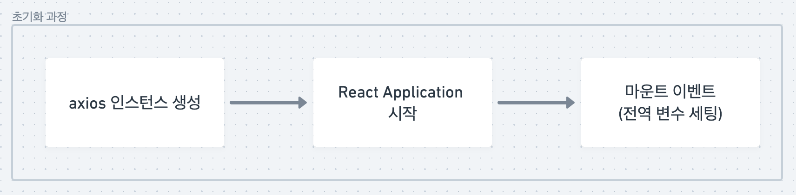
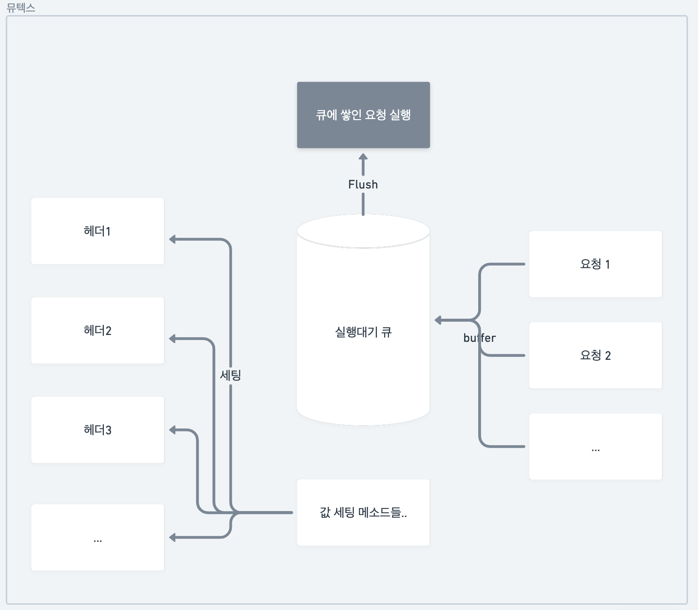
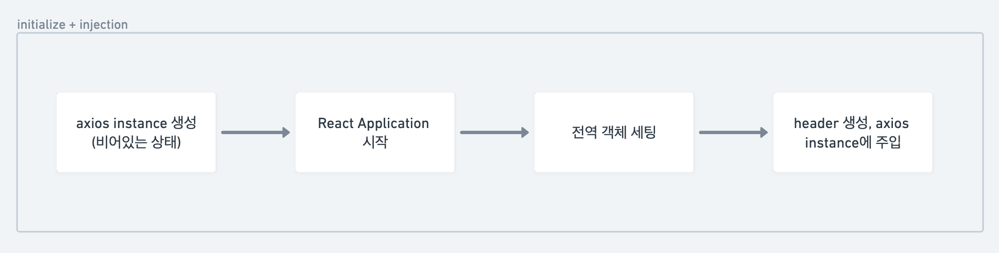

대학다닐 때 어렴풋이 전역변수는 최대한 쓰지 말라고 배웠습니다. 앱이 죽기 전까지 메모리에 좀비처럼 살아있는(의도된 것이지만) 점과 수정 할 때 여러 사이드이펙트가 날 수 있다는 점, 의존성 때문에 유지보수가 힘들다는 점에서 잘 사용하지 않아요.

근데 현업에 나와보니 전역변수를 안쓰면 문제가 굉장히 복잡하고 어려워지는 경우가 생깁니다. 그래서 모든 View나 Service 단에서 접근해 값을 가져다 쓰지만 변화가 자주 일어나지 않는 정보는 전역객체에 저장하죠. 저도 그런 방식으로 몇몇 데이터를 전역변수에 저장해서 쓰곤 했습니다.

오늘은 axios instance 관련 문제 해결 도중 알게 된 전역변수에 관한 지혜, 뮤텍스와 세마포어로 해결하는 아이디어, 자바스크립트 모듈의 실행 순서 등을 알아보고 결국 어떻게 해결하게 되었는지 알려드릴게요.

<!--truncate-->

## 사건의 발단

몇달 전부터 서버 개발자들이 자꾸 어떤 요청의 필수 헤더가 누락된 채로 들어온다는 제보를 받았어요. 그리고 시점을 확인해보니 앱의 시작 시점인 경우였고요. 그래서 초기화와 관련된 점 까지는 알겠는데 그 이후론 진전이 없었습니다.

당시 필수 헤더들를 포함시키는 로직은 다음과 같이 구성되어 있었어요.

```tsx
import axios from "axios"

const AxiosInstance = axios.create({
	baseUrl: myhosturl,
	headers: {
		'custom-header1' : getHeader1(),
		'custom-header2' : getHeader2(),
		...
	}
})
```

getHeader 모듈은 전역객체에서 헤더에 넣을 데이터를 가져오는 함수인데, 비동기 함수면 몰라도 동기로 전역객체를 가져오는 함수임에도 간헐적으로 undefined가 반환되는 오류가 있었습니다.

그래서 임시방편으로 해당 헤더들을 가져오는 로직들을 하나씩 interceptor에 넣기 시작했습니다. interceptor는 axios에서 요청을 보내기 전에 거치는 미들웨어같은 로직인데 요청이 날아가는 시점엔 그래도 값이 채워져있었을 것이므로 더이상 문제는 발생하지 않았죠.

```tsx
// Axios Request Interceptor 중..
(config) => {
	config.baseURL = getServerURL();

	const header1 = getheader1()
	if (header1) {
		config.headers = {
			...config.headers,
			header1
		};
	}

const header2 = getheader2()
	if (header2) {
		config.headers = {
			...config.headers,
			header2
		};
	}
const header3 = await getheader3()
	if (header3) {
		config.headers = {
			...config.headers,
			header3
		};
	}
const header4 = await getheader4()
	if (header4) {
		config.headers = {
			...config.headers,
			header4
		};
	}

	return config;
},
(error) => error,

```

하지만 모든 요청에 이런 불필요한 로직이 실행된다는 것은 큰 문제였습니다. 그리고 그 실마리는 어이없게도 모듈의 실행 시점과 관련이 있었습니다.

## 모듈의 실행 순서

전역 변수를 초기화하는 코드는 리액트 어플리케이션이 시작한 이후인데, axios 인스턴스를 생성하는 시점은 그 이전이었던 것이죠.



우선 자바스크립트에서 모듈이 어떻게 실행되는지에 대한 이해가 필요합니다. 자바스크립트에서 모듈은 순전히 의존관계에 의해 실행됩니다. 다음과 같은 모듈이 있다고 가정해볼게요.

first.js는 second.js에서 SECOND라는 값을 받아옵니다.

```tsx
//first.js
import { SECOND } from "./second.js";
console.log("first 실행,", SECOND);
```

second.js는 third.js에서 THIRD라는 값을 받아오고요.

```tsx
// second.js
import { THIRD } from "./third.js";
console.log("second 실행", THIRD);

export const SECOND = "second";
```

third.js는 THIRD라는 값을 export만 할 뿐 어떤 값도 가져오지 않습니다.

```tsx
// third.js
console.log("third 실행");

export const THIRD = "third";
```

자 이제, first.js를 실행시켜봅니다.

```bash
~/practice/module > node first.js

third 실행
second 실행 third
first 실행, second
```

결과에서 보다시피, 실행한 파일은 first.js인데, 실제 (ES6기준) import 문법을 통해 결정된 모듈 실행 순서에 따라 **3→2→1** 순서로 실행됩니다. 즉, 의존성이 우선시되는 모듈을 먼저 실행한다는 뜻입니다.

:::info 테스트중 알게된 사실

자바스크립트 모듈 시스템에서는 순환참조가 허용되는 것으로 알고 있는데, third.js 모듈에 first.js에서 export하는 값을 호출하라고 하면 오류를 냅니다.

:::

## 문제 해결 과정

여튼, axios 인스턴스 생성 모듈은 React Application의 index.js(엔트리 파일) 보다 먼저 실행됩니다. 이 시점은 디바이스 저장소에서 필요한 데이터들을 꺼내 전역 변수로 등록하기 전이므로 당연히 인스턴스에는 필요한 설정을 넣어줘도 알 수 없습니다.

문제해결을 위해 두가지 생각을 해봤어요.

1.  mutex & semaphore

    OS시간에 멀티 스레딩에서 공유자원의 접근을 다루는 방법으로 mutex & semaphore를 배운적 있어요. 이 개념에 착안해서 공유자원 접근에 대한 컨트롤타워 역할을 해줄 class를 singletone으로 만들어 해결해볼 생각을 해봤어요. class는 최초 생성되고 세팅되기 전에 요청된 모든 API를 해당 클래스에서 관리하는 queue에 넣은 다음 모든 값이 세팅된 다음 쫙 호출해주는거죠.

    

이렇게 되면 axios 인스턴스엔 뭐가 들었든 문제없이, API요청은 표준헤더가 없으면 보내지지 않고 나중에 세팅이 끝나면 호출될테니까요.

1. initializer + injection

   헤더 구성에 필요한 모든 값이 보장된 시점에 실행될 initializer 모듈을 만들어서 앱이 실행되어 최초 API가 발생하기 이전에 axios 인스턴스에 헤더가 존재하도록 보장하는 방법입니다. 초기화 과정이 끝나기 전에는 어떤 API도 날아갈 수 없기 때문에 아무런 화면도 볼 수 없다는 단점이 있어요.

   

저는 결국 두번째 방법을 선택했어요. 결국 단순히 코드가 쉽고 안전하다, 내가 없어도 충분히 이해될만한 코드다, 시점 자체가 명확하다 정도의 이유였습니다. 첫번째 방법은 세팅되는 시점과 요청이 발생하는 시점의 간극이 벌어질수록 사용자 경험이 떨어질 것 같았어요. 결국은 잘 만들지 못하면 사용자가 불능 상태에 빠진다는 치명적인 점도 절 두렵게 했고요.

### 구현

initialzer 모듈을 구현합니다. 해당 모듈이 호출되는 시점엔 모든 헤더값의 값이 보장된 시점이므로 동기함수로 모든 값을 가져옵니다. 보기 쉽게 표현하기 위해 composeFunctions라는 함수를 정의해서 사용했어요.

```tsx
/**
 * 필수 헤더를 초기화합니다.
 */
export const initializeHeaders = () => {
	// composeFunctions는 functional하게 함수들을 합성하는 함수입니다.
	const header = composeFunctions(
		initializeHeader1,
		initializeHeader2,
		initializeHeader3,
		...,
	)(getchaCommonHeader);

	if(isNotNull(header) && typeGuard(header)){
		return header;
	}

	return null;
};

// 헤더를 초기화합니다.
const initializeheader1 = (headers) => {
	const essentialHeader1 = getEssentialHeader1();

	if (essentialHeader1) {
		return { ...headers, 'header1': essentialHeader1 };
	}

	return headers;
};

/**
 * 함수를 합성합니다. 왼쪽부터 실행됩니다.
 * @param funcs
 * @returns
 */
export const composeFunctions =
	(...funcs) =>
	(initialVal) =>
		funcs.reduce((val, fn) => fn(val), initialVal);
```

이렇게 만들어진 헤더를 ApiClient에 주입합니다. 추가로, host도 초기화되기 이전이므로 이 단계에서 같이 주입해줍니다.

```tsx
/**
 * 필수 헤더를 axios instance들에 주입합니다.
 */
export const injectHeaderToInstance = (headers) => {
  AxiosInstance.defaults.headers.common = {
    ...ApiClient.defaults.headers.common,
    ...headers,
  };

  AxiosInstance.defaults.baseURL = getServerURL();

  return true;
};
```

이렇게 만든 모듈을 앱의 entry module에서 호출합니다.

```tsx
// 마운트 시점에 entry module에서 실행
useEffect(() =>
...
initApp()
			.then( ... )
			.then(initializeHeaders)
			.then(injectHeaderToInstance)
			.then( ... )
...
}, [])
```

동적으로 헤더를 주입하는 과정도 필요했어요. 헤더 정보가 바뀌는 경우도 있으니까요. 아래와 같이 작성해서 사용할 수 있습니다. 아니면 실제 인스턴스의 메소드를 호출할 때 직접 주입하는 방식도 있습니다.

```tsx
// 토큰을 주입합니다. 값이 없거나 null이면 헤더를 제거합니다.
export const injectToken = (token) => {
  if (header) {
    AxiosInstance.defaults.headers.common.Authorization = `Bearer ${token}`;
    return;
  }

  delete ApiClient.defaults.headers.common.Authorization;
};
```

## 결론

자바스크립트의 모듈 실행방식은 항상 일정하다라는 사실을 알고 있었다면 axios 인스턴스 생성 모듈의 실행 시점에 전역객체가 비어있을 수 있다는 사실을 유추할 수 있었을 것 같은데, 그 사실을 명확히 몰라서 이렇게 질질 끌게 되었던 것 같아요.

이번 개선은 찬반이 갈리 수 있는게 전반적인 속도는 개선해줬을 것이지만 초반 사용자 경험은 떨어뜨릴 것 같고, 방법 또한 초기화 전까진 아무것도 못하게 강제한 것이기 때문에 유연하지 못하다고 판단되요. 처음에 생각했던 뮤텍스와 세마포어의 아이디어를 가지고 다시한번 만들어보고 싶네요.
