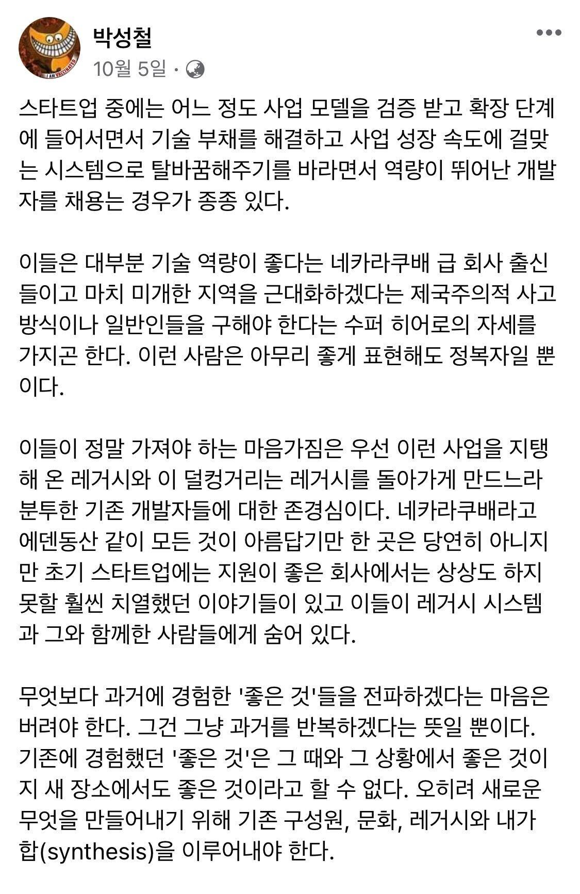

**기술적 정복자**에 대한 아티클을 본 적 있습니다. 당신이 아무리 뛰어난 기술을 가진 엔지니어라고 한들, 이를 다른 조직에 적용하는 과정에서 그 집단 구성원에 대한 존중이 없다면 한낱 정복자에 지나지 않다고.

이 글이 충격적이었던 사실은, 제가 현재 조직에 처음 와서 여러 기술과 방법론을 도입했을 때의 상황과 비슷했다는 점 때문이었습니다. 당시 옛날 기술로 도배가 되어 있어 고통받던 동료 개발자들을 위해 개발자 경험을 올릴 수 있도록 기여해야겠다는 생각에 야근까지 자처하면서 다양한 신문물을 들여와서 적용시켰습니다.

그 결과 우리 팀 기술 스택은 꽤 많이 바뀌었고, 개발이나 관리에 있어 효율을 얻을 수 있었죠. 하지만 그 과정이 순탄치는 않았습니다. 기술 자체를 이해하지 못하는 사람도 있었고, 딱히 니즈가 없으신 분들도 있었어요. 오히려 과거의 기술들이 장점을 가진 경우도 있었죠. 어쩌면 저는 앞뒤사정을 확인하지 않고 무자비하게 회사 기술을 갈아엎었던 정복자라고 볼 수 있는 거에요.

<!--truncate-->

이 바닥에 은탄환은 없는데, 마치 이 총알을 넣으면 모든 적이 죽을 것 처럼 떠들고 선봉장을 자처해 앞으로 달려나간 거에요. 그러다 그 선봉장이 없어지면, 이 곳에 남겨질 사람들의 사정은 생각도 안하고 말이죠.

## 기술적 정복자(Technical Conqueror)

탄탄한 기술이 지탱하고 있는 스타트업은 없습니다. 오늘 만든 프로덕트가 언제 시장에서 외면받을 줄 알고, 언제까지 환영받을 줄 알고 기술 리소스를 쏟겠어요. 그럴싸한 MVP를 만들어 내보내기를 반복하며 꾸역꾸역 서비스를 유지해왔을거에요. 그 역사를 써내려간 사람들, 그럴 수 밖에 없었던 결정들을 존중하지 않는다면 우리는 위 아티클에서 언급된대로 한낱 문명화되지 않은 지역을 해방이라는 명목 하에 점령하러 떠나는 정복자에 지나지 않습니다.

정복자의 마음가짐을 가진 사람은, 정복을 하던 못하던 그 목적을 달성하는데 큰 에너지를 소모하게 되요. 만약 완벽히 수복했더라도 그 과정에서 기존 구성원들을 우매한 기술을 가진 사람들로 규정하고 혀를 끌끌찰테니까요. 잘 모르겠다고 해도, 개발을 잘 못해도, 구성원들이 못나서 그런거라고 생각할 것이고 그런 상황을 술자리에서 이 곳 사람들은 이것밖에 안된다고 토로하지 않을까요?

만약 완벽히 정복하지 못하고 중간에 팀을 떠나는 사건이 발생하더라도, 아마 끝까지 이해하지 못할거에요. 내 기술은 완벽했는데 왜 실패했지? 마치 압도적 화력으로 이라크를 정복했지만 안정화 작전에서 실패하여 결국 떠날 수 밖에 없었던 미군처럼요.

## 히어로

축구팀에는 스타 플레이어라는 존재가 있습니다. 실력이 월등하거나 주급이 높아서 상대가 예의주시하는 팀의 일원을 말합니다. 이 스타 플레이어는 팀의 정신적 지주가 되기도 하고, 실력 상향 평준화의 도구로 쓰이기도 하며 전략적으로 활용되기도 합니다.

어떤 조직에도 이와 비슷한 개념이 존재할 수 있습니다. 지금부터 그 개념을 **히어로**라고 부르기로 해요. 개발팀에 대입해서 생각하면 유명한 스타 개발자, 슈퍼 개발자라고 할 수 있습니다. 최근 높은 연봉을 유지했다거나, 개발 도서의 저자, 유명한 세션의 연사 혹은 유명한 오픈소스 프로젝트의 메인테이너 같은 사람들이요. 위 아티클에서 언급된, 소위 네카라쿠배에서 온 개발자들도 비슷한 부류라고 보실 수 있어요.

이런 히어로와 함께 일할 때, 그리고 스스로가 히어로로서 기술적 의존도가 높은 사람이라면 서로 필요한 태도가 있다고 생각해요. 내가 히어로라면 서비스가 잘 유지되도록 노력해온 기존 구성원에 대한 존중이고, 구성원이라면 메시야를 본 민중이 되지 않도록 하는 자세입니다. 상호존중하되 어느 곳도 점령되지 않는 상태. 서로 승리하는 구도가 필요하다고 생각해요.

## 레거시에 대한 존중

레거시는 혐오스럽습니다. 이건 진심입니다. 과거의 아둔한 내가 생산해놓은 레거시는 그 혐오감이 더 커요. 당장 큰 문제는 없으니까 가만히 두는거지, 시간이 난다면 득달같이 달려들어 제거할 부끄러운 코드 투성이입니다.

하지만 그 당시의 나를 돌아보면, 나는 최선을 다했습니다. 어떤 요구가 있었고, 그 요청을 잘 수행하기 위해 최대한 노력했을거에요. 그렇게 그 요청을 잘 수행했지만, 그 과정에서 정리되지 않은 작업물이 있을 수 있고 한두번 더 생각했으면 나았을 코드가 나올 수 있잖아요. 하지만 당시의 나에겐 그 정도의 여유는 없었던거죠. 변명이라면 변명일 수 있지만, 최선을 다한 사람의 변명이라고 이해하면 좋을 것 같아요.

남들도 별반 다르지 않을거에요. 누가 일부러 그랬겠습니까. 다들 당시 할 수 있는 최선을 했겠죠. 그들이 그렇지 않았더라도 우리는 그렇게 믿고 앞으로 나아가야합니다. 의심을 가지는 순간 더이상 함게 나아갈 수 없어요.

## 함께 가야합니다.

대학다닐 때 교수님이 엔지니어는 기술만 잘하면 된다고 하셨습니다. 지금 생각해보니 터무니없이 틀린 말이였던것 같아요. 세상에 은탄환은 없습니다. 어느 날 어떤 순간, 고등생물이나 몇세대나 앞선 기술이 나타나서 우리를 모두 구원해줄 거라고 기대할 수 없어요. 그리고 그런 기대를 가진 사람이 존중까지 잃어버리면 기술적 정복자로 다시 태어나는게 아닐까 싶어요.

같이 나아가기 위해, 죽이되든 밥이되든 함께 가야 할 동료로 바라보고 그들의 그간 노고를 치하하며 천천히 그들의 가장 믿음직한 협력자 중 하나로 거듭나야 합니다.

---

Copyright © HOJUN IN. All rights reserved.
