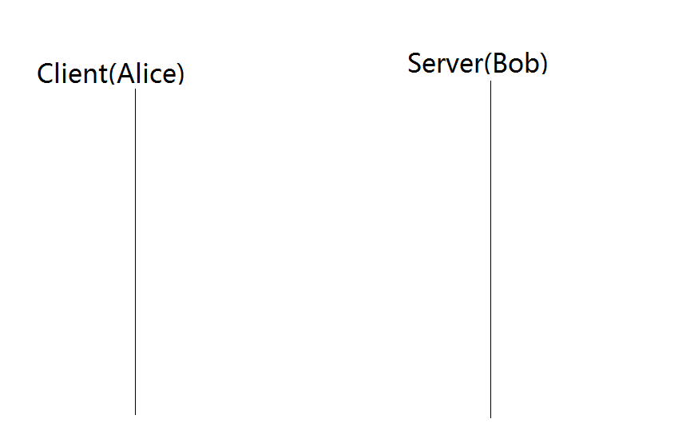
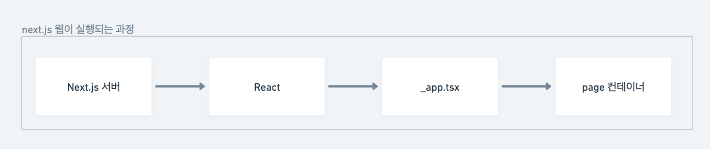
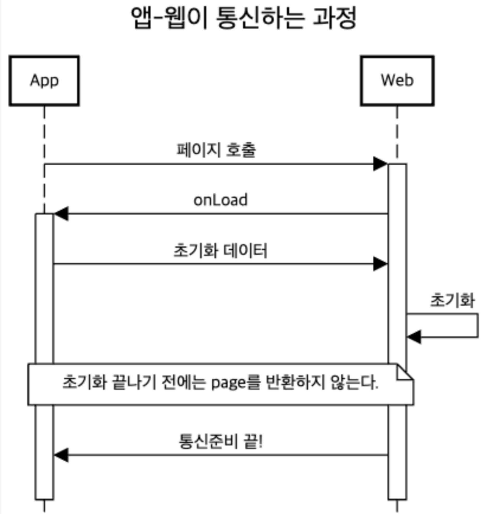

## 웹뷰 통신

WebView는 웹이라는 자유롭고 성능좋은 도구를 어플리케이션에서 활용할 수 있도록 하는 도구입니다. 그리고 이 웹뷰를 활용하는 방법은 놀라울 만큼 간단합니다. 각 OS 웹뷰 모듈을 호출해서 원하는 웹페이지 주소를 입력하면 끝이에요. 웹만 잘 만들어 놓았다면 호출하는 순간 잘 만들어진 서비스가 됩니다.

하지만 앱에서만 처리할 수 있는 일이 있고, 앱에서 처리하면 더 좋은 문제들이 있습니다. 그러기 위해선 앱과 웹이 소통하면서 서로가 필요한 일을 잘 수행해야해요. 그렇기 때문에 **앱-웹 간 통신**은 정말 중요한 문제에요.

오늘 다뤄볼 문제는 **앱-웹 간 통신**하기입니다.

<!--truncate-->

:::tip 앱-웹뷰 간 통신을 왜 잘 해야할까?

앱-웹 간 통신의 궁극적인 목적은 뭘까요? 앱과 웹은 각각 독립된 서비스이지만 앱이 웹을 호출함으로써 하나의 서비스가 됩니다. 하나의 서비스라 함은, 사용자는 앱과 웹이 어떤 상호작용을 하던 그저 하나의 잘 만든 앱을 사용하는 것 처럼 느낀다는 것과 같습니다. 즉, 마치 하나의 앱을 사용하는 것 처럼 자연스러운 흐름을 만들어 내는 것이 목적입니다. 서로 안전하게 데이터를 전달하고, 혹시나 오동작하는 경우에는 에러UI를 보여주거나 로깅이 이루어져야 합니다.

:::

## 해결해야 하는 문제

아래와 같은 순수한 호기심이 들 수 있어요.

:::info 굳이..?
그냥 웹을 호출하자 마자 통신 시작하면 되는거 아니야?
:::

하지만 앱과 웹이 준비되기 전에 통신을 시작하면 다음과 같은 문제가 발생해요.

1. 앱이 던진 메시지를 웹이 수신할 수 없다.

   → 메시지 이벤트 핸들러를 등록하기도 전에 받았기 때문이다.

2. 앱이 던진 요청을 웹이 처리할 수 없다.

   → 비동기로 세팅되는 featured flag가 세팅되기도 전에 앱이 메시지를 던졌기 때문이다.

3. 웹이 던진 요청을 앱이 처리할 수 없다.

   → 현재 버전에서는 가능한 처리지만 과거 버전에서는 처리할 수 없는 요청이기 때문이다.

그러므로 앱과 웹 간 통신은 **준비된 상태**에서, 약속된 요청만을 보내야해요.

## 안전하게 통신하기

안전하게라는 말에는 두가지 의미가 있어요.

1. 보안
2. 약속대로 동작

1번은 차치하고, 이번엔 2번을 다뤄볼거에요. 앱과 웹이 통신할 준비도 전에 통신이 시작되면 오동작을 일으킬게 뻔하니까요.

:::caution 1. 보안 문제
같은 기기 내에서 이루어지는 통신이다보니 보안은 문제가 안될 거라고 생각해요. 하지만 문제가 된다면 아래에서 설명할 Three Way HandShake 개념을 그대로 사용하면 될 거라 생각해요. 일단 생략합니다
:::

### 아이디어

**[HandShake](<https://en.wikipedia.org/wiki/Handshake_(computing)>)**라는 개념은 넓은 의미에서 서로를 확인하고 소통할 준비를 마치는걸 말해요.
그 중 TCP/IP의 Three Way HandShake의 개념을 생각해볼게요. 네트워크 시간에 배운 간단한 개념이에요. 두 존재가 통신을 하기 전에 3번의 단방향 통신을 하면서 서로 통신할 준비를 마치는 과정이죠.

:::tip 간단히 이해하기

1. 들려?
2. 어 들려!
3. 어 들리는구나, 이제 통신한다?!

정도로 이해하면 됩니다. 이 개념을 한번 웹뷰 통신 과정에 적용해볼거에요.
:::



:::info handshake의 의의

양쪽 모두 데이터를 전송할 준비가 되었다는 것을 보장하고, 실제로 데이터 전달이 시작하기전에 한쪽이 다른 쪽이 준비되었다는 것을 알수 있도록 한다.

:::

## 웹뷰 초기화 로직

---

App, Web이 각 단계에 맞게 블로킹되어 있다가 조건이 맞으면 다음 단계를 진행하는 아이디어입니다. 우선, 웹뷰용 프로젝트로 활용하는 Next.js 어플리케이션의 생명주기를 살펴볼게요.

### Next.js 생명주기

Next.js 어플리케이션은 생명주기를 간략히 그려보면 다음과 같아요.



1. Next.js 서버, 즉 Next.js 앱, 미들웨어, 커스텀 프록시 서버 등이 먼저 요청을 받고 처리합니다. SSR메소드(getServerSideProps, getInitialProps 등)를 호출 후 필요한 데이터를 생성해서 웹뷰에게 반환합니다.
2. 웹뷰는 이를 활용해 리액트 앱을 실행시킵니다.
3. 브라우져에서 `_app.tsx`은 앱의 entry point로써 모든 `page 컨테이너` 컴포넌트를 HOC처럼 감싸서 반환합니다.
4. 마지막으로 각 page 컴포넌트에서 구현한 페이지가 렌더링됩니다.



1. 페이지 호출 (앱이 웹을 최초 호출) : 앱이 웹뷰용 웹에게 요청을 보냅니다.
2. 연결 확인 (웹이 앱의 호출 검증) : web 프로젝트의 프록시 서버나 미들웨어 모듈이 먼저 요청을 받고 처리. 웹뷰용 웹이기 때문에 웹뷰 이외의 환경에서 열었을 때의 검증과정이 필요하다. 검증 후 앱에게 onLoad라는 메시지를 보냅니다.
3. 앱 확인 : 웹이 보낸 `onLoad`라는 메시지를 받으면, 웹(리액트 어플리케이션)이 정상적으로 동작함을 확인하고 초기화 데이터를 회신합니다.
4. 웹은 이 데이터로 웹 초기화 과정을 거칩니다. 준비가 다 되면, \_app.tsx는 page 컴포넌트를 반환하고 앱으로 통신 준비 끝 메시지를 보냅니다.
5. 이로써 통신할 준비가 마무리됩니다.

:::tip 보안 문제
연결 요청, 응답 등에 “**onLoad”**같은 **고정된 string**을 보내는건 위험합니다. 실제 HandShake 과정에서는 난수를 보내고 응답에 1을 더해서 보내는 방식을 사용해요.
:::

웹은 이렇게 받은 초기화 데이터로 React 어플리케이션을 초기화합니다.

## 구현

### App

웹뷰용 라이브러리인 react-native-webview에서 제공하는 웹뷰 모듈을 사용합니다. 앱이 웹에게 데이터를 보낼 땐 sendMessage 함수를, 웹이 앱에게 보낸 데이터를 처리할 땐 onMessage 함수를 정의해서 사용할게요.

1. 웹으로부터 `onLoad` 라는 메시지를 받으면 앱은 웹이 로드되었음을 인지하고 초기화를 위한 데이터를 보냅니다. 이 데이터들로 웹에서 처리되는 네트워크 통신의 헤더를 주입하고, 전역 스토어를 최신화합니다. 또한 앱에서 현재 제공할 수 있는 기능 목록을 보내줘요.
2. 웹이 초기화를 한 다음, `onReady`라는 메시지를 보냅니다.
3. 이 메시지를 받은 앱은 로딩상태를 제거하고, 보낸 기능들 중 웹이 필요하다고 한 기능들을 세팅합니다. 그리고 웹뷰 화면을 보여주며 통신 및 서비스를 시작합니다.

```tsx
import WebView from 'react-native-webview'

const WebViewScreen = (event: WebViewMessageEvent) => {
	const webViewRef = useRef<Webview>(null)
	const	[webReady, setWebReady] = useState(false)

	// 보낼 땐 직렬화해서 보낸다.
	const sendMessage = (data) => {
		webViewRef.current.postMessage(JSON.stringify(data))
	}

	// 처리할 땐 파싱해서 처리한다.
	const onMessage = () => {
		const { message, ... } = JSON.parse(event.nativeEvent.data)

		switch (message){
			case "onLoad":
				sendMessage({ // 초기화 데이터 전송
					os: Platform.OS,
					version : getVersion()
					token : getToken(),
					features: ["AppState", "Focus", ...] // 사용 가능한 기능들.
					...
				})
				break
			case "onReady":
				setWebReady(true) // 로딩 상태 제거 및 통신 시작.
				setWebViewFeatures(["Focus", ...]) // 웹이 필요한 기능 세팅
				break
			...
			{다른 메시지 처리}
			...
		}
	}

	return
			...
			<WebView
				ref={webViewRef}
				source={{
					url : "https://hojunin.com/page",
					...
				}}
				onMessage={onMessage}
			/>
			...
}
```

### Web

Next.js를 기준으로 설명할게요. 다른 웹 프로젝트라면 각 생명주기 및 라우팅 구조에 맞춰서 블로킹하면 됩니다.

우선, 엔트리 파일인 app.tsx에서 이벤트 핸들러를 달고 메시지를 받을 준비를 합니다. 그 다음 onLoad 이벤트를 앱에 던집니다.

```tsx
//app.tsx

const [webViewReady, setWebViewReady] = useState(false)
...
useEffect(()=> {
	initWebView()
	sendMessage({ // 이벤트핸들러를 달고, 로드 이벤트를 앱으로 보냅니다.
			message: "onLoad"
	})
}, [])

// 메시지 이벤트핸들러를 달고 초기화 데이터를 기다립니다. 이 작업은 동기적이에요.
const initWebView = () => {
	const listener = event => {
      const { os, version, token, ... } = JSON.parse(event.data);
			try {
	      initialize(os, version, token, ...);

				sendMessage({ // 초기화에 성공했으면 앱에 메시지 전송
					message: "onReady"
				})
				setWebViewReady(true)
			} catch (error){
				sendMessage({ // 실패 시 로드 실패 전송
						message: "loadFail"
				})
			}

    };

    if (window?.ReactNativeWebView) {
      window.addEventListener('message', listener);
      document.addEventListener('message', listener);
    }
}
// 웹뷰가 준비되기 전까지 페이지 컨테이너 컴포넌트를 반환하지 않습니다.
if(!webViewReady) return <></>
```

이런 방식으로 웹 엔트리 파일에서 초기화를 마칠 때가지 블로킹하고 있다가, 준비가 끝나면 원하는 path의 웹 페이지 컴포넌트가 마운트되며 서비스가 시작되게 됩니다.

## 옵션 구현하기

---

앱과 웹은 서로 어떤 통신이 가능한지 알고 있어야 합니다. 웹은 비교적 수정이 쉽지만 앱은 버전에 따라 되는 기능이나 안되는 기능이 있기 때문입니다. 가령 앱에는 화면의 `focus`와 `blur`라는 이벤트가 있습니다. 이에 따라 로깅을 하거나 기능을 만들기도 하고 디버깅을 하기도 하죠. 웹에는 없는 개념으로, 반드시 앱에서 통제해야하는 기능입니다.

웹에서 이 focus 유무로 로직을 만든다고 가정해봅시다. 앱의 2.0.1버전 이하 사용자에게는 아래 코드가 없고 2.0.2버전 사용자부터는 이 코드가 있다고 한다면, 하위호환성 문제가 생기겠죠?

```tsx
// 앱의 focus 상태를 전송한다.
useEffect(() => {
  sendMessage(webViewRef, { target: 'focus', data: isFocused });
}, [isFocused]);
```

그러므로 앱이 기본적으로 제공하는 모든 이벤트들을 일단 웹에서 사용 가능하도록 세팅해두고, 웹이 필요하다고 할 때만 그 기능들을 활성화하도록 기능을 구현하면 됩니다.

```tsx
//  App -> Web (이번 버전에서는 이런 기능들을 쓸 수 있어!)
sendMessageToWeb({
	...
	features: ["Focus", "AppState", "backButtonPressed", ...]
})

// Web -> App (그럼 이 기능들만 쓸래!)
sendMessageToApp({
	features: ["Focus", "AppState"]
})
```

제공하지 않는 기능들은 일괄적으로 오류 UI나 간단한 업데이트 UI를 보여줘서 앱 버전도 끌어올리고 사용자 경험도 올릴 수 있게 됩니다.

## 뭘 더 할 수 있을까

---

사실 위와같은 방법은 브라우져에서 실행되기 때문에 시점의 측면에서 느리고, 핑퐁핑퐁 통신하는 과정이 3~4퍼널이나 됩니다. 단계를 줄이거나 서버에서 다 처리되서 내려오면 좋을 것 같아요.

### 시도해볼만한 것

WebView를 호출할 때 header를 주입할 수 있어요. 또한 Next.js나 Remix같이 서버 사이드 렌더링을 지원하는 프레임워크나 리액트에 프록시 서버를 붙히는 경우 등을 고려하면 서버가 미들웨어로써 클라이언트의 초기화 과정을 대체할 수 있지 않을까 생각해요. 가령 다음과 같은 방식이죠.

```tsx
// App에서 다음과 같이 헤더를 동봉해서 호출한다.
<WebView
	source={{
		 uri: `${HOST}/path`,
		 headers: {
			Authorization : "Bearer askdfjlsadkfjs...",
			"x-app-version" : "1.0.0",
			...
		}
	 }}
/>
```

next.js의 middleware 기능을 사용한다고 해볼게요. 엔트리 파일이 시작되기 전에 프록시 서버로써 동작합니다. 아직 해본적은 없는데 아래 방법으로 해결한다면 더 깔끔해질 것 같아요.

```tsx
// middleware.ts
import { NextResponse ,NextRequest } from 'next/server'

export function middleware(request: NextRequest) {
	... // 전처리가 가능할지도..?
  return NextResponse.xxx
}
```

아니면 단순히 SSR 함수가 처리해줘도 됩니다. `getServerSideProps`의 context 객체에 헤더나 쿠키 정보를 확인할 수 있으니까요. 하지만 getStaticProps나 일반 CSR에서는 접근할 방법이 없기 때문에 이건 반쪽짜리 해답입니다.
