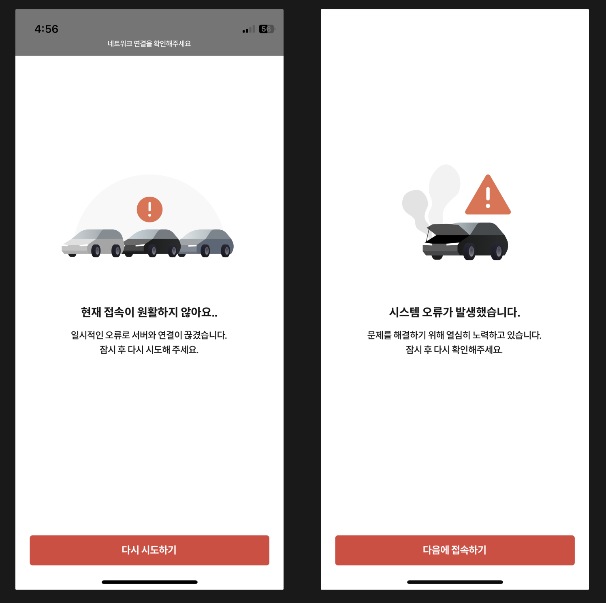
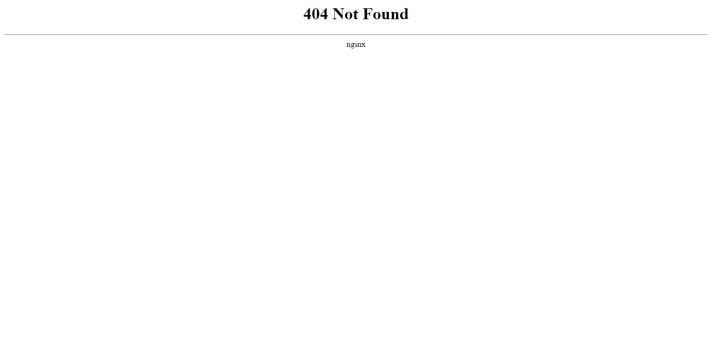
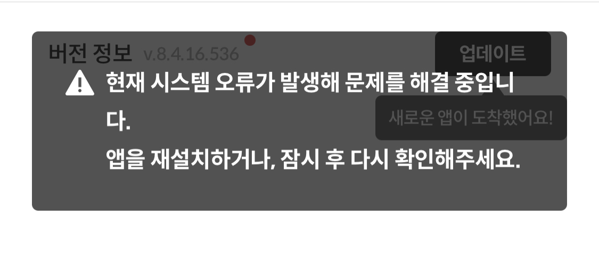
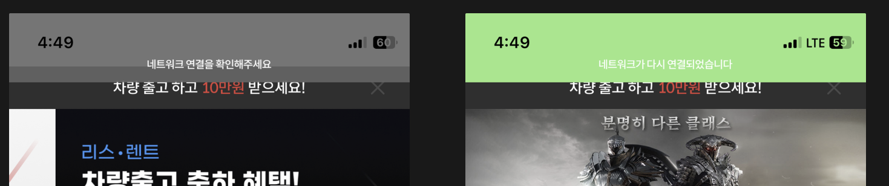
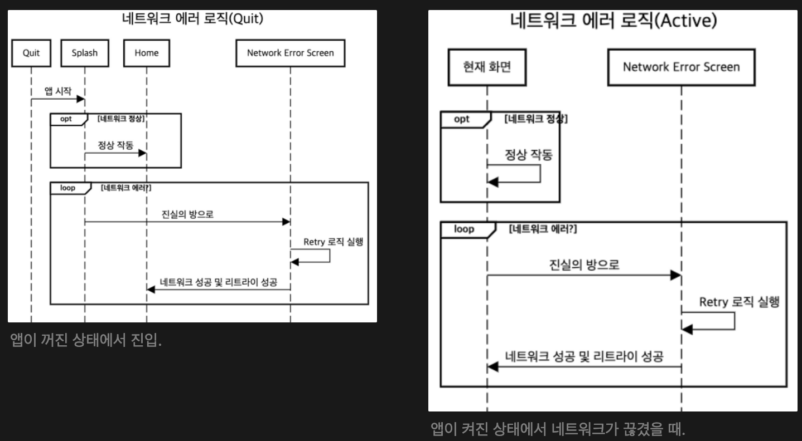
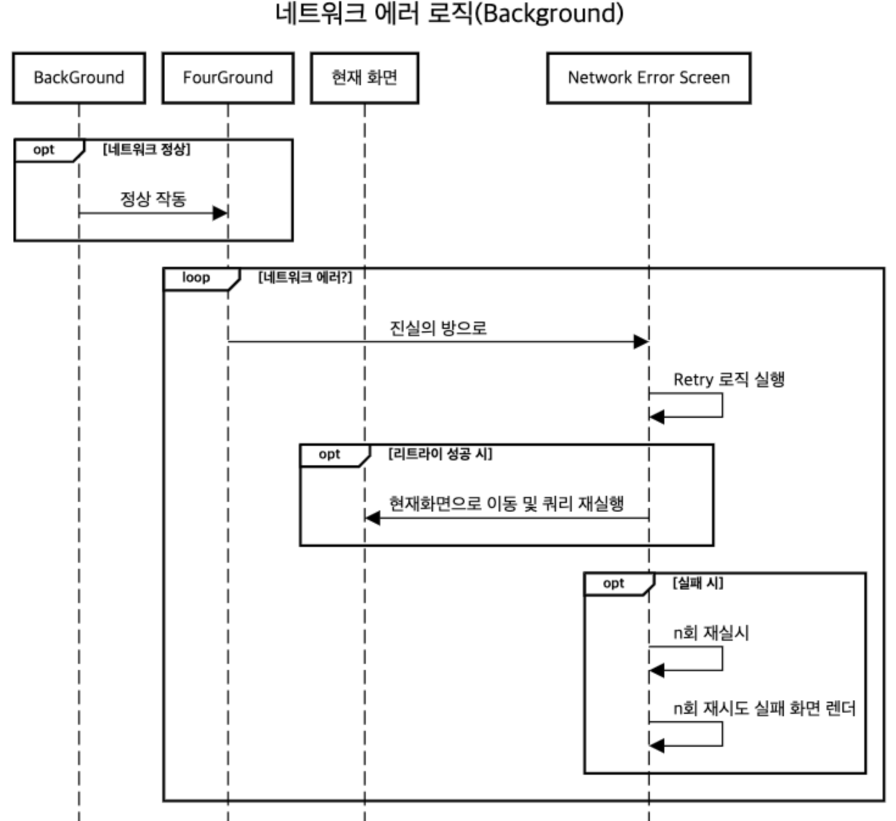

어플이나 웹 서비스를 사용하다가 **에러**를 겪어보신 적 있나요? 물론 단순히 에러라고만 말하면 다양한 케이스가 포함될 수 있어 모호한 단어입니다. 사용 중 버벅임과 같은 성능 이슈도 있고, 서비스가 갑자기 흰화면으로 변한다던가 움직이지 않는 불능의 상태에 빠질수도 있어요. 충돌이 일어나거나 앱이 그냥 죽으면서 홈화면으로 돌아가는 경우도 있습니다.

프론트엔드 개발자로서 제가 이 회사에서 가장 먼저 주도했던 프로젝트인 에러 경험 개선하기를 소개할게요.



<!--truncate-->

개발자는 이런 돌발상황에서 사용자에게 명확한 오류의 이유를 알려주고, 재시도를 유도해야합니다. 치명적인 버그의 경우 조그마한 선물과 함께 리포트를 요청드릴 수도 있겠죠. 실제로 별도의 QA팀이나 프로세스 없이 사용자가 에러를 찾도록 하고 찾으신 분에게 커피쿠폰을 쏴드리는 회사도 있더라고요.

제가 현재 회사에 합류했을 시점에, 가장 중대한 문제 중 하나가 바로 에러 처리였어요. 앱이 죽는 일이 비일비재했고, 흰화면으로 변해버리곤 했습니다. 에러가 났을 때 적정 선에서 사용자에게 이유를 명확히 알려주고 재시도를 유도하는 기능을 넣었습니다.

:::info 내가 풀고 싶었던 문제

사용자가 에러를 겪었다면 **_정중하게 사과_**하고, **_명확히 알려_**주고, **_돌아오게_** 만들자.

원인을 찾는 과정은 그 이후다.

:::

## 사용자에게 뭘 알려주지?

에러로 인해 화가 난 사용자에게 어떤 사실을 알려줘야 할까요? 문제를 해결하기 위해 우선 고민해야 했던 포인트는 사용자에게 **_어떤 정보_**를 전달하고, 이를 기반으로 **_어떤 액션_**을 유도할까에요. 현재 상황을 너무 알려주지 않으면 어리둥절할테고, 너무 구체적으로 알려주면 그건 유저가 필요한 정보가 아닐테니까. 합당한 정보를 주고, 필요한 액션을 이끌어 내야해요.

### 이게 내 문제냐, 니 문제냐

제가 생각한 정보의 구분은 누구의 잘못인가입니다. 일단 **사용자 잘못**인지 **우리의 잘못**인지를 알려줘야 합니다. 다음과 같이 분류해볼 수 있어요.

:::info 사용자의 문제 범위

1.  내 기기가 워낙 구형이라 성능이 안좋다.
2.  와이파이를 꺼놨거나 3G처럼 안좋은 네트워크 환경에 있다.
3.  지원하는 OS나 특정 OS버전이 아니다.
4.  업데이트를 안해서 이 기능을 쓸 수 없다.

:::

:::info 우리의 문제 범위

1.  서버가 뻗었다.
2.  타임아웃이 났다.
3.  클라이언트의 오타나 연산 오류로 앱이 죽었다.

:::

더 많은 경우가 있을 수 있고, 실제로 그 많은 경우를 다 커버할 수 있다면 더 섬세한 경험을 줄 수 있다고 생각해요. 이렇게 분류해냈다면, 이제 그 메시지를 명확히 알려줄 때입니다.

### 명확히 알려주기

다양한 에러 상황은 아무리 잘 만든 서비스에서도 발생해요. 어처피 언젠가 발생할거, 좋은 에러경험을 주면 되는거겠죠? 서버가 던진 404 코드를 그저 브라우져에 맞겨버린다면, 404가 뭔지, 뭘 못찾겠다는건지 사용자는 한번 더 생각해야 하니까요.



결론은, **여러가지 상황**이 발생할 수 있는데 그 상황을 인지하게 만드는 메시지를 던지자는거에요.

1. 네트워크 연결이 끊겼어요! → 와이파이나 데이터를 열어보겠지?
2. 버그가 발생했어요! → 아 개발자들이 실수를 했구나!
3. 찾으시는 글이 존재하지 않아요 → 그새 누가 글을 지웠나?

좀 더 각 비즈니스 로직에 맞는 에러 메시지라면 위와 같지는 않겠지만, 천편 일률적으로 적용해야 할 낮은 추상화 레벨의 컴포넌트나 모듈의 경우 위와 같이 분류해낼 수 있습니다.

이제 실제로 이런 에러들을 한번 처리해보도록 할게요.

## 에러를 해결하기

저는 리액트 네이티브(이하 RN)에서 발생하는 오류에 대해 적어볼게요. 아마 리액트 웹 어플리케이션보다는 더 많은 케이스가 발생한다고 생각해요. 모바일 환경에서는 웹 환경보다 더 다양한 케이스가 있으니까요. 리소스도 더 한정적이고요. 그래서 일반적인 리액트 웹 환경에서의 에러처리보다 상위호환으로 볼 수 있어요.

### 에러가 발생하는 이유

사용자의 환경 문제가 아니라면, 저는 RN에서의 에러를 크게 3가지로 분류합니다 다음과 같아요.

1. JS Thread 에러 → ex. undefined나 null에서 dot notation으로 데이터를 읽어오려 할 때
2. UI Thread 에러 → ex. 없는 인덱스나 오프셋으로 스크롤을 할 때
3. 서버 에러 → 500, 503 .., 401, 404 등등

RN의 아키텍쳐 상 javaScript 스레드와 UI 스레드가 분리되어 있고, 서로 비동기 통신을 하며 화면을 그리고 로직을 처리하도록 되어있습니다. 이 과정에서 발생한 에러의 모양 자체가 서로 다르기 때문에 보통 분리해서 생각하곤 해요. 네트워크 에러는 우리가 잘 아는 그 Http 표준 에러 맞습니다.

## 에러를 처리하는 방식

리액트 어플리케이션에서 **에러를 처리하는 방식**은 대표적으로 두가지가 있습니다.

1. [try - catch](https://developer.mozilla.org/ko/docs/Web/JavaScript/Reference/Statements/try...catch)

   javaScript에서 에러를 처리하는 방법입니다. try에 작성한 코드에서 오류가 던져지면 바로 아래 catch 블럭에서 실행을 이어갑니다. 다만 try-catch는 **명령형 코드**에서만 동작합니다. 선언형 코드가 많은 리액트에서는 다른 보완이 필요해요.

2. [Error Boundary](https://react.dev/reference/react/Component#catching-rendering-errors-with-an-error-boundary)

   Error Boundary는 선언형 코드의 에러를 잡아요. 컴포넌트를 이 ErrorBoundary로 감싸면 하위 노드에서 발생했지만 처리되지 않은 오류들을 잡아내죠.

   
   비동기 에러나 UI 스레드 에러는 잡아낼 수 없다는 문제도 있어요 예를 들어 0개의 아이템이 렌더링된 ListView의 10번 index로 Scroll하라는 “ScrollEvent”는 에러가 나지만 Error Boundary 내에서 잡히지 않고 그냥 터져버립니다.

   이런 경우엔 validation check나 항상 try/catch를 거치도록 하고, catch에서 잡힌 error 를 Errorr객체에 담아 throw까지 해주면 잡을 수 있습니다.

### 에러 바운더리 위치

보통 엔트리 파일에 에러 경계를 배치하고, 에러를 잡아내는데 사실 이건 가장 기본적인 사항입니다. 스크린 단위로 다른 에러 메시지를 보여줄 수도 있고 컴포넌트 단위로 에러를 보여줄 수도 있습니다.


예를 들어 탭 단위로 에러바운더리를 배치하면 **_탭 단위로_** 다른 에러메시지 및 컴포넌트를 보여줄 수 있고, 각기 다른 액션을 하도록 유도할 수 있습니다. 같은 스크린 내에서도 **_컴포넌트 단위_**로 다른 에러 바운더리를 배치하면 또 다른 경험을 선사할 수 있죠.

### Touchable, View 컴포넌트 내 에러처리

간단한 팁으로, 저는 Touchable, View 컴포넌트를 공통 컴포넌트로 만들고, 에러 처리 및 이벤트 처리를 공통화했는데, 에러 처리 중 하나의 팁이 될 수 있을 것 같아서 소개해요.

```jsx
const Touchable = ({onPress, events ...PressableProps}) => {

	const onPressWrapper = (event) => {
			if(!isValidFunction(onPress)) {
				Toast.show("현재 시스템 오류가 발생했어요 ... !!") // 함수 유효성 검증 실패
				return
			}
			if(isValidEvents(events)){// 클릭 이벤트 처리
				handleEvnets(events)
			}
			...
			try {
			onPress(event)
			} catch (error) {
				Toast.show("현재 시스템 오류가 발생했어요 ... !!")
				logError(error) // 에러에 대한 데이터 로깅
			}

	}

	return <Pressable onPress={onPressWrapper} {...PressableProps}/>
}
```

이렇게 공통모듈을 만들어두고 모든 터치 가능한 객체들을 이 컴포넌트를 합성해서 만들면 터치했을 때 처리되는 로직에서 발생한 에러들을 모두 잡아낼 수 있습니다.



---

## Network

네트워크 장애에는 일반적인 에러 상황에서 사용자 환경이라는 변수가 깊게 개입합니다. 물론 메모리 부족으로 앱이 죽을 수도 있고, 성능이 떨어져서 사용 못할 수준으로 버벅인다면 그것도 에러지만 네트워크는 모든 기기에 공통적으로 발생할 수 있거든요.

### NetInfo

:::tip React Native NetInfo
[React Native NetInfo](https://github.com/react-native-netinfo/react-native-netinfo)

현재 사용자의 네트워크 상태를 인지하는 패키지입니다. 아마 IOS, Android에서 제공하는 기능을 래핑해서 javaScript에서 사용할 수 있도록 도와주는 것 같아요.

:::

서비스가 연결상태인지 아닌지를 확인해서 미리 알려주고, 그 후에 발생할 수 있는 **에러에 대한 밑밥**을 깐다고나 할까요. 현재는 네트워크를 잃었는지 여부만 알려주지만, 지하철이나 승강기에서 사용할 때 불안정한 네트워크 환경까지 감지해서 **품질이 저하될 수 있음**을 부드럽게 알려주는 형태로도 발전시킬 수 있을 것 같아요.



### 사용자 네트워크 에러

사용자가 네트워크 에러를 발생시켰다면, 곧이 곧대로 앱이나 컴포넌트를 죽이지 말고, 좀 더 섬세한 작업이 필요해요. 대표적인게 **_리트라이 로직_**이에요. 잠깐 문제가 생겼던 것일 수 있고, 몇백 밀리세컨드 안에 그 문제가 해소될 수도 있는거니까요.

:::info 모듈화

아마 클라이언트 개발자라면 서버와의 Http 요청을 담당하는 기능들을 하나의 모듈처럼 관리하고 계실거에요. [axios](https://axios-http.com/kr/docs/intro)나 [wretch](https://github.com/elbywan/wretch), [ky](https://github.com/sindresorhus/ky)와 같은 [XMLHttpRequest](https://developer.mozilla.org/ko/docs/Web/API/XMLHttpRequest), [fetch](https://developer.mozilla.org/ko/docs/Web/API/Fetch_API/Using_Fetch) 기반 라이브러리들을 사용하실 수도 있고, 이 웹 API들을 직접 래핑해서 사용하실 수도 있어요.

리트라이 로직은 그 공통모듈 혹은 인스턴스에 작성해주시면 동일한 경험을 줄 수 있으니 좋고, 파라미터로 껏다 켤 수 있도록 조절하도록 만들면 더 좋습니다.

:::

에러가 발생할 수 있는 상황을 조금 더 세분화해볼 수도 있을 것 같아요. 아래 상황은 앱의 상태에 따른 로직을 생각해본것입니다. 앱을 정상적으로 켰을 때, 백그라운드에 있다가 진입했을 때 등 앱이 감지하는 상태에 따라 다른 로직을 적용해야 할 수도, 다른 경험을 줘야 할 수도 있습니다.





## 마치며

**_에러 경험_**이라는 용어는 저도 들어본 적 없어요. 하지만 이 작업을 하다보니 스스로 사용하게 되더라고요. 어떻게하면 더 섬세하게 에러를 처리하고 그 결과를 효과적으로, 기분나쁘지 않게 전달할 수 있을까?

실제로 에러 페이지에 심은 로그를 통해 확인해본 결과 에러 화면에 있는 다시 접속하기 버튼이나 다시 시도하기 버튼을 누른 사용자가 많았어요. 없었다면 그대로 앱을 종료했겠죠? 에러 경험도 높여야 하는 사용자 경험의 하나입니다. 에러가 발생했더라도 좋은 경험을 준다면 앱을 지우거나 페이지를 이탈해버릴 사용자들이 한명이라도 다시 돌아오지 않을까 하고요.

마치 전사자의 가족에게 전사 소식을 전하듯 조심스럽되 어떻게 책임질지 말해주는 통보관의 심정으로 에러들과 이 에러들을 겪은 사용자들을 생각해야해요. 그렇지 않다면 한두번의 실수에도 사용자들을 계속 떠나보내게 될거에요. 그런 측면에서 얼마나 잘 개발하느냐보다, 얼마나 사용자들을 더 생각하느냐가 더 좋은 가치를 이끌어낼지도 모르겠습니다.


