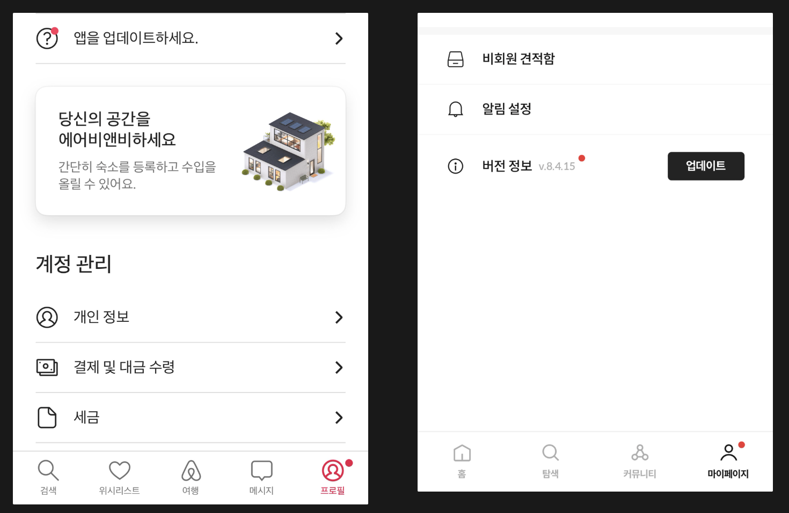

스마트폰과 앱이라는 개념이 나온지도 10년이 훌쩍 넘었습니다. 사람들이 온라인 상에서 콘텐츠를 소비하고 상호작용하기 위한 터널은 인터넷, 즉 웹페이지 뿐이었는데 앱이라는 커다란 시장이 열리게 된 셈이죠. 앱은 모바일 기기에 최적화된 경험을 주기 때문에 스마트폰으로 사용하기엔 꼭 알맞습니다. 외형만 보자면 크게 다르지도 않습니다. 컨텐츠를 전달하고, 상호작용을 한다는 커다란 가치만 놓고 보자면요. 그래서 지금까지도 활발하게 사용되고 있죠.

반대로 웹과 앱이 다른 점이 많이 있고 다들 화면 크기나 인터렉션 방식의 차이를 꼽으시겠지만 요즘같이 웹과 앱이 혼용되는 환경에서 저는 **버저닝**을 꼽을 수 있을 것 같아요.

오늘 이야기 할 주제는 **앱의 버전 관리**에요.

<!--truncate-->

---

## 버전

먼저, 버전이라는 개념은 왜 등장했을까요? 웹페이지에는 그런 말을 사용하지 않는데 말이에요. 어떤 깊은 고민과 역사가 존재했는지는 명확하게 알 수 없습니다. 버저닝을 도입한 앱스토어라는 개념부터 애플이나 구글 같은 사기업에서 나왔으니까요.

감히 추측해보자면, 웹 페이지는 실행주체가 브라우져라는 응용프로그램이고, 앱은 그 자체로 응용 프로그램이기 때문에 버전이라는 개념은 꼭 필요했다고 생각해요. 브라우져도 크롬, 사파리 등 각자 버전을 가지고 있고 그 버전마다 제공하는 기능이 다르니까요.

### 시멘틱 버저닝 (Semantic Versioning)

흔히 x.x.x로 대표되는 버저닝 방식입니다. 구글과 애플이 양분하고 있는 각 앱 스토어에서도 이걸 사용합니다.

:::info semantic이란?

시멘틱(semantic)이라는 뜻은 “딱 봐도 안다”로 설명할 수 있어요.


- 메이져 버전 : 브레이킹 체인지, 많은 부분이 변경되어 버전업을 하게되면 색다른 경험을 하게되요.
- 마이너 버전 : 무시못할 크기의 기능이 추가되거나, 캠페인이 시작되요. 성능이 전반적으로 늘어났을 경우도 사용해요.
- 패치 버전 : 버그를 수정하거나 작은 기능이 수정되었을 때 사용해요.

:::

이와 같은 의미를 사용자들은 알 지 못할 수 있지만, 각 자릿수가 주는 느낌은 확실히 다릅니다. 가령 강제 업데이트를 하는데 패치 버전만 높힌다면 뭔가 이상하겠죠?

## 버전을 다루는 방법

사용자가 앱 업데이트를 하는데에는 시간과 돈이 들어요. 앱스토어에 들어가서 업데이트 버튼을 눌러줘야 하죠. 와이파이 연결이 되어있지 않다면 오롯이 모바일 데이터로 충당해야 합니다. 사용자가 이런 귀찮음과 에너지를 쏟아가며 앱 업데이트를 해야 하는 이유를 **명확히 설명**하고 **매너있게 요청**해야 합니다.

반대로 운영의 입장에서도 준비해야 할 게 많습니다.

- 의사결정을 위해서 활용할 충분한 데이터를 가지고 있어야 합니다.
- UI/UX의 측면에서 부드럽고 유연하게 유도하는 플로우가 필요합니다.
- 기술적으로 명확하게 업데이트 플로우를 구현해야 합니다.
- 기타 ..

버전을 섬세하게 다루려면 이보다 더 많은 준비가 필요할거에요. 다음으로는 구체적으로 버전을 어떻게 다루는지 소개해요. 우선 버전을 두가지로 구분합니다. 그리고 API나 remote config로 이 값들을 받아요. 그리고 엔트리 파일에서 체크해서 동작을 분기해요.

바로 **최소 구동 버전**과 **권장 구동 버전**입니다**.**

### 최소 구동 버전

최소 구동 버전은 앱을 사용하기 위한 최소버전이에요. 최소 구동 버전보다 낮으면 앱을 사용할 수 없기 때문에 앱 진입과 동시에 강제 업데이트 안내가 나오고, 업데이트하지 않는다면 앱을 빠져나가게 만들어요.


다음과 같은 상황을 예로 들 수 있어요.

- 앱의 최소 구동 SDK 버전을 높히는 경우 : 특정 OS가 앱을 지원하지 않을 수 있기 때문이에요
- 치명적인 버그가 있는 경우 : 중요도가 높은 기능이 오동작하는 경우에요. 서비스의 BM에 치명적이거나 홈화면 같이 매우 빈번하게 사용되는 경우에 해당해요.
- 운영/정책의 변경 : 앱 운영 정책이 크게 변경되는 것은 꽤나 큰 변화에요.
- 브레이킹 체인지 : 앱이 새단장을 한다거나, 야심작을 출시할 때에요. 어쩌면 전략적일지도, 탐욕일지도 모르죠.

:::danger 강제 업데이트의 위험성

앱 강제 업데이트는 사용자 경험을 매우 저하시키고, 이탈률을 높히므로 가급적 사용하면 안되지만 위와 같은 이유들이라면 울며 겨자먹기로 진행하는 경우가 많습니다.

:::

### 권장 구동 버전

권장 구동 버전은 현재도 이용하는데 문제는 없지만 가능하면 최신 버전으로 오라고 권고하는 버전입니다. 가령 다음과 같은 경우가 있을 수 있어요.


- 1.0.0 : 최초 버전
- 1.2.0 : 여러 기능이 추가된 버전
- 2.0.0 : 새단장한 서비스!

사용자는 2.0.0으로 올리지 않아도 문제 없이 서비스를 즐길 수 있어요. 하지만 최소한 1.2.0 정도는 써줘야 우리 서비스를 온전히 즐길 수 있죠. 그렇다면 권장 구동 버전을 1.2.0으로 설정해두는거에요. 금진적으로 업데이트를 강제하지 않고 점진적으로 사용자를 끌어올리는 방법이라고 볼 수 있죠.

물론 이 방법을 사용하려면 업데이트하고싶게끔 하는 다양한 장치들이 필요합니다. 은연중에 업데이트를 하고싶게 해서 버그도 없고 새로운 컨텐츠도 있는 앱을 사용하게 하는 것이죠. 아래 UI 파트에서 더 이어나가볼게요.

### 데이터

그리고 마지막은 앱 버전에 대한 로깅을 통해 사용자의 행태를 바라보는 것입니다. 온 세상 사람들이 같은 패턴으로 움직여주면 얼마나 일이 쉽겠어요. 하지만 나라마다, 연령마다, 도메인마다 사용자의 업데이트 양상은 달라져요. 그렇기 때문에 업데이트에 대한 의사결정을 위해 데이터가 필요해요.

가령 다음과 같은 정보를 조합해서

- 우리 유저의 95%는 최신 3개 버전에 분포한다.
- 시장에 새로운 버전이 공개된 시점부터 3일 이내에 75%의 유저는 알아서 최신 앱 업데이트를 한다.
- 강제 업데이트를 요구했을 때, 다이얼로그를 보고 이탈하는 유저는 30%다.
- 오늘 신기능을 배포했고, 강제할 필요까진 없지만 최대한 사용하게 하고싶다.
- 치명적인 버그가 최신 7개 이전 버전에 발견되었다.
- ...

다음과 같은 의사결정을 할 수 있죠.

- 앱 정상화를 위해 7개 버전 이하를 **최소 구동 버전**으로 정한다.
- 알아서 앱 업데이트를 하는 유저의 심기를 건드리지 않기 위해 최신 3개 버전 바로 아래 버전을 **권장 구동 버전**으로 지정합니다.

상황마다 다르겠지만, 이런 의사결정에도 이탈할 유저는 이탈하겠지만, 납득할만한 이유와 명분이 있다면 그 의사결정에 대해 마음의 짐은 지지 않아도 될거에요.

## UI

업데이트를 하기 위해 굳이 스토어를 열고, 앱 이름을 검색한 다음 업데이트 버튼을 누르는것을 기대하긴 어렵습니다. 최대한 쉽고 빠르게 업데이트를 할 수 있도록 장치를 마련하고, 그 장치까지 부드럽게 유도하는 UI가 필요한 시점이에요.

다양한 방법이 있겠지만, 아래 예시를 같이 볼게요.

### 정적 업데이트 유도



위 사진은 에어비엔비의 방식과 저희 회사 서비스의 방식입니다. 바텀탭이라는 항상 사용자의 눈에 보이는 곳에 빨간 유도등을 달고, 해당 탭을 누르면 나오는 화면에 업데이트 유도 UI를 두는 것이죠. 업데이트를 권장하는 UI이기 때문에, 권장 버전 이하인 사용자에게만 나오고 비교적 최근 앱 버전 사용자들에게는 보이지 않아요.

### 동적 업데이트 유도

앱에서 특정 기능을 사용하기 위해선 반드시 업데이트가 필요할 수 있습니다. 특정 앱 버전 이상에서만 지원되는 기능이 분명 생기거든요. 가령 어떤 버튼을 렌더링하는 API를 다음과 같이 구성한다고 해볼게요.

```json
result: {
  button: {
		label: "상담 신청하기",
		link: "app://consulting"
	},
  ...
}
```

button이라는 키로 조회한 데이터로 버튼을 렌더링하고, 클릭했을 때 link에 들어있는 값을 내부오픈해서 화면을 이동하는 겁니다. 하지만 만약 특정 버전 이하의 사용자들은 위 딥링크를 처리할 수 없는 상황이라면 서버에서 버전에 따라 다음과 같은 데이터를 내려줍니다.

```json
result: {
  button: {
		label: "상담 신청하기", // "앱 업데이트하고 혜택받기"로 바꿔도 좋겠죠?
		link: "app://actions?type=update"
	},
  ...
}
```

이렇게 이 기능을 사용하려면 업데이트하라고 팝업을 띄워주거나 토스트 메시지를 띄워줄 수 있습니다. 이는 권장이라기보단 제한에 가까워요. 하지만 앱 사용엔 무리가 없으니 이를 권장하는 사용 방법이라고 볼 수 있습니다.


사용할 수 없는 특정 기능을 아예 노출하지 않거나 노출된 UI가 아무 동작도 안하거나 오류를 뱉게하는 경험보다는 더 나은 사용자 경험을 선사할 수 있고, 덤으로 유저를 최신 버전으로 끌어올리는 효과도 가집니다.

## 그 외

앱 배포의 궁극적인 목적은 버그없는 앱에서 최신 컨텐츠를 보게하는 것입니다. 우리의 선한(?) 의도와는 다르게 사용자들은 업데이트를 하지 않을 수도 있으니 최대한 그 효과를 극대화하기 위해 다음과 같은 추가적인 방법을 동원하기도 합니다.

### 릴리즈 노트

매너있는 톤으로 친절한 서비스센터 느낌을 주는 릴리즈 노트를 통해 실제 업데이트 버튼을 누르기 직전의 의사결정에 영향을 줄 수 있습니다. 대표적인 서비스들의 릴리즈 노트를 가져와봤는데요, 아래 사진을 보면 왼쪽은 인스타그램, 오른쪽은 카카오톡입니다. 성의나 정보전달의 측면에서 큰 차이가 보이죠?

인스타그램은 시멘틱 버저닝을 사용하지 않고 릴리즈 노트에도 복사 붙혀넣기를 했다는 느낌을 줍니다. 딱히 업데이트하지 않아도 될 것 같다는 느낌을 줘요. 반대로 카카오톡을 보면 시멘틱 버저닝을 사용하고 매너있는 정보전달 톤으로 10.2.0에서는 유용한 기능이 추가됨을 알 수 있고, 10.2.2에서는 버그수정 패치 정도가 이루어졌음을 알 수 있죠.


### 웹뷰

아키텍쳐의 문제이기 때문에 사실 논외지만, 웹뷰를 활용하는 방법이 있습니다. 사용자는 앱 업데이트 없이도 항상 최신 컨텐츠를 볼 수 있어요. 웹에는 버전이라는 개념이 없기 때문입니다. 모바일 앱에서 웹페이지를 그대로 로드하고, 웹이 앱과 인터렉션하며 서비스를 구성하는 방식으로, 현대 앱에서 자주 사용되는 방식입니다.

웹뷰 모듈과 통신방식만 잘 만들어두면, 오랜기간 앱 업데이트 안하고도 안정적으로 서비스할 수 있습니다.

### 코드푸시

리액트 네이티브(이하 RN)에는 code-push라는 걸출한 기능이 있습니다. RN의 본체는 리액트이기 때문에, 리액트 번들에 실제 앱의 모든 로직이 들어있어요. 이 번들을 버전단위로 관리해서 앱이 시작할 때 최신 버전 번들을 다운받은 다음 갈아끼는 방식이에요.

하지만 안정성과 사용자 경험 문제에서 약간의 문제가 있기 때문에 맹신할 수는 없습니다. 롤백이라는 개념도 존재하기 때문에 100% 보장할 수 없답니다. 그렇게되면 서비스 운영 관점에서 관리포인트가 늘어나기 때문에 머리가 지끈해질 수 있어요.

:::caution 코드푸시의 이면

가령 특정 버전에서 코드푸시를 받아서 정상 업데이트가 된 기기와 그렇지 않은 기기의 비율이 적지 않고 IOS, Android 간 비율 조차도 크게 차이날 때, 코드푸시를 받은 사용자에게만 활성화되는 특정 기능이 회사 메인 BM과 연관이 있거나 돈과 큰 연관이 있는 경우엔 아예 안하느니만 못한 경우가 생길 수 있기 때문이에요.

:::

### UI API

웹페이지 만들어주기 서비스는 워낙 유행해서 잘 알고계시겠지만, 이는 운영 측면에서 생각하면 앱에서도 가능합니다. 요즘 유행하는 디자인 시스템과 비즈니스 로직 템플릿을 활용해 UI API를 만드는거에요.

디자인 시스템은 앱의 전반적인 디자인 자원을 정리하고, 개발자와 디자이너의 소통을 원활히 하기 위한 목적으로 알고있으시겠지만, 더 나아가 UI를 그리는 API와 결합되면 비로소 온전히 운영가능한 앱서비스를 만들 수 있습니다. 예를 들어, 아래 사진은 mui라는 대표적인 UI 라이브러리입니다. buttonGroup이라는 JSON 데이터를 받으면 아래 컴포넌트를 렌더링하도록 미리 정의해둘 수 있습니다.


특정 콜백을 어떻게 수행할지에 대해서는 사실 연구가 필요합니다. 앱 내에서의 대부분의 기능은 deeplink로 표현하면 어떻게 처리할지를 잘 정해두었을 때 처리할 수 있습니다. 복잡한 로직을 수행해야하는 경우가 아니라면 말이죠.

이 방식의 장점은 다음과 같은 이유로 코드푸시나 앱 배포를 하지 않아도 된다는것입니다.

- 약관이나 이용수칙 변경
- 컨텐츠나 버튼 텍스트에서 오타 수정
- 특정 버전에서의 상황 분기
- …

그저 텍스트나 동작을 바꿔서 API를 내려주면 되니까요. 코드푸시의 여부에서도 자유로울 수 있습니다. 코드푸시 버전까지 받아서 처리해주면 될뿐인 일이 됩니다. (서버 개발자는 싫어할 수 있습니다..!)

## 마치며

앱 버전은 어떤 앱 서비스가 시작되던 가장 먼저 정해야할 원칙이며 개발해야 할 작업 중 하나입니다. 그 정도로 관리 방식과 유도 장치에 따라 수많은 사용자를 잃을수도, 좋은 타이밍에 내보낼 컨텐츠를 못내보내 손해를 볼지도 몰라요.

굳이 업데이트하고 싶지 않은 사용자의 마음을 이해하면 할수록 더욱 섬세하고 엄격한 장치를 만들 수 있습니다. 그런 측면에서 개발자에게 비즈니스와 사용자를 이해하는 마음이 얼마나 중요한지 다시 한 번 강조하고 싶네요.
