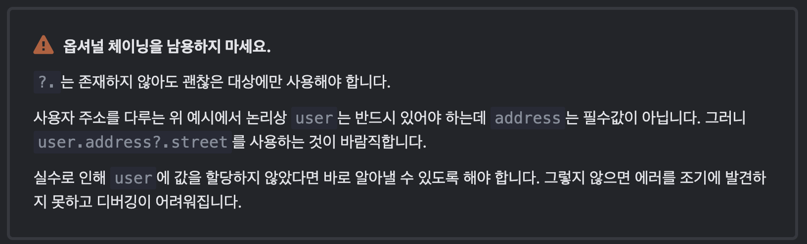
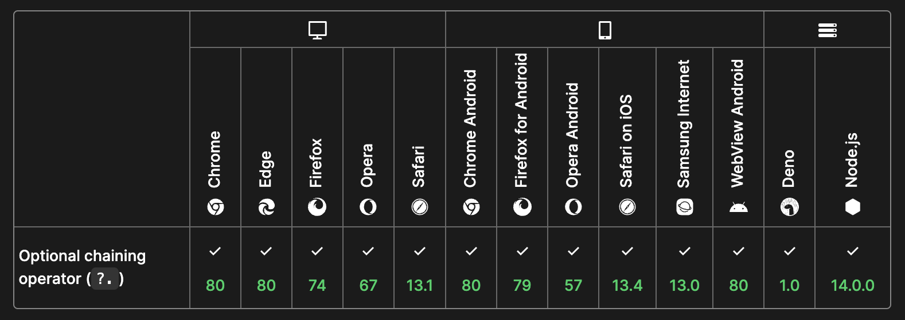

Optional Chaining은 자바스크립트에서 객체에 접근하는 방법 중 하나입니다. 간결하고, 안전하죠.

:::info Optional Chaining이란?

`?.`은 `?.`'앞’의 평가 대상이 Nullish하면, 즉 `undefined`나 `null`이면 평가를 멈추고 `undefined`를 반환합니다.

:::



이 문법은 편리하고 유용하지만, 단점이 분명히 존재합니다. 자세히 알아보고 잘 쓰도록 해요!

<!--truncate-->

## 객체에서 값 다루기

현대 웹앱 서비스에서 데이터는 흔히 JSON 형태로 관리합니다.

```tsx
const developer_hj = {
    name : "hj",
    age: 29,
    skills: ["javaScript", "react", "typeScript", "next.js"],
    company: {
        name: "hj_company",
        category: "dev"
    }
    ...
}
```

### dot notation과 bracket notation

자바스크립트로 이를 핸들링할 때 흔히 **dot notation**이나 **bracket notation**을 활용합니다.

```tsx
///1. dot notation
const hisName = developer_hj.name;
///2. bracket notation
const hisName = developer_hj['name'];
```

하지만 데이터가 항상 예쁘게 내려온다고 믿을 순 없지 않습니까. 에러 핸들링을 추가해야합니다. 다음과 같이 실제로는 존재하지 않는 키로 데이터를 조회했을 때의 결과를 확인해봅시다.

```tsx
/// 오류가 발생하지 않습니다. undefined를 반환합니다.
const hisMoney = developer_hj.money;

/// 오류가 발생합니다.
const histHouseValue = developer_hj.house.value;
```

왜 둘 다 없는 데이터인데, 첫번째 예시에서는 오류가 발생하지 않고, 두번째에서는 오류가 발생할까요?

### 프로토타입 체이닝과 값의 평가

이는 자바스크립트의 프로토타입 체이닝과 값 평가 방식과 관련되어 있습니다.

javaScript에서 객체를 조회할 땐 왼쪽부터 평가된 값을 반환합니다.

첫번째 예시에서 hisMoney를 평가할 땐 developer_hj에 money라는 key가 존재하지 않으니 undefined로 평가하고 그 값을 반환합니다.

두번째 예시에서 developer_hj.house가 undefined로 평가됩니다. 그렇게 반환된 undefined라는 값에서 value라는 key로 값을 조회하니 오류가 발생한 것입니다.

:::info 프로토타입 체이닝

자바스크립트에서는 Primitive Type객체가 아닌 Reference Type은 ProtoType Chaining을 가집니다.
객체를 찾기 위해 상위 프로토타입 체인을 찾아요.

가령 Array 타입 데이터에서 .map 메소드를 사용할 수 있는건, 배열 객체의 최상위 프로토타입에 해당 메소드가 이미 정의되어 있기 때문입니다.

다만 조회하다가 상위 객체가 nullish하다면 조회할 수 있는 프로토타입이 없음에도 조회하게 되므로 undefined를 **반환**하지 않고 **오류**가 발생합니다.

:::

### 옵셔널 체이닝(Optional Chaining)

이렇게 중첩된 객체에서 존재하지 않는 특정 property를 조회할 때 오류 없이 항상 undefined를 반환하고 넘어가게 해주는 문법이 optional chaining입니다.

사용 방법은 다음과 같아요.

```js
// MDN 문서에 나온 예시를 그대로 차용했습니다.

// dot notation
obj?.prop;

// bracket notation
obj?.[expr];

// array
arr?.[index];

//function
func?.(args);
```

그럼 이 사용법으로 위에서 제시했던 예시를 오류가 발생하지 않도록 바꿔볼까요?

```tsx
/// 오류가 발생하지 않고, undefined가 반환됩니다.
const histHouseValue = developer_hj.house?.value;
```

undefined로 평가되는 값은 오류가 아닙니다. 어떤 값이 정상적으로 반환된 것이죠. 사용자 경험이 떨어질 순 있어도 **런타임에 서비스 자체를 다운시킬 수도 있는** 치명적인 문법 오류보다는 훨씬 낫기 때문에, 객체 조회할 때 무지성으로 물음표를 달아놓는 경우가 많아요(물음표 살인마..?)

하지만 이 문법은 양날의 검입니다.

## 단점

### 런타임 오동작

Optional Chaning의 목적은 자바스크립트가 에러를 던지지 않게 함입니다. 결국 에러 대신 undefined를 반환하고, 우리가 기대했던 동작을 하지 않습니다. 즉, 런타임에 오류가 아닌 오동작을 하게됩니다.

```tsx
const [userName, setUserName] = useState<string>('');

useEffect(() => {
  setUserName(data.user?.name);
}, []);

/// 이름이 렌더링되어야 할 자리에 undefined가 나올 수 있다.
return <p>{userName}</p>;
```

### 디버깅

Optional Chaining은 에러를 뱉지 않습니다. 그저 평가 결과에 따라 그 값을 반환하거나 undefined를 반환하는 함수일 뿐입니다. 그래서 에러가 아니에요. 즉, try-catch를 통한 디버깅이 불가능합니다. 가령, 다음과 같은 처리에서 데이터가 얼마나 망가져있던, 에러처리는 불가능합니다. 에러 기록도 못하고, 결국 오동작을 추적할 수 없게합니다.

```tsx
const data = { a: 1 };
try {
  console.log(data.asdf?.asdfasdf);
} catch (error) {
  // 에러처리
}
```

다음과 같이 특정 데이터가 없음에 대한 처리를 분명히 해줘야 하죠.

```tsx
const isData = (data: unknown): data is Data => {
  return typeof (data as Data).id === 'number';
};

try {
  if (isData(data)) {
    console.log(data.id);
  }
} catch (error) {
  //에러처리
}
```

만약 try-catch로 에러가 전파되는 과정이 10단계라고 가정해봅시다. 한 3번째 단계 쯤에서 optional chaining을 걸어놓는 바람에 오류가 발생하지 않아 다음에 호출될 함수부터 모두 에러가 발생했다고 가정해볼게요. 전파된 에러를 추적하는데 큰 애를 먹겠죠?

### 폴리필

지원하기 시작한지 몇년 안되는 연산자라서 구버전 브라우져를 위한 폴리필이 필요합니다.



```js
let temp = obj.first;
let nestedProp = temp === null || temp === undefined ? undefined : temp.second;
```

## 결론

정말 유용하고 간편해서 저도 연산자로 현업에서 정말 자주 씁니다.

다만 분명한 문제가 있으므로

왼쪽 평가대상이 없어도 괜찮은 경우에만 **선택적**으로 사용

## Reference

[MDN - Optional Chaining](https://developer.mozilla.org/ko/docs/Web/JavaScript/Reference/Operators/Optional_chaining)

[javascript.info - Optional Chaining](https://ko.javascript.info/optional-chaining)
