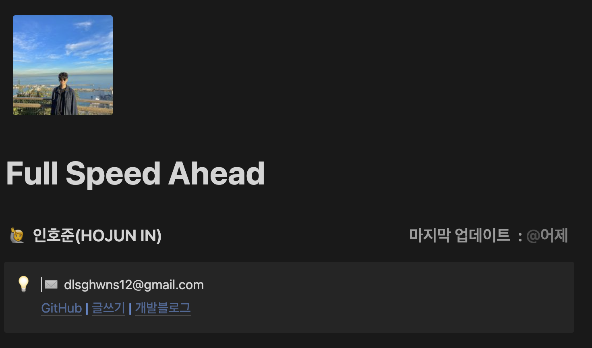
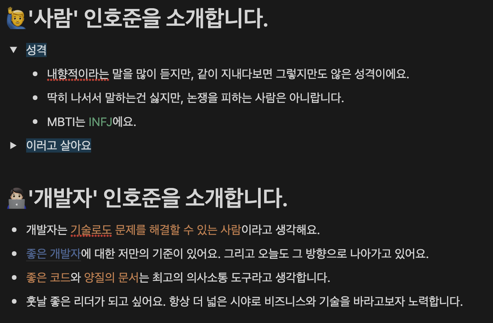
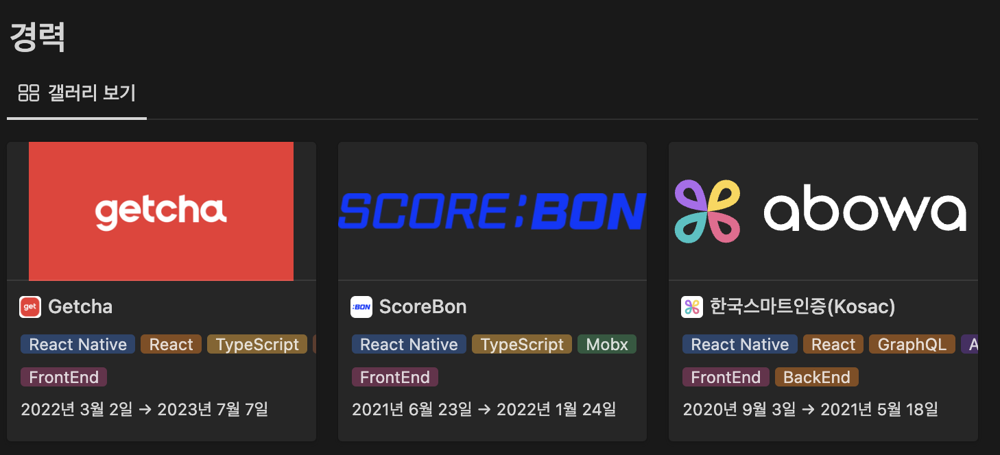
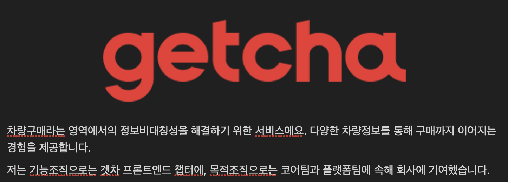
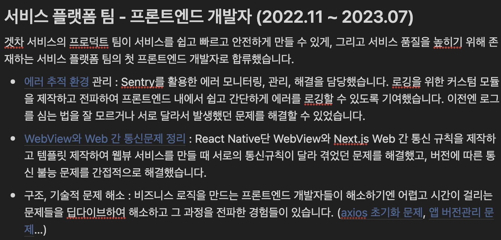
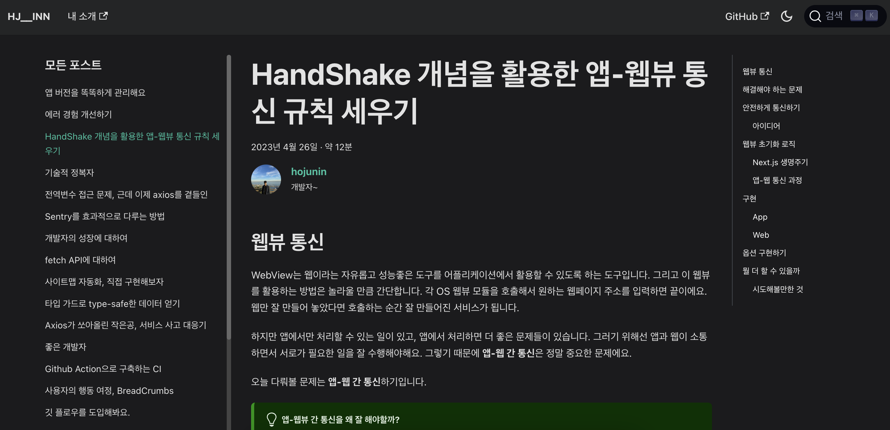
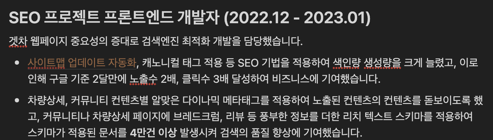
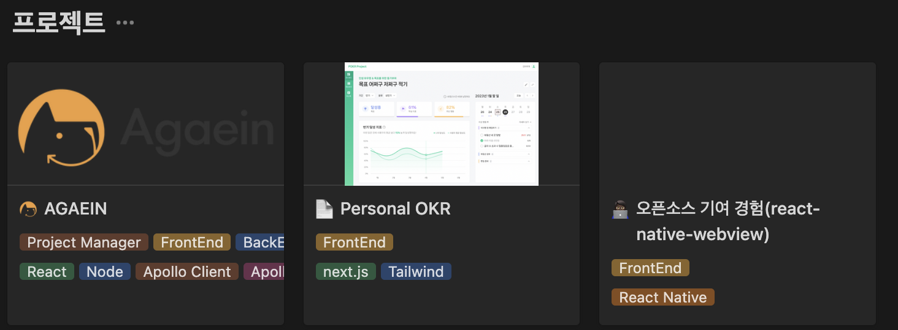
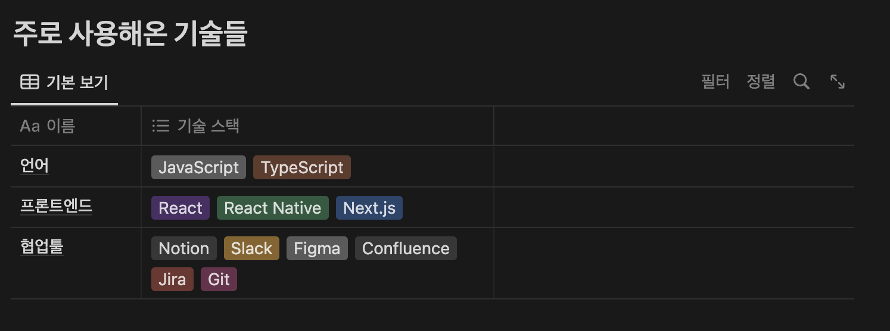
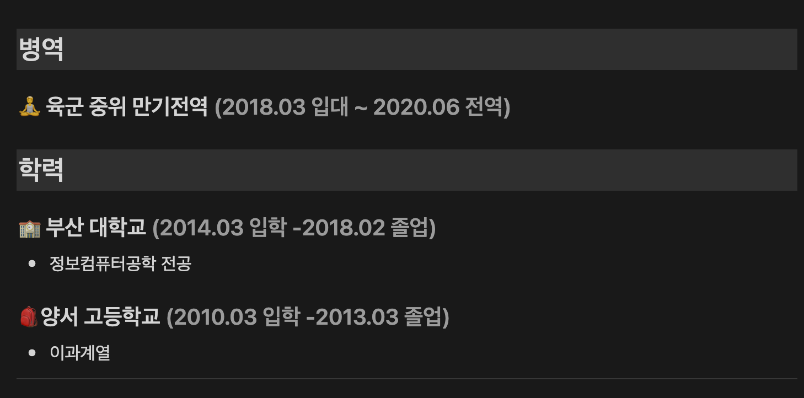

어떤 이력서가 좋은 이력서인가?

<!--truncate-->

천편일률적인 기준에 의해 평가받는 문서가 아니기에 이력서는 잘 쓰기 어렵습니다. 회사나 조직에 따라, 사람에 따라 같은 이력서라도 상반된 평가를 받을 수 있으니까요. 가령 빠른 문제해결을 높게 평가하는 조직에 내는 이력서에 대규모 서비스의 설계 능력이나 팀원들을 관리하는 능력만을 어필한다면 높은 점수를 얻기 힘들거에요. 반대로 프로덕트를 안정적으로 운영만 하면 되는 기업에 애자일하게 프로덕트를 빠르고 정확하게 만들어내고 고객에게 전달하는 능력을 어필한다고 가정해도 비슷한 결과를 얻을거에요.

평가하는 사람에 따라서도 다르게 느껴질 수 있습니다. 비슷한 가치를 강조하더라도 그 방법이나 글의 톤에 따라 성격이나 중요하시하는 가치가 다르게 다가올 수 있기에 그렇습니다. 단답형으로 끊어서 쓰는 문체보다 풀어쓰는 형식을 선호하는 사람도 있고, 기여도를 표현할 때 데이터를 매우 중요시하는 경향이 있는 사람도 있습니다.

그렇기에 이 글은 지극히 주관적으로 생각할 때 좋은 이력서의 구성과 형태를 설명해요. 누군가에겐 최악의, 저에게는 최고의 이력서가 되겠지요.

저는 이력서의 역할이 나중에는 단순히 회사에 제출하는 용도를 넘어서 Personal Branding의 일환으로 쓰일거라 생각해요. **글 만으로도 매력적인 사람이 되려면 어떤 점을 어필해야 하는가**에 대한 고민이 들어있다고 볼 수 있어요.

\*이 블로그의 좌측 상단에 이 글의 예시로 쓰인 제 소개링크가 있습니다.

---

## 구성

구성은 글의 흐름을 담당해요. 마치 잘 짜여진 코스요리처럼 자연스러운 흐름으로 읽는 사람으로 하여금 다음 섹션을 읽고싶게 하고 순서에 맞춰 정보를 전달할 수 있습니다. 그렇다고 제가 짠 구성이 독특하거나 이유가 있는건 아니고 이력서 플랫폼들에서 쓰는 방식을 거의 차용했어요.

대신 최대한 많은 정보를 담기 위해 간단히 소개하고 링크를 남기는 방식으로 한 섹션에서 머무는 시간을 최소화하기 위해 노력했습니다.

### 기본정보

기본적인 정보를 가장 먼저 제공해요. 이름, 전화번호나 이메일같은 연락처도 포함해요. 제 주요 작업물들이 포진해있는 블로그나 깃허브 링크는 물론 업데이트 날짜를 넣어서 최신 정보임을 알리는 요소도 포함되어 있습니다. 이력서를 처음 봤을 때 꼭 같이 보여야 할 정보라고 생각하는 것들은 모두 포함시켰어요.

### 내 소개

나는 어떤 생각을 하고 사는 사람이고, 개발자로서는 어떤 사명감이 있는지에 대해 적습니다. 면접관으로서 이력서를 볼 때 안타까웠던 부분은 이력서는 기술적으로 치중되어있긴 해도 어쨌든 그 사람을 소개하는 글인데 사람 자체에 대한 설명이나 스토리가 포함된 이력서가 거의 없었다는 점입니다. 저는 이 부분을 꽤 중요하게 생각했어요.

거창한 가치관이나 생각덩어리를 넣으라는게 아니라, 기술로써만 평가받고 싶지 않다면 어느정도 나에대한 설명이 필요하다는거죠. 성향이나 성격, 좋아하는 것, 취미 등등 나를 설명할 수 있는 요소는 찾아보면 꽤나 많습니다. 좋은 아이스브레이킹 요소가 될 수도 있고요. 웃으며 면접을 시작할 수 있는 무기가 되줄수도 있어요.

하지만 핵심은, 이 문서는 나를 소개한다는 목적이 있습니다. 개발자로서의 지향점이나 삶의 가치관과 같은 요소는 나를 몇단어로 표현해줄 수 있는 몇안되는 소재입니다.

### 경력

어쩌면 대부분의 이력서는 경력의 나열이라고 볼 수도 있어요. 지금껏 받아본 이력서들의 대부분이 그랬기도 하고요. 사실 정말 담백하게 경력과 거기서 한 일만 슥슥 적었는데도 내공이 느껴지는 이력서도 본 적 있고, 실제 면접에서 그 내공을 온전히 느껴본 경험이 있어서 조심스럽지만, 저는 그런 이력서를 선호하지는 않습니다. 적어도 인하우스에서 같이 일할 개발자라면 말이에요.

저는 우선 경력을 보기 편하게 정리하고, 각 카드를 누르면 추가적인 정보를 볼 수 있도록 구성했어요.

실제 마지막에 다녔던 회사의 이력을 정리한 문서를 같이 볼게요. 우선 이력서를 보는 사람을 위한 배려로 회사에 대한 간단한 소개를 적어요. 어떤 문제를 풀기 위한 사람들이 모여있는 곳인지, 그리고 내가 어떤 기여를 했는지에 대한 개괄을 적습니다.

그 다음부터는 구체적으로 어떤 팀에 속해 어떤 기여를 했는지를 소개해요. 저는 프론트엔드 개발자로서 3가지 가치(비즈니스, 사용자 경험, 개발자 경험)를 높게 평가합니다. 그리고 그 관점에서 회사에 어떤 기여를 했는지를 중점적으로 적어내려갑니다.

그리고 최대한 하나의 문단마다 기여한 내용을 함축적으로 적고, 그 내용을 구체적으로 설명해놓은 개발블로그로 링크시켰어요. 제가 이 문제를 마주했을 때 했던 고민이나 해결과정, 추가적으로 해결해야 할 내용들이 많은데 이걸 한두줄에 적기엔 이력서가 너무 길어지니까요. 혹시나 더 궁금하다면 이 글을 통해 해소할 수 있는거죠.

데이터와 함께 표기하는 전략도 좋습니다. 개발자가 비즈니스를 이해하고, 내가 개발한 내용이 회사나 사용자, 동료 개발자들에게 어떤 임팩트를 줬는지를 구체적으로 아는 상태로 개발한다는 점은 시키는대로만 개발하는 말잘듣는 사람이 아닌 프로덕트에 대한 오너십까지 평가할 수 있는 좋은 요소이기 때문입니다.

저처럼 러프하게 표기해도 좋고, 따로 그래프로 구체적인 숫자나 스냅샷을 첨부해도 좋습니다. 중요한 점은 실제 해당 작업으로 인해 발생한 데이터 변화를 스스로 알고 했다는 점이니까 그 부분을 강조하면 더욱 좋겠어요.

### 프로젝트

셀프러닝의 관점에서의 경험을 적는 섹션이에요. 스터디를 하거나 어떤 문제에 딥다이브해서 해결해본 경험, 오픈소스 기여 경험 등이 모두 포함될 수 있습니다. 회사에서 진행한 사이드 프로젝트여도 되고, 주말에 틈틈이 하거나 해커톤같이 한 순간에 집중해서 풀어낸 문제도 좋아요.

저는 사이드프로젝트와 오픈소스 기여 경험을 적었습니다. 간단한 소개와 링크 등도 제공해서 필요하다면 이와 관련된 모든 정보에 접근할 수 있도록 합니다.

### 기술

아직까지 제 기준에서 사용할 줄 아는 기술은 그리 중요하지 않습니다. 몸에도 코어근육이라는게 있듯이 개발자의 지식에도 코어지식이 있어요. 하지만 익숙한 기술이 주는 퍼포먼스는 무시할 수 없죠. 그래서 이 칸이 필요합니다.

저는 지금까지 경험했던 기술들 중 현업에서 자주 써왔던 기술들만을 나열했어요. 흔한 실수 중 하나가 숙련도 레벨을 부여하는 것인데요. 모든이에게 같은 기준이 있는 자격증이면 그럴만 한데, 어느수준으로 다룬다는 괜한 타겟이 되므로 저는 선호하지 않습니다.

### 약력

학력, 군경력 등 비어있는 시간에 대한 근거를 제공해요. 제 생각엔 없어도 그만인 섹션이라 빠르게 맨 마지막에 위치시켰어요. 하지만 학력이 최고로 중요한 조직이 있을 수 있고, 스타트업에선 대체복무 때문에 군 경력을 중요하게 보기도 해요. 장교를 우대하는 회사에서는 저와 같은 장교 경험이 다른 경력보다 중요하기도 합니다.

## One Piece of Resume

대화 한마디 없이 사람을 매료시킬 수 있는 한 페이지의 글, 누구나 신선한 미끼를 본 물고기마냥 후킹되는 조합이 존재한다면 저도 너무너무 써보고 싶어요. 하지만 다 아시다시피 세상에 완벽한 어떤것은 없습니다. 완벽함으로 가는 과정만이 존재할 뿐이니까요.

확실히 고칠 때마다 바뀌는 이력서를 보며 저도 그 과정을 살고 있는 것 같아 기뻐요. 다음엔 좀 더 다가갈 수 있길 스스로 바래봅니다.
