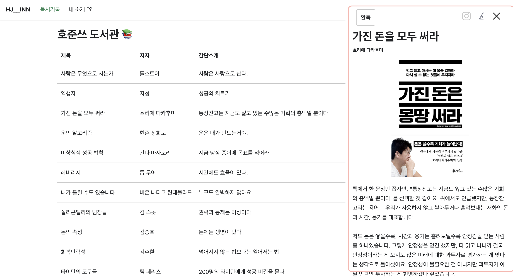

리액트에서 상태의 단방향 흐름은 굉장히 기초적이고 유명한 개념입니다. 하지만 역방향 전파가 불가능한건 아닙니다. 리액트 팀도 권장하진 않지만 그 필요성을 알고 기능도 제공합니다.

이 글에서는 부모 컴포넌트가 자식 컴포넌트의 상태에 접근하는 상태 역전파를 알아보고 이를 활용한 모달 만들기를 해볼겁니다.



<!--truncate-->

---

## 상태 역전파

리액트는 Flux 아키텍쳐에 기반합니다. View 레벨에서 사용자가 보는 데이터는 한방향으로 흐르죠.


반면 역방향으로 상태를 전달해야 하는 경우가 있습니다.

예를 들어 form에서 하위 컴포넌트의 state로 관리하던 input값을 상위 컴포넌트인 form에 전달하기 위해서는 상태 역전파가 필수입니다.

:::info form에서의 상태관리

보통 formic이나 react-hook-form을 통해 관리하지만, 그런 라이브러리를 쓰지 않고 한다면 form 컴포넌트에서 모든 상태를 관리하고 하위 컴포넌트로 상위 컴포넌트의 상태를 변경할 수 있는 함수를 props로 내려주는게 일반적입니다.

:::

### useImperativeHandle

useImperativeHandle는 ref에 상태나 메소드를 노출할 때 사용되는 훅입니다.

```tsx
useImperativeHandle(ref, createHandle, dependencies?)
```

자식 컴포넌트에 선언해두고 부모 컴포넌트가 이 ref에 접근하여 직접 접근하는 것입니다.

```tsx
import { forwardRef, useImperativeHandle } from 'react';

const MyInput = forwardRef(function MyInput(props, ref) {
  useImperativeHandle(ref, () => {
    return {
		// 노출하고 싶은 메소드
    };
  }, []);
```

### useImperativeHandle의 단점

우선 컴포넌트라는 **캡슐화된 모듈**에 구멍이 생깁니다. 컴포넌트의 상태는 컴포넌트 내부에서만 다뤄져야 하고 외부 상태의 주입은 props라는 형태로 내려받도록 만들어진 규칙이 있는데 이를 깬 것이니까요. 이 캡슐화 원칙은 다른 컴포넌트에 손쉽게 선언적으로 가져다 쓰도록 하기 위함인데, 이 아류가 생기면 그렇지 못해요. 부모 컴포넌트가 추가적인 작업을 해줘야 하죠. 즉, 컴포넌트 간 **결합도**가 높아지고 이로인해 **복잡도**가 증가해요.

만약 이 패턴으로 상태를 만연하게 관리하다보면 양방향 데이터 바인딩의 형태로 전체 아키텍쳐가 흔들릴 수 있어요. 마치 좀비 바이러스처럼요. 그래서 꼭 필요한 경우에만 사용해야 합니다.

## 모달 만들기

그럼 모달을 만들 땐 왜 이 훅을 사용해야 할까요? 사실 선언적으로 모달을 제작하는 방식은 이미 리액트 생태계에 아주 많습니다. 저는 모달이나 토스트 메시지와 같은 껐다켰다 할 수 있는 요소들에는 선언형 코드가 어울리지 않는다고 생각하고, 상태를 부모 컴포넌트가 가질 필요가 없다고 생각하기 때문이에요.

### 선언적으로 모달 만들기

```tsx
// 선언형 모달 다루기
const [modalVisible, setModalVisible] = useState(false)

const open = () => setModalVisible(true)
const close = () => setModalVisible(false)

return (
	...
	...
	<Modal visible={modalVisible} close={close}/>
)
```

위의 형태는 꽤나 선언적입니다. 모달이 선언되어 있고, modalVisible이라는 상태가 true나 false로 바뀌면서 보이는 상태와 안보이는 상태가 관리되니까요.

하지만 모달을 여닫는 함수가 하는 일을 보면 그냥 상태를 바꾸는 것입니다. 저는 다음과 같은 의문을 품었어요.

1. 꽤 긴 메소드나 함수에서 이와 같은 코드가 들어간다면 혼란을 줄 수도 있지 않을까요? (상태를 바꾸기만 하네?)
2. 모달의 켜고 꺼짐의 상태를 스스로가 가지고 있어도 된다면, 부모 입장에서는 켜라, 꺼라라고 명령만 하면 되는게 아닐까요?

### 명령형으로 모달 만들기

그 결과 저는 Modal.open()과 같은 명령형 실행문이 나와야 한다고 생각했습니다. 이전 글에서도 Static Method로 모달을 만드는 법을 다뤘지만 클래스 컴포넌트에 국한되는 단점이 있었습니다. 전역 컴포넌트 용이기도 했고요. 이번에는 함수형 컴포넌트에서 명령형으로 모달을 열어보도록 해요.

오늘 만들어볼건 제 블로그의 독서기록 페이지의 [책 디테일뷰](/books)를 보여주는 사이드 바 모달이에요.

:::tip 공개된 코드입니다.
전체 코드는 [이 링크](https://github.com/hojunin/hjinn/blob/main/src/components/bookDetail/index.tsx)를 참고해주세요 :)
:::

### 컴포넌트 만들기

우선 부모 컴포넌트가 ref를 주입해줘야 하기 때문에 forwardRef로 만들어야 합니다. useImperactiveHandle 훅을 사용하려면 필수 조건이에요. typeScript도 적용하면 아래와 같이 만들어집니다.

props타입은 이 컴포넌트를 선언할 때 넣어주는 값의 타입이고, ref 타입은 useImperactiveHandle로 외부 접근할 메소드의 타입입니다.

```tsx
interface BookDetailModalProps {
  book: BOOK;
}

export interface BookDetailModalRef extends HTMLDivElement {
  open: () => void;
  close: () => void;
}

const BookDetail = forwardRef<BookDetailModalRef, BookDetailModalProps>(
  (props, ref) => {
    return <></>;
  },
);
```

### 상태 선언하고 메소드 외부로 공유

위와 같이 만들었다면 이제 상태를 선언하고, 조절하는 모듈을 만든 다음 외부로 외부에서 접근 가능하도록 공유(노출)합니다. 이렇게 하면 구조는 끝입니다. 멋진 모달을 만들고, 로직에 추가로 필요한 커스텀을 가미하면 자식 컴포넌트는 끝납니다.

```tsx
// 부모가 아닌 자식컴포넌트에 visible 상태를 관리한다
const [visible, setVisible] = useState(false);
// 모달을 켜고 끄는 모듈 또한 자식이 가진다.
const open = () => setIsVisible(true);
const close = () => setIsVisible(false);

// useImperativeHandle 훅으로 그 모듈을 공유할 뿐이다.
useImperativeHandle(
  ref,
  () => ({
    open,
    close,
  }),
  [],
);

if (!visible) {
  return <></>;
}

return (
  <OutsideClickDetector onOutsideClick={close}>
    <aside>... ...</aside>
  </OutsideClickDetector>
);
```

### 사용부

아쉽게도 컴포넌트의 선언은 필요합니다. 지난번에 전역에서 접근 가능한 컴포넌트를 만드는 방법을 설명할 땐 선언이 필요하지 않아 완벽한 명령형이었는데 말이에요.

아래 코드를 봅시다. 일단 ref를 하나 생성해 BookDetail 컴포넌트에 주입해 컨트롤할 준비를 합니다.

책 리스트를 클릭했을 때 호출되는 함수를 보면 위에서 노출시켜놓은 메소드에 접근하는 모습을 볼 수 있습니다. 이렇게 사용하시면 됩니다. 간단하죠?

```tsx
//BookList.tsx

const BookList = () => {
	const detailModal = useRef<BookDetailModalRef | null>(null)

  // 책 리스트 아이템을 클릭하면, 모달을 열어라
	const onClickBook = () => {
    detailModal.current?.open();
  };

	return (
		...
		...

		<BookDetail ref={detailModal} />
	)
}
```

## 마치며

공식 문서를 꼭 둘러보세요. 개념을 명확히 알아야 하고, 제가 쓴 방식과는 다르게 활용하는 부분도 있으니까요. 그리고 이 훅은 정상적인 경우를 염두해두고 만든게 아닙니다. 그래서 위에서 언급한대로 useState나 useEffect같이 빈번하게 사용하시면 안됩니다. 아키텍쳐가 망가지고 복잡도가 증가할 수 있어요.

하지만 모달같은 on/off 개념이 있는 컴포넌트 만큼은 이렇게 사용하도 되지 않을까 하는 제 개인적인 생각입니다. 이 밖에도 모달을 개발하는 방법은 정말 많습니다. 여러가지 참고하셔서 개발하시면 좋겠습니다.

### Reference

[Sharing State Between Components – React](https://react.dev/learn/sharing-state-between-components)
[useImperativeHandle – React](https://react.dev/reference/react/useImperativeHandle)
