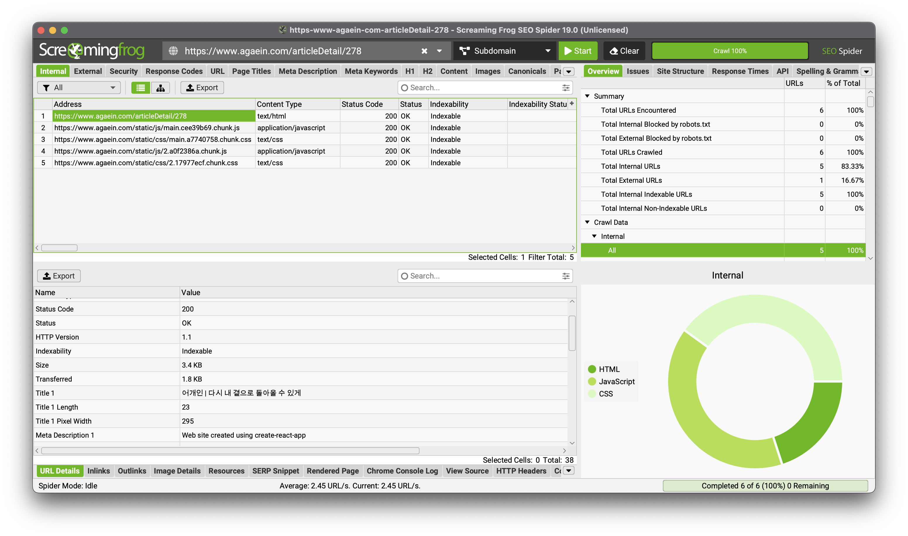
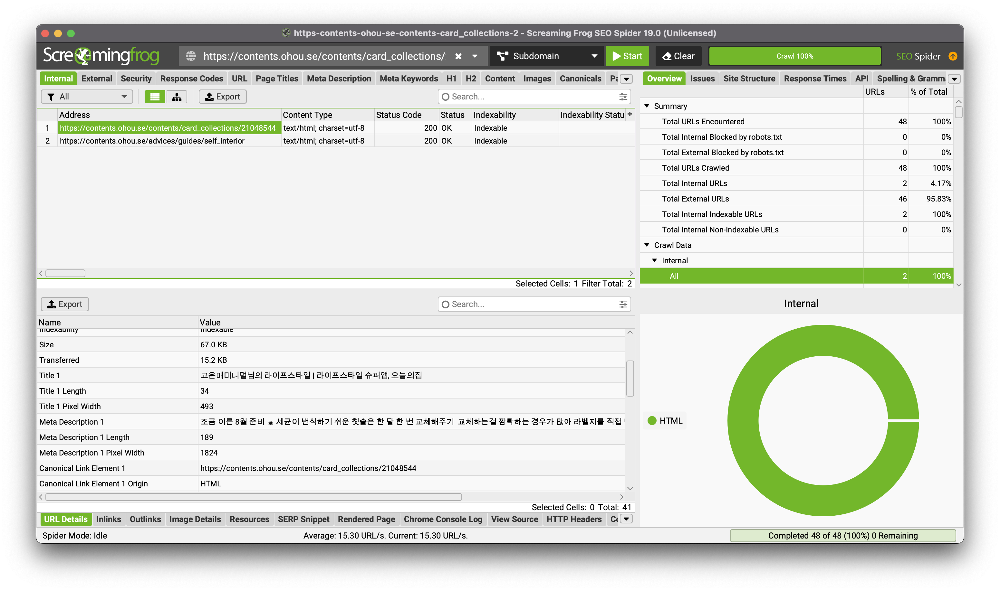
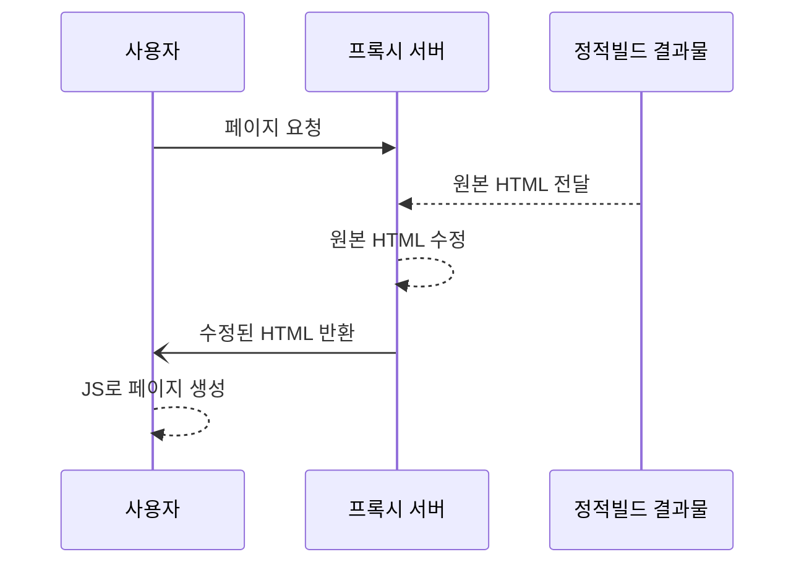
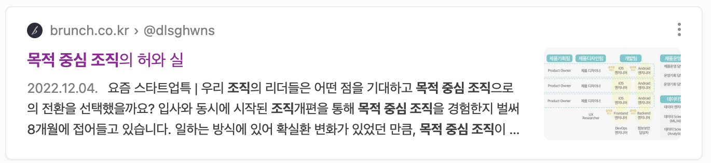
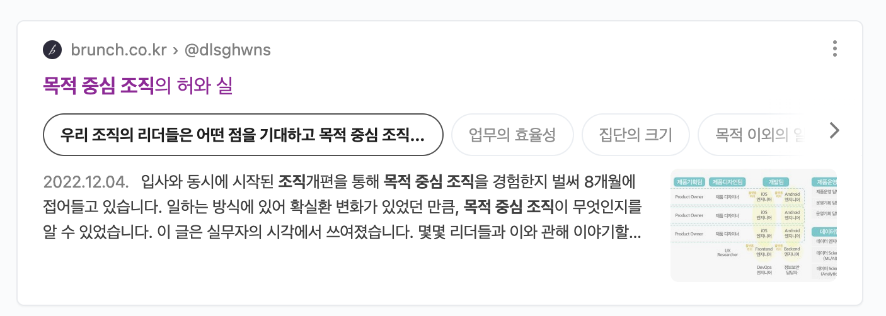
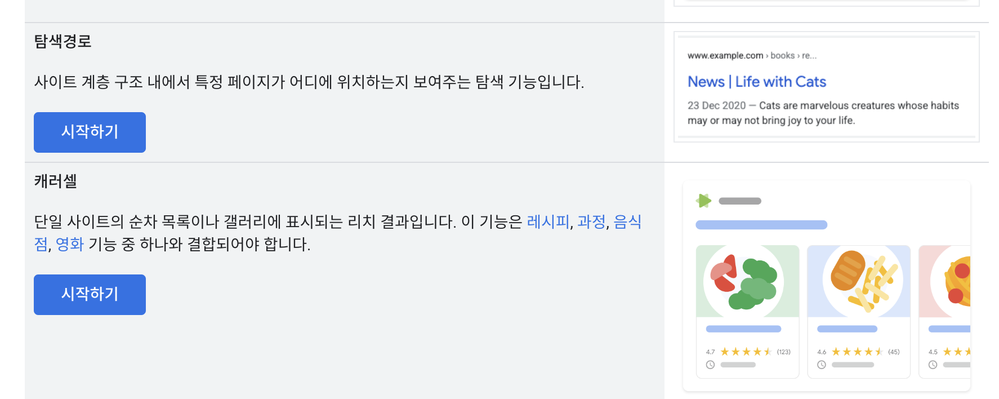
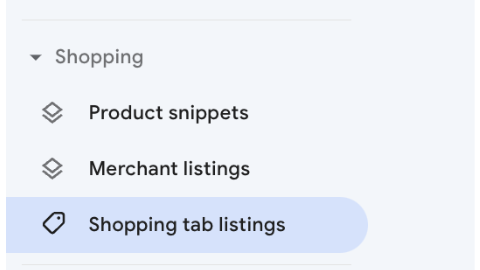

어찌어찌 색인도 잘 생성되고, 키워드 작이 잘 되었는지 랭크도 높아졌습니다. 근데 너무 초라한 내 게시글, 원채 누르고 싶지가 않습니다. 어떻게 해야할까요?

오늘 다뤄볼 주제는 SEO의 마지막 관문. 사용자가 누르고 싶게끔 하기입니다.

<!--truncate-->

웹문서로써 기본적인 구성요소를 가지고 있고 결격사유가 없다면 (중복 컨텐츠거나 오류페이지 처리되거나 등등) 보통 색인이 생성됩니다. 그리고 도메인의 키워드 전략이나 보유량에 따라 특정 검색어를 입력했을 때 높은 랭크로 우리 사이트가 사용자의 검색화면에 나타나요. 하지만 사용자가 클릭을 해줄지는 모르는 일입니다.

## 다이나믹 메타태그

보통 게시글 형태의 페이지는 같은 템플릿에 데이터만 바뀌는 형태로 만들어집니다. 애초에 서버에서 모든 데이터를 조합해서 HTML을 내려주는 SSR의 형태일수도 있고, react 처럼 일단 빈 HTML을 내려준 다음 javaScript로 데이터를 채워서 사용자가 볼 땐 데이터가 변경되어 있도록 할 수도 있죠. 중요한 점은, 크롤러 입장에서는 요청 시점의 HTML만을 평가한다는 점입니다.

제가 담당했던 프로덕트는 안타깝게도 SEO에 취약한, SSR이 없는 react로 작성되어 있었는데요, 아래 SEO 도구가 평가한 두가지 결과를 봅시다.

첫번째 결과는 title, description 값이 기본값으로 들어가있습니다. 이는 react-helmet같은 SEO 도구를 사용해도 극복할 수 없습니다. 사용자가 브라우져에서 볼 때 웹문서의 제목이나 설명이 변경되는것이지 SEO도구의 시점, 즉 크롤러의 관점에서는 아직 head 태그 안에 값은 변화가 없기 때문입니다.



하지만 아래 페이지는 title, description, keywords에 기본 페이지 메타데이터가 아닌 특정 페이지 고유 데이터로 평가된 것을 볼 수 있죠? 이를 다이나믹 메타태그 작업이라고 부릅니다. 동적으로 컨텐츠가 변경되는 페이지인데 title, description, keywords, open graph 정보 등이 각 페이지의 데이터에 따라 동적으로 변경된다는 뜻입니다.



### CSR에서 SEO 향상시키기

결론부터 말하면 전부 CSR(Client Side Rendering)인 페이지에 부분적으로 **SSR(Server Side Rendering)**을 구현하면 됩니다. 크롤러가 웹문서를 요청했을 시점에는 자바스크립트가 데이터를 생성하기 이전이라 html 엘리먼트가 가장 최초 상태이기 때문에, 최소 수준인 메타태그에만 적용하는 방식입니다.

:::tip CSR과 SSR

CSR과 SSR은 웹페이지에서 html 구성요소인 element들이 요청 시점에 채워져 있느냐 없느냐에 따라 달라집니다. 당연하게도 부분적으로 적용될 수도 있고요. 각각에 장단점이 존재하기 때문에 잘 이해한 상태에서 적절하게 배합해 사용하는게 좋습니다.

:::

SSR을 구현하는 방식은 다양하니, 이 글에서는 러프한 구조만 소개하겠습니다.



이렇게 하면 요청 시점에도 메타데이터가 온전히 담겨있어 부분적인 SSR을 할 수 있게됩니다.

이제 각 페이지의 특성에 맞게 웹문서의 메타정보나 오픈그레프 정보를 수정하여 색인된 결과를 볼 때나 링크를 넘겨줄 때 페이지마다 가진 주요한 정보를 제공할 수 있습니다.

## 리치텍스트 스니펫

리치텍스트 스니펫은 같은 검색결과라도 사용자의 검색의도에 맞게 **풍부한 데이터**를 **목적성에 맞는 UI**를 입혀 제공하는 것을 말합니다. 아래 게시글을 예시로 들어볼까요? 네이버의 리치텍스트 스니펫이 적용된 제 블로그 게시글입니다.

목적중심조직에 대해 검색했을 땐 아래와 같이 밋밋하게 나오지만,



목적중심조직의 장단점 같은 목적성을 띈 검색에서는 아래와 같은 추가적인 UI가 제공됩니다. 이렇다고 정보를 신뢰할 수 있는건 아니지만



이와 같이 일반 메타데이터는 물론이고 목적에 맞는 게시글에 특별한 UI가 추가되어 보이는 형태를 리치 텍스트 스니펫이라고 합니다.

### 리치텍스트 스니펫의 종류

[구글 검색센터 문서](https://developers.google.com/search/docs/appearance/structured-data/search-gallery?hl=ko)에서 해당 스니펫의 종류를 명시해뒀습니다. 아마 구글에서의 숱한 검색 경험이 있으시다면 아래 사진의 우측에 나오는 형태의 검색을 종종 보셨을거에요. 뉴스 기사나 레시피, 추가 정보 등등 종류는 거의 20가지 정도 되는 것 같아요.



### 구현 방법

생각보다 구현 방법은 어렵지 않습니다. 하지만 아래 방법대로 한다고 항상 생성되는건 아니니 주의하세요(SEO가 뭐 그렇잖아요..!) 크롤러가 페이지를 요청해서 반환받는 시점에 정적이든 동적이든 아래 데이터가 양식에 맞게 html 파일에 포함되어있으면 됩니다. 아래 예시는 [BreadCrumb 스니펫](https://developers.google.com/search/docs/appearance/structured-data/breadcrumb?hl=ko)을 예로 들었어요.

```html
<html>
  <head>
    <title>Award Winners</title>
    <script type="application/ld+json">
      {
        "@context": "https://schema.org",
        "@type": "BreadcrumbList",
        "itemListElement": [
          {
            "@type": "ListItem",
            "position": 1,
            "name": "Books",
            "item": "https://example.com/books"
          },
          {
            "@type": "ListItem",
            "position": 2,
            "name": "Science Fiction",
            "item": "https://example.com/books/sciencefiction"
          },
          {
            "@type": "ListItem",
            "position": 3,
            "name": "Award Winners"
          }
        ]
      }
    </script>
  </head>
  <body></body>
</html>
```

모든 예시가 문서에 잘 나와있어서 적용이 어렵지는 않습니다. 또한 리치텍스트 스니펫 적용이 잘 되었는지를 검사할 수 있는 [리치텍스트 검사기](https://search.google.com/test/rich-results?utm_source=support.google.com/webmasters/&utm_medium=referral&utm_campaign=7445569)를 구글에서 직접 제공하고, 여기서 검사해보면서 적용 테스트를 할 수 있습니다.

아래 사진은 구글 서치콘솔의 좌측 탭입니다. 스니펫이정상적으로 적용이 시작되었다면 스니펫 관련 탭이 활성화되며 정상적으로 서비스되고 있는지에 대한 결과를 조회할 수 있습니다.



## 마치며

아무리 색인이 잘 생성되고 높은 랭크로 우리 페이지가 노출된다 하더라도, 클릭하기 싫은 글은 안하게됩니다. 마치 빵집 앞에서 우리를 고소한 냄새와 기름진 버터 때깔로 유혹하는 빵처럼 우리 웹페이지도 후킹요소를 잔뜩 휘감아 어떻게든 클릭하게 만드는 노력이 필요합니다.
