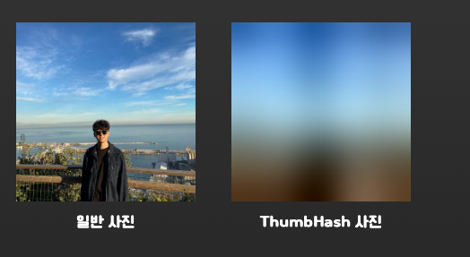

사진은 정말 중요합니다. 웹문서를 다채롭게 만들어주기 때문입니다.

하지만 이미지는 웹 성능에있어 주요 병목 중 하나입니다. 네트워크나 기기 상황에 따라 그저 멍하니 흰화면만 보고 있어야 하는 경우도 있으니까 말입니다. 하지만우리는 사용자에게 뭐라도 보여줘야하고, 현재 어떤 단계에 있는지에 대한 정보 제시가 필요합니다.

그러려면 우리는 이미지가 사용자 눈에 보여지는 과정을 이해하고 단계마다 필요한 조치를 해줘야합니다. 오늘은 최적화라기보다는 사용자 경험을 높히는 방법에 대한 이야기입니다.

<!--truncate-->

## 이미지의 렌더링

보통의 경우 네트워크에서 이미지를 받아온다고 가정했을 때 다음과 같은 과정을 거칩니다. 가령 어떤 게시글을 조회했을 때 포함된 이미지를 렌더링한다고 해볼게요.


### 내 이미지가 느리게 뜨는 이유

결국 위 그래프에서 단계단계가 조금씩 늦어지면서 워터폴을 만들었기 때문입니다.

그러므로 이미지 최적화 및 사용자 경험 개선을 할 때 우선적으로 해야 하는 작업은 위 그래프의 초록색과 빨간색 부분의 개선입니다. 마치 릴레이 달리기를 하듯이, 초록색 주자가 빨리 도착할수록 빨간색 주자가 그 바톤을 이어받아 진행하고, 파란색 주자가 종지부를 찍을 수 있기 때문입니다.

## Thumbnail Image

우선 이미지 주소를 반환하는 API의 응답이 올 때까지 보여줄 화면을 매끄럽게 구성해야합니다. 아래는 서버 응답이 정상적으로 도착하지 않았을 때 보여주는 loading 컴포넌트 대신 사용하는 Thumbnail 이미지입니다.


### 로딩 컴포넌트

구현은 뭐 너무나도 많이 쓰는 방식이에요. 서버 데이터의 상태에 따라 어떤 컴포넌트를 보여줄지 결정하는 훅을 만들고, 이에 따라 스켈레톤을 보여줄지, 로딩 스피너를 보여줄지 결정하는 코드입니다.

```jsx
const CarList = ({isLoading}) => {
const {data, isLoading, isError } = useFetchCars()

	if(isLoading){
		<div>
			
			...
		</div>
	}

return <CarListItem data={data}>
}
```

서버에서 데이터를 가져오는 부분이 사실 시간이 환경에 따라 오래걸리는 경우가 더 많기 때문에 이 화면을 가장 오래 볼 가능성이 있어요.

자 그럼 이 구간을 무사히 넘겨서, 서버 데이터가 다 넘어왔다고 가정해볼게요. 즉, 자원의 주소가 잘 도착했다는 뜻이 됩니다. 이제 사용자에게 보여주기 위해 자원의 주소로 이미지를 요청하는 과정이 필요하죠. 그래야 그 이미지를 다운받아 그려낼테니까요.

이제 빨간색 영역에서 발생하는 문제에 대해 서술해볼게요.

## 지연로딩

우리가 이미지를 보여주기 위해 img 태그에 자원의 주소를 입력하면, 사용자가 보고있지 않아도 그 이미지를 다운받습니다. 잘 생각해보면 이것저것 다운받을게 안그래도 많은데, 당장 쓰이지도 않을 이미지를 다운받는게 너무 이상하지 않나요?

보이는 영역에서만 이미지나 모듈 등을 다운받도록 하는 기능을 지연로딩이라고 합니다.


### 기존의 방식

기존엔 두가지 방식으로 지연로딩을 구현했습니다. Intersection Observer API와 scroll 이벤트 핸들러죠. Intersection Observer API도 비교적 최근에 추가된 스펙이기 때문에 전통 웹사이트들은 이벤트 핸들러 방식으로 구현되어 있었습니다.

하지만 지연로딩만을 위한 기능이 아니었기 때문에 사용할 때면 개발자마다 다른 규칙으로 만들어서 써야 했고 성능과 기능이 조금씩 달랐으며 추후 오는 개발자들의 일관된 유지보수를 보장할 수 없었습니다.

### loading 속성의 등장

loading 속성은 img 태그에서 선언적으로 어떤 정책으로 이미지를 지연로딩시킬지 결정하는 스펙입니다. 아래와 같이 사용할 수 있어요.

```jsx

```

:::tip 💡 loading 프로퍼티의 동작

- `auto`: 속성을 포함하지 않는 것과 동일한 브라우저의 기본 지연 로딩 동작입니다.
- `lazy`: 뷰포트로부터 [계산된 거리](https://web.dev/i18n/ko/browser-level-image-lazy-loading/#distance-from-viewport-thresholds)에 도달할 때까지 리소스 로딩을 지연시킵니다.
- `eager`: 페이지에서의 위치에 관계없이 리소스를 즉시 로드합니다.

:::

### 한계

지연로딩은 잘 알고 써야하는 스펙입니다. 당장 홈화면 최상단 이미지에 레이지로딩을 걸어버린다면, 사용자들은 매번 깜빡임을 보게 될거에요. 또한 css background에 대한 지원은 아직 없습니다. 프리로드 스캐너의 영향의 밖에 놓이는 점도 추후 소통과 디버깅을 어렵게할 수 있습니다.

엄청 빠르게 스크롤할 때 보이는 빈화면들도 역으로 사용자경험에 있어 문제가 될 수 있습니다. 이러한 문제는 어느정도 커스텀을 통해 조절할 수 있지만 전부 개발자 리소스와의 트레이드 오프 관계에 있다보니 적용함에 있어 생각할 점이 적지 않습니다.

## ThumbHash

이미지를 잘 다운로드 받았다고 하더라도 고해상도 이미지의 경우 로드하는데 시간이 걸립니다. 이미지가 로드되는 과정엔 이미지를 비트맵으로 변환하고 해석한 다음 메모리에 영사하는 복잡한 컴퓨터 연산을 거칩니다. 즉, 픽셀 데이터가 큰 사진은 다운로드를 받아도 그려내는데 오래걸린다는 것이고, 사용자는 그 기간동안 빈화면만 보고 있어야 합니다. 맨위 그래프의 파란색 영역의 사용자 경험을 높히기 위한 장치가 필요하다는 뜻이지요.

### ThumbHash란?

[ThumbHash](https://evanw.github.io/thumbhash/)는 이럴 때 사용하는 일종의 placeholder 이미지입니다. 사실 ThumbHash의 본체는 사진이 아니라 문자열입니다. 아래 예시의 가장 오른쪽 사진은 가운데의 24바이트짜리 데이터를 역변환해서 만들어내요. 저 바이트 코드는 인코딩해서 34바이트짜리 string으로 변환되지요.


아래 사진은 다른 placeholder 이미지 라이브러리들과 다른 ThumbHash의 장점을 보여주는 사진입니다. 윤곽을 뭉개지 않고 원형을 조절해주는 모습을 볼 수 있습니다.


### 구현

ThumbHash는 하나의 알고리즘입니다. 사진 데이터에 어떤 알고리즘을 적용하여 대충 모양은 비슷하되 크기를 최소화하도록 변환해서 빠르게 로드할 수 있도록 합니다. 이미지를 표현하는데 32바이트짜리 string 하나면 되니까, 거의 용량이 없다고 봐도 됩니다.

일단 브라우져에서 테스트를 해보고, 실무에서 쓸만한 방법을 소개해드려요.

1. 우선 [Thumbhash 알고리즘을 모듈화한 코드](https://github1s.com/evanw/thumbhash/blob/HEAD/js/thumbhash.js)를 가져옵니다. 그냥 모듈파일을 만들고 이 코드를 전부 복붙하면 되요. 저 모듈 중 몇개를 가져다 쓸거에요.
2. 그 다음 컴포넌트를 만들고 이 알고리즘을 적용하면 됩니다.

```jsx
// 1번에서 가져온 모듈을 받아옵니다.
import * as ThumbHash from '@/utils/thumbhash';

const ThumbHashTest = () => {
  const [thumbnail, setThumbnail] = useState('');

  const generateThumbHash = async () => {
    // 1. 원본 이미지에서 필요한 데이터를 꺼냅니다.
    const originalURL = 'http://localhost:3000/icons/hojun.jpeg';
    const image = new Image();
    image.src = originalURL;
    await new Promise((resolve) => (image.onload = resolve));
    const canvas = document.createElement('canvas');
    const context = canvas.getContext('2d');
    if (context === null) {
      return;
    }
    const scale = 100 / Math.max(image.width, image.height);
    canvas.width = Math.round(image.width * scale);
    canvas.height = Math.round(image.height * scale);
    context.drawImage(image, 0, 0, canvas.width, canvas.height);
    const pixels = context.getImageData(0, 0, canvas.width, canvas.height);

    // 2. ThumbHash 알고리즘을 적용시킵니다.
    const binaryThumbHash = ThumbHash.rgbaToThumbHash(
      pixels.width,
      pixels.height,
      pixels.data,
    );
    // 3. dataURL 형태로 변환합니다. 이걸 렌더링하면 됩니다.
    const placeholderURL = ThumbHash.thumbHashToDataURL(binaryThumbHash);
    setThumbnail(placeholderURL);
  };

  useEffect(() => {
    generateThumbHash();
  }, []);

  return (
    <>
      
    </>
  );
};
```

결과적으로 아래와 같이 플레이스 홀더 사진을 dataURL로 얻어내 렌더링할 수 있게 됩니다.



### 실무에서 사용할 때

현재 이 방법의 문제는 모든 계산을 클라이언트가 하고 있다는 점입니다. 위에 언급한 코드로 가보면, 이미지 하나하나를 다 저 복잡한 연산 과정을 거쳐야 하니 느릴 수 밖에 없죠. 하지만 미리 계산해놓는다면 말이 달라집니다. 즉, 요청 시점에 저 연산이 끝나있으면 된다는 뜻이죠.

만약 이미지 URL을 받았을 때, 원본 이미지와 함게 thumbhash string이 동봉되어있다면, 저희는 원본 이미지를 로드시켜놓고 빠르게 thumbhash string만 dataURL로 변환시켜 placeholder image를 보여주면 되니까요.

간단한 노드 서버를 만들어서 위 알고리즘을 그대로 적용하면 되는 부분이라 코드는 넣지 않도록 할게요. 정상동작한다면 응답으로 아래와 같은 형태로 받게되면 되겠죠?

```jsx
{
	...
	// 아래와 같이 # hash로 붙어서 string이 내려오면, 이를 해석해서 dataURL을 얻을 수 있다.
	image: "https://cdn.image.kr/394832904#4cYNPwiXaIeOd3hwiGd4h3eHdwiHh3AK"
	...
}
```

## 양날의 검

이미지 최적화는 양날의 검입니다. 좋은 의도로, 멍하니 빈 화면만 보고있지 않도록 하기 위해 최대한 노력한 것이지만 괜히 사용자 경험을 떨어뜨린다는 말을 들을 수도 있다는 것이지요.

제가 이와 비슷한 작업을 할 때 들었던 이야기 중 하나는 placeholder용 컴포넌트가 보기 흉하다 였습니다. 개인차일수도 있지만 시작부터 미적 감각의 벽에 부딪혔던 거에요. 저는 결국 이러한 노력이 성능도 좋아지고 사용자 경험도 증대시켰다고 믿지만 어느정도 개인차가 있나봅니다. 그래서 이런 작업을 할 땐 다수에게 얻은 정성적인 데이터를 기반으로 의사결정하는게 좋겠네요.

## Reference

[웹용 브라우저 수준 이미지 지연 로딩](https://web.dev/i18n/ko/browser-level-image-lazy-loading/)

[ThumbHash: A very compact representation of an image placeholder](https://evanw.github.io/thumbhash/)
